# 产品介绍

- [产品介绍](#产品介绍)
  - [产品组成](#产品组成)
  - [产品规格](#产品规格)
  - [KUAVO\_4pro\_短手版自由度范围、速度扭矩限制关节位置及运动控制坐标系图示](#kuavo_4pro_短手版自由度范围速度扭矩限制关节位置及运动控制坐标系图示)
  - [KUAVO\_4pro\_长手版自由度范围、速度扭矩限制关节位置及运动控制坐标系图示](#kuavo_4pro_长手版自由度范围速度扭矩限制关节位置及运动控制坐标系图示)
  - [KUAVO\_4pro\_短手版电气接口](#kuavo_4pro_短手版电气接口)
  - [KUAVO\_4pro\_长手版电气接口](#kuavo_4pro_长手版电气接口)
    - [换电板接口说明：](#换电板接口说明)
    - [电源板接口说明](#电源板接口说明)
  - [传感器参数](#传感器参数)
    - [IMU](#imu)
    - [深度摄像头：D435](#深度摄像头d435)
    - [激光雷达：mid-360](#激光雷达mid-360)
    - [下位机：摩方i9-13900](#下位机摩方i9-13900)
    - [上位机：](#上位机)
      - [SWNUC12WSKI70000](#swnuc12wski70000)
      - [AGX Orin（选配）](#agx-orin选配)
  - [二指爪（标配）](#二指爪标配)
  - [灵巧手（选配）](#灵巧手选配)

## 产品组成

KUAVO机器人4pro包含头、躯干、手臂、腿部，全身总共28个自由度（不含末端），使得机器人能够实现灵活的运动和姿态控制

- 头部拥有2个自由度，包含头部旋转关节和头部俯仰关节。深度相机、激光雷达、麦克风阵列、交互灯等位于头部。

- 躯干内包含：运动控制板、电源板及换电电池 。

- 单手臂拥有7个自由度，包含手臂前摆关节、手臂侧摆关节、手臂旋转关节、手肘关节、手腕旋转关节、手腕前摆关节和手腕侧摆关节。手臂可选配末端二指爪/灵巧手

- 单腿拥有6个自由度，包含大腿侧摆关节、大腿旋转关节、大腿前摆关节、膝关节、上踝关节和下踝关节

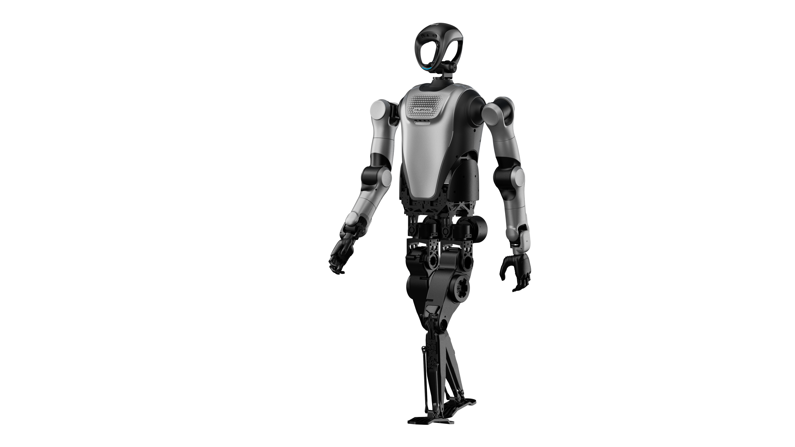

## 产品规格

| 类型   | 规格参数                                                                    | 指标说明                                                        |
|:----:|:-----------------------------------------------------------------------:|:-----------------------------------------------------------:|
| 基本参数 | 高 重量 短臂单臂长度 长臂单臂长度                                          | 1.66m 55kg 626mm 790mm                          |
| 自由度  | 全身自由度（不含末端） 头部自由度 单臂自由度 单腿自由度 二指爪自由度（标配） 灵巧手自由度（选配） | 30 2 7 6 1 6                            |
| 运行参数 | 行走速度                                                                    | 0.6m/s                                                      |
| 电池参数 | 工作电压 行走续航 电池容量 循环寿命 充电时长                                | 60V 1h 6Ah ≥500次 ≤1.5h                      |
| 传感器  | 摄像头 麦克风 激光雷达 扬声器 关节温度传感器 IMU                        | D435 6MIC  360度定位 mid-360 立体音响 LB01  /  |
| 算力平台 | 下位机 上位机                                                             | 摩方i913900 x 1 SWNUC12WSKI70000 x 1（标配）/AGX Orin x 1（选配） |
| 安全功能 | 本体急停 声音提醒                                                           | 1 低电量提醒                                                 |

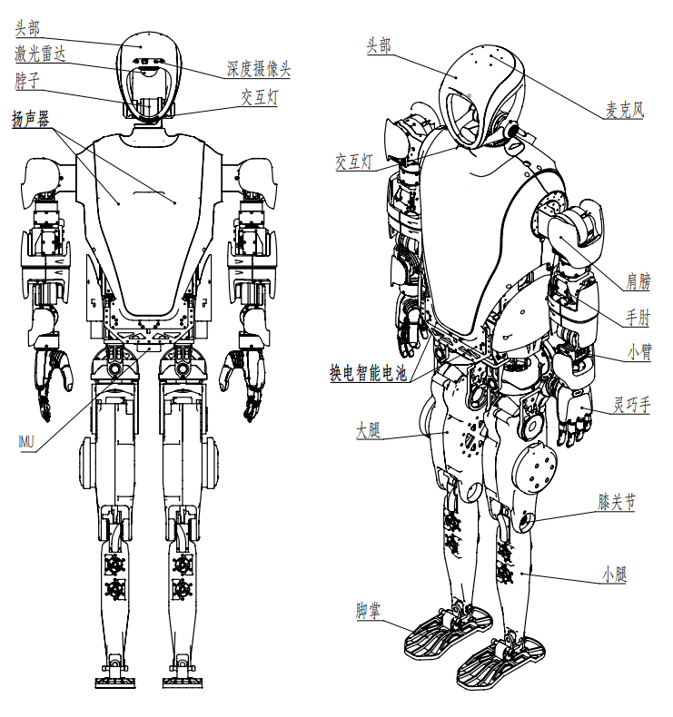

## KUAVO_4pro_短手版自由度范围、速度扭矩限制关节位置及运动控制坐标系图示

| 关节序号 | 关节名称 | 关节代号         | 位置下限（°） | 位置上限（°） | 额定力矩（Nm） | 额定速度（rpm） |
|:----:|:----:|:------------:|:-------:|:-------:|:--------:|:---------:|
| 0    | 头部旋转 | head_pitch   | -30     | 30      | 6        | 50        |
| 1    | 头部俯仰 | head_yaw     | -90     | 90      | 0.5      | 50        |
| 2    | 左肩前摆 | l_arm_pitch  | -150    | 30      | 20       | 50        |
| 3    | 左肩侧摆 | l_arm_roll   | -20     | 120     | 22       | 50        |
| 4    | 左臂旋转 | l_arm_yaw    | -90     | 90      | 10       | 50        |
| 5    | 左肘   | l_forearm    | 0       | 90      | 10       | 50        |
| 6    | 左腕旋转 | l_hand_yaw   | -90     | 90      | 2        | 50        |
| 7    | 左腕前摆 | l_hand_pitch | -90     | 90      | 2        | 50        |
| 8    | 左腕侧摆 | l_hand_roll  | -90     | 90      | 2        | 50        |
| 9    | 右肩前摆 | r_arm_pitch  | -150    | 30      | 20       | 50        |
| 10   | 右肩侧摆 | r_arm_roll   | -120    | 20      | 22       | 50        |
| 11   | 右臂旋转 | r_arm_yaw    | -90     | 90      | 10       | 50        |
| 12   | 右肘   | r_forearm    | 0       | 90      | 10       | 50        |
| 13   | 右腕旋转 | r_hand_yaw   | -90     | 90      | 2        | 50        |
| 14   | 右腕前摆 | r_hand_pitch | -90     | 90      | 2        | 50        |
| 15   | 右腕侧摆 | r_hand_roll  | -90     | 90      | 2        | 50        |
| 16   | 左髋侧摆 | l_leg_roll   | -18     | 38      | 40       | 120       |
| 17   | 左髋旋转 | l_leg_yaw    | -50     | 45      | 20       | 120       |
| 18   | 左髋前摆 | l_leg_pitch  | -115    | 90      | 20       | 120       |
| 19   | 左膝   | l_knee       | 0       | 150     | 40       | 120       |
| 20   | 左踝上  | l_foot_pitch | -45     | 20      | 12       | 77        |
| 21   | 左踝下  | l_foot_roll  | -15     | 15      | 12       | 77        |
| 22   | 右髋侧摆 | r_leg_roll   | -38     | 18      | 40       | 120       |
| 23   | 右髋旋转 | r_leg_yaw    | -45     | 50      | 20       | 120       |
| 24   | 右髋前摆 | r_leg_pitch  | -115    | 90      | 20       | 120       |
| 25   | 右膝   | r_knee       | 0       | 150     | 40       | 120       |
| 26   | 右踝上  | r_foot_pitch | -45     | 20      | 12       | 77        |
| 27   | 右踝下  | r_foot_roll  | -15     | 15      | 12       | 77        |

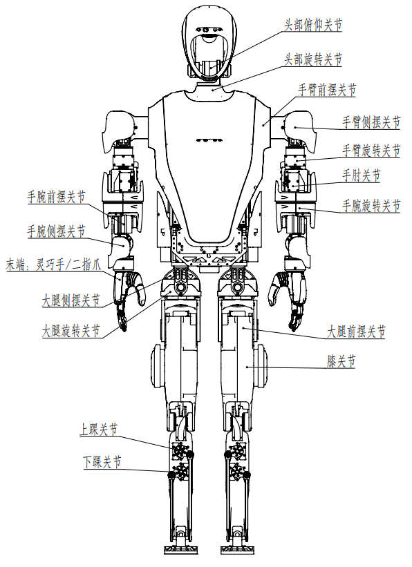

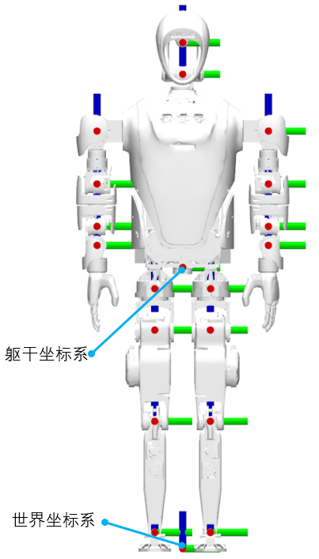
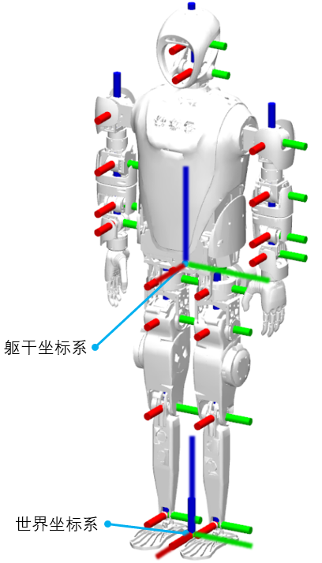

当各个关节均为零度时，各坐标系如上图。红色为x轴，绿色为y轴，蓝色为z轴。

## KUAVO_4pro_长手版自由度范围、速度扭矩限制关节位置及运动控制坐标系图示

| 关节序号 | 关节名称 | 关节代号         | 位置下限（°） | 位置上限（°） | 力矩限制（Nm） | 额定力矩（Nm） | 额定速度（rpm） |
| ---- | ---- | ------------ | ------- | ------- | -------- | -------- | --------- |
| 0    | 头部旋转 | head_pitch   | -30     | 30      | 12       | 6        | 50        |
| 1    | 头部俯仰 | head_yaw     | -90     | 90      | 1.5      | 0.5      | 50        |
| 2    | 左肩前摆 | l_arm_pitch  | -180    | 90      | 100      | 20       | 120       |
| 3    | 左肩侧摆 | l_arm_roll   | -20     | 120     | 50       | 22       | 30        |
| 4    | 左臂旋转 | l_arm_yaw    | -90     | 90      | 36       | 12       | 50        |
| 5    | 左肘   | l_forearm    | -150    | 0       | 50       | 22       | 30        |
| 6    | 左腕旋转 | l_hand_yaw   | -90     | 90      | 12       | 6        | 50        |
| 7    | 左腕前摆 | l_hand_pitch | -40     | 40      | 12       | 6        | 50        |
| 8    | 左腕侧摆 | l_hand_roll  | -75     | 40      | 12       | 6        | 50        |
| 9    | 右肩前摆 | r_arm_pitch  | -180    | 90      | 100      | 20       | 120       |
| 10   | 右肩侧摆 | r_arm_roll   | -120    | 20      | 50       | 22       | 30        |
| 11   | 右臂旋转 | r_arm_yaw    | -90     | 90      | 36       | 12       | 50        |
| 12  | 右肘   | r_forearm    | -150    | 0       | 50       | 22       | 30        |
| 13   | 右腕旋转 | r_hand_yaw   | -90     | 90      | 12       | 6        | 50        |
| 14   | 右腕前摆 | r_hand_pitch | -40     | 40      | 12       | 6        | 50        |
| 15   | 右腕侧摆 | r_hand_roll  | -40     | 75      | 12       | 6        | 50        |
| 16   | 左髋侧摆 | l_leg_roll   | -18     | 38      | 127      | 40       | 120       |
| 17   | 左髋旋转 | l_leg_yaw    | -50     | 45      | 84       | 20       | 120       |
| 18   | 左髋前摆 | l_leg_pitch  | -115    | 90      | 84       | 20       | 120       |
| 19   | 左膝   | l_knee       | 0       | 150     | 141      | 40       | 120       |
| 20   | 左踝上  | l_foot_pitch | -45     | 20      | 36       | 12       | 77        |
| 21   | 左踝下  | l_foot_roll  | -15     | 15      | 36       | 12       | 77        |
| 22   | 右髋侧摆 | r_leg_roll   | -38     | 18      | 127      | 40       | 120       |
| 23   | 右髋旋转 | r_leg_yaw    | -45     | 50      | 84       | 20       | 120       |
| 24   | 右髋前摆 | r_leg_pitch  | -115    | 90      | 84       | 20       | 120       |
| 25   | 右膝   | r_knee       | 0       | 150     | 141      | 40       | 120       |
| 26   | 右踝上  | r_foot_pitch | -45     | 20      | 36       | 12       | 77        |
| 27   | 右踝下  | r_foot_roll  | -15     | 15      | 36       | 12       | 77        |

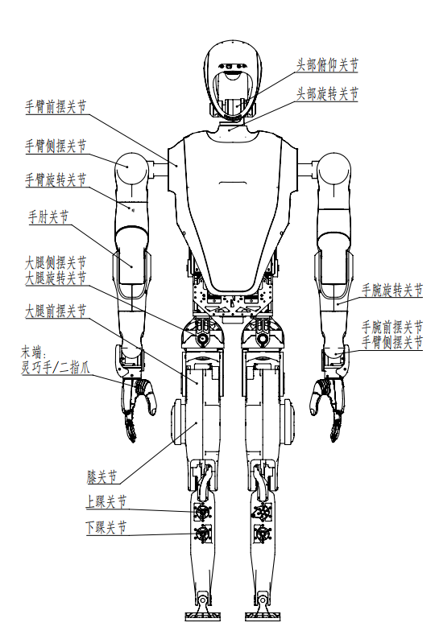

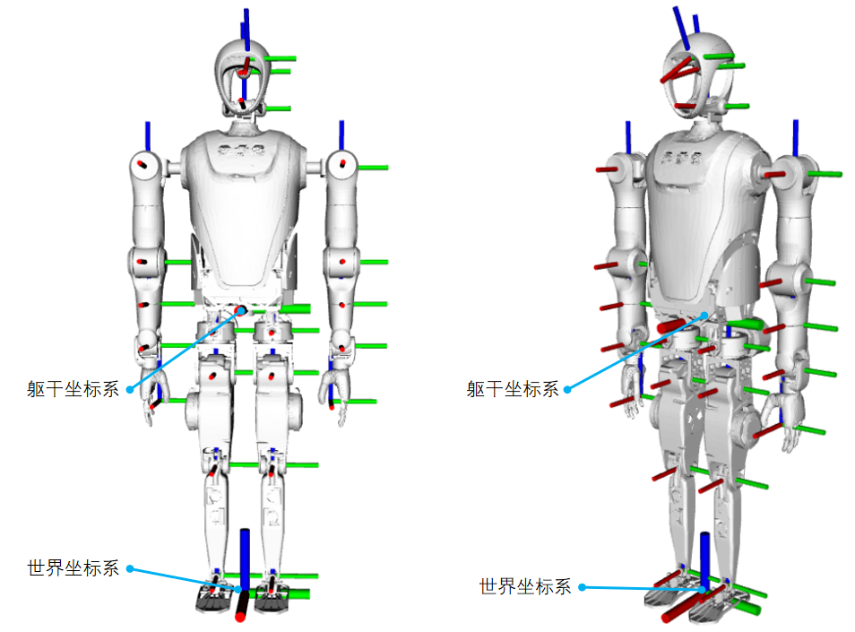

当各个关节均为零度时，各坐标系如上图。红色为x轴，绿色为y轴，蓝色为z轴。

## KUAVO_4pro_短手版电气接口

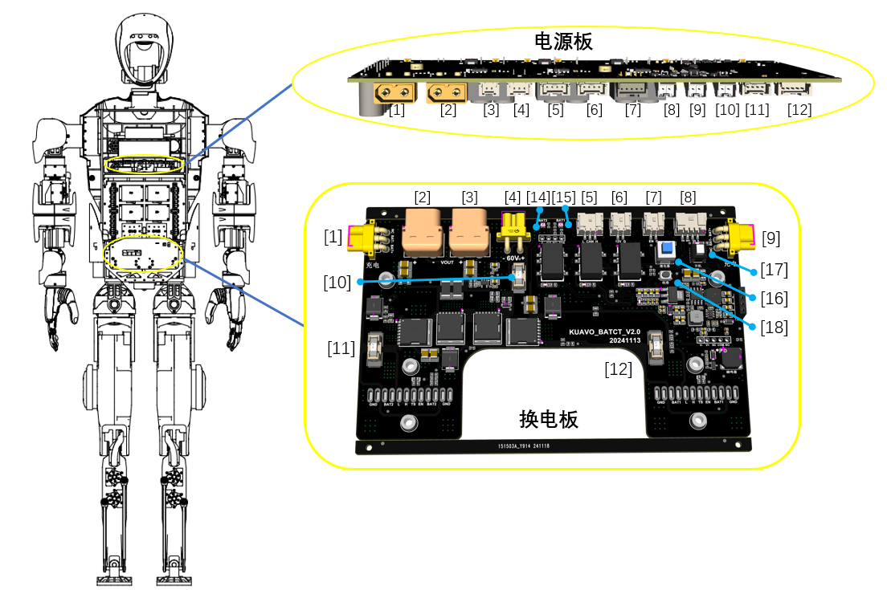
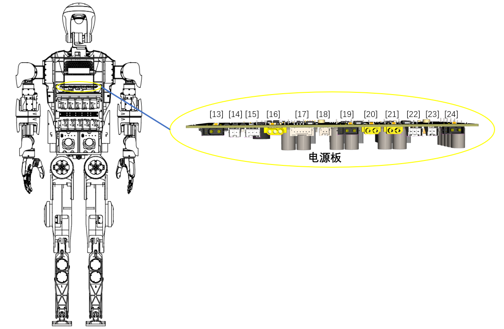

## KUAVO_4pro_长手版电气接口

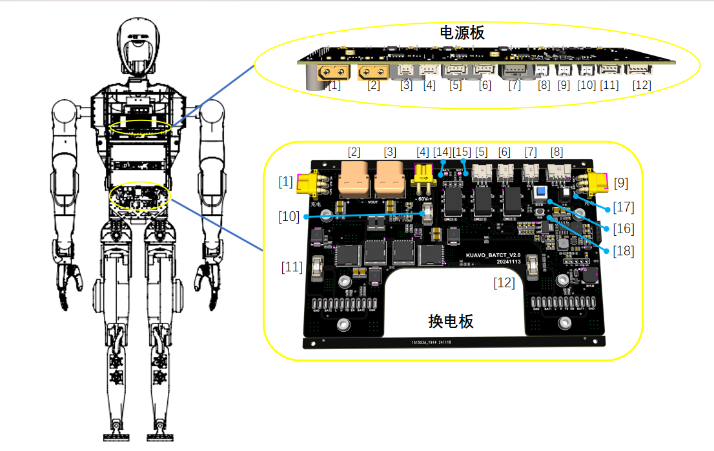

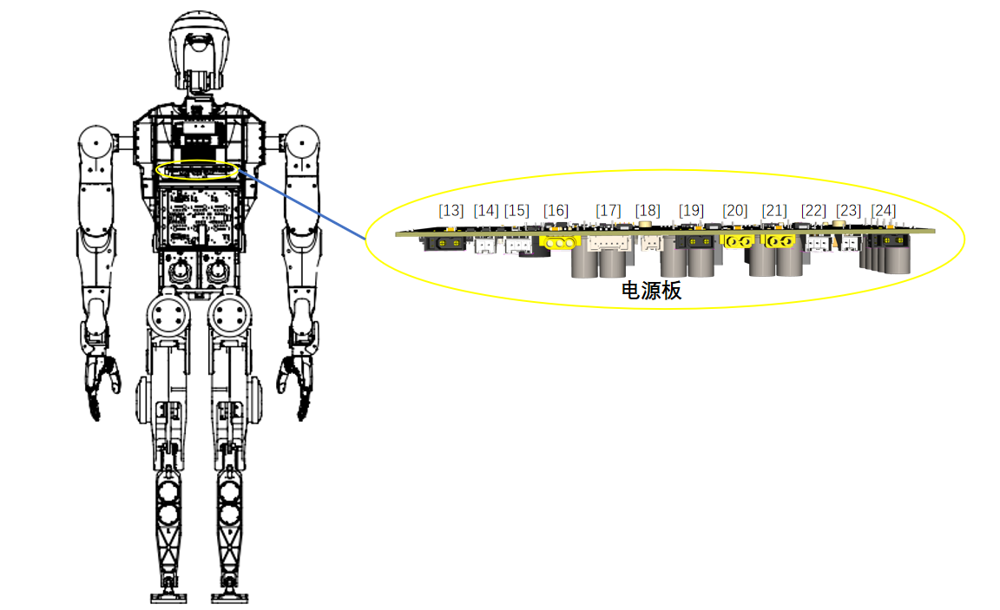

### 换电板接口说明：

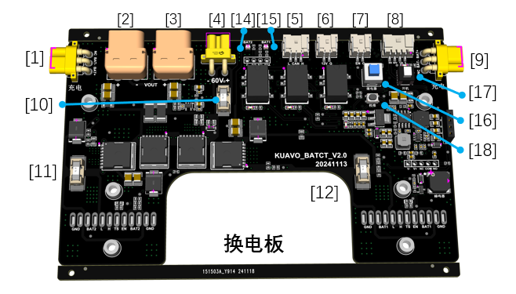

| **序号** | **接口型号**                  | **接口名称**  | **说明**                                                                                 |
| ------ | ------------------------- | --------- | -------------------------------------------------------------------------------------- |
| 1      | MR30PW-F                  | 左充电接口     | 外接67.2V/5A锂电池专用充电器给左侧电池充电                                                              |
| 2      | XT60PW-F                  | 60V放电接口   | 输出电压48V~67.2V，输出电流40A                                                                  |
| 3      | XT60PW-F                  | 60V放电接口   | 输出电压48V~67.2V，输出电流40A                                                                  |
| 4      | XT30PW-F                  | 电源板接口     | 输出电压48V~67.2V，输出电流15A                                                                  |
| 5      | 3PIN，2mm连接器 PAP-03V-S | CAN通信     | 电池CAN通信接口                                                                              |
| 6      | 2PIN，2mm连接器 PAP-02V-S | 12V接口     | 输出电压12V，0.5A                                                                           |
| 7      | 2PIN，2mm连接器 PAP-02V-S | 外接驱动器电源开关 | 控制驱动器60V放电接口输出开关                                                                       |
| 8      | 4PIN，2mm连接器 PAP-04V-S | 外接开机开关    | 外接开机按钮接口，开机后电源板和NUC供电打开，蜂鸣器响一声；                                                        |
| 9      | MR30PW-F                  | 右充电接口     | 外接67.2V/5A锂电池专用充电器给右侧电池充电                                                              |
| 10     | 6125保险丝30A                | 保险丝       | 左/右侧电池输出保险丝，型号：6125，125V,30A                                                           |
| 11     | 6125保险丝30A                | 保险丝       | 左/右侧电池输出保险丝，型号：6125，125V,30A                                                           |
| 12     | 6125保险丝15A                | 保险丝       | 电源板输出保险丝，型号：6125，125V,15A                                                              |
| 14     | 红绿双色LED灯                  | 左电池指示灯    | 左/右侧电池状态指示灯，正常：绿灯闪烁；电量低或电池拔出：红灯闪烁，蜂鸣器间断响；过温保护：红灯和蜂鸣器同步间隔1秒闪烁/响起；过流保护：红灯常亮，蜂鸣器长鸣；       |
| 15     | 红绿双色LED灯                  | 右电池指示灯    | 左/右侧电池状态指示灯，正常：绿灯闪烁；电量低或电池拔出：红灯闪烁，蜂鸣器间断响；过温保护：红灯和蜂鸣器同步间隔1秒闪烁/响起；过流保护：红灯常亮，蜂鸣器长鸣；       |
| 16     | 蓝色自锁开关                    | 板载驱动器电源开关 | 板载控制驱动器60V放电接口输出开关                                                                     |
| 17     | 白色自锁开关                    | 板载开机开关    | 板载开机开关，开机后电源板和NUC供电打开，蜂鸣器响一声；                                                          |
| 18     | 轻触开关                      | 校准开关      | 该开关有两种工作状态： 校准电压采集：机器接入一个电池，按住校准开关，按下开机开关，等待2秒，校准PCB电压采样； 短路保护复位：过流保护状态下，长按2秒复位过流保护状态； |

### 电源板接口说明

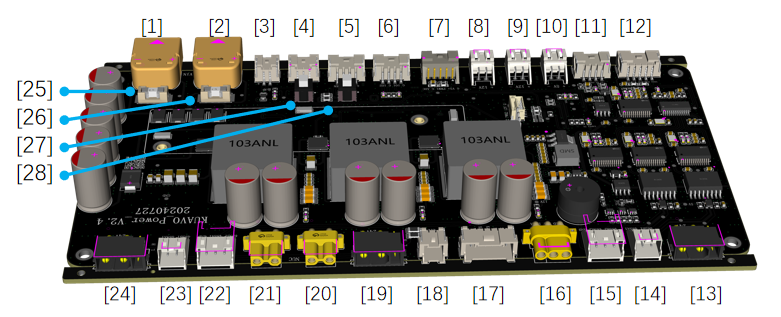

| **序号** | **接口型号**                     | **接口名称** | **说明**                        |
| ------ | ---------------------------- | -------- | ----------------------------- |
| 1      | XT60PW-M                     | 电源输入     | 输入电压范围36V~80V DC              |
| 2      | XT60PW-M                     | 电源输入     |                               |
| 3      | 2PIN，2.0MM连接器 PAP-02V-S  | NG       |                               |
| 4      | 3PIN，2.0MM连接器 PAP-03V-S  | 驱动器电源反馈  | 驱动器电源信号反馈                     |
| 5      | 4PIN，2.0MM连接器 PAP-04V-S  | NG       |                               |
| 6      | 4PIN，2.0MM连接器 PAP-04V-S  | 预留输入     |                               |
| 7      | 5PIN，2.0MM连接器 PAP-05V-S  | 散热风扇     | 驱动器散热风扇接口，24V/1A输出            |
| 8      | 2PIN，2.54MM连接器 XAP-02V-1 | 12V输出    | 12V/1A电源输出                    |
| 9      | 2PIN，2.54MM连接器 XAP-02V-1 | 12V输出    | 12V/1A电源输出                    |
| 10     | 2PIN，2.54MM连接器 XAP-02V-1 | 5V输出     | 5V/1A电源输出                     |
| 11     | 4PIN，2.0MM连接器 PAP-04V-S  | SBUS通信   | 无线遥控接收模块通信接口                  |
| 12     | 5PIN，2.0MM连接器 PAP-05V-S  | USB通信输入  | 电源板UBS接口，接到运动控制NUC            |
| 13     | XT30(2+2)PW-M                | 左手臂接口    | 左手电机24V电源与CAN通信               |
| 14     | 2PIN，2.54MM连接器 XAP-02V-1 | 夹爪RS485  | 左手为钧舵夹爪时，485通讯线接口             |
| 15     | 3PIN，2.54MM连接器 XAP-03V-1 | 灵巧手RS485 | 左手为灵巧手时，485通讯线接口              |
| 16     | MR30PW-F                     | 12V输出    | 12V/10A电源输出与LIN通信             |
| 17     | 6PIN，2.0MM连接器 PAP-06V-S  | 电量指示     | 电池电量指示板接口                     |
| 18     | 2PIN，2.0MM连接器 PAP-02V-S  | CAN通信输入  | 外接USB转CAN模块                   |
| 19     | XT30(2+2)PW-M                | 脖子电机接口   | 脖子电机24V电源与CAN通信               |
| 20     | XT30PW-F                     | NUC电源输出  | 18V/6A电源输出                    |
| 21     | XT30PW-F                     | NUC电源输出  | 18V/6A电源输出                    |
| 22     | 3PIN，2.54MM连接器 XAP-03V-1 | 灵巧手RS485 | 右手为灵巧手时，485通讯线接口              |
| 23     | 2PIN，2.54MM连接器 XAP-02V-1 | 夹爪RS485  | 右手为钧舵夹爪时，485通讯线接口             |
| 24     | XT30(2+2)PW-M                | 右手臂接口    | 右手电机24V电源与CAN通信               |
| 25     | 6125保险丝15A                   | 左侧电源保险丝  | 电源板左侧电池输入保险丝，型号：6125，125V/15A |
| 26     | 6125保险丝15A                   | 右侧电源保险丝  | 电源板右侧电池输入保险丝，型号：6125，125V/15A |
| 27     | 自锁开关                         | 开机开关     | 板载开机开关，开机后电源板和NUC供电打开,按钮默认按下； |
| 28     | 自锁开关                         | NG       |                               |

## 传感器参数

### IMU

- 纵倾横滚精度：0.2度；

- 方位角精度：1度；

**陀螺仪:**

- 满量程：2000度/秒；

- 零偏稳定性：8°/h；

- 带宽：520Hz；

- 噪声密度：0.007 º/s/√Hz。

**加速度传感器：**

- 满量程：10g；

- 零偏稳定性：10（x,y）15(z) μg；

- 带宽：500Hz；

- 噪声密度：60 μg/√Hz

### 深度摄像头：D435

- 深度技术：双目红外；

- 图像传感器技术：全局快门；

- 深度视场角（水平 X 垂直）：87° X 58°；

- 深度分辨率：1280 X 720；

- 深度精度：2米内<2%；

- 景深速率：90fps；

- RGB传感器技术：卷帘门；

- RGB传感器分辨率：2MP；

- RGB帧速率和分辨率：30fps下1920 X 1080；

- RGB传感器FOV（H X V）：69° X 42°；

- 惯性测量单位：无；

- 高分辨率时的min深度距离：0.2m；

- 理想范围：0.3~3m；

- 连接器：USB 3.1 Gen 1；

- 使用环境：室外；

- 支持物体识别、定位和追踪，可构建人体架构图，人体手势识别、肢体手势和动作判断等。

### 激光雷达：mid-360

- 扫描模式：双模式：重复扫描与非重复扫描；

- 量程（@100klx）：40m@10%反射率，70m@80%反射率；

- 近处盲区：0.1m；

- 视场角（H X V）：360° X 59°；

- 测距随机误差（@1δ）：≤2cm（@10m），≤3cm（@0.2m）；

- 角度随机误差（@1δ）：＜0.15°；

- 光束发散度：典型值：0.1° x 1°；

- 点云输出：~200，000点/秒；

- 点云帧率：10Hz；

- 数据接口：100Mbps以太网接口；

- 供电电压范围：9~27V DC；

- 功率：额定功率≤6.5W，启动功率≤18W；

- 工作温度：-20℃~55℃；

- 防护级别：IP67；

- IMU：ICM40609；

### 下位机：摩方i9-13900

- CPU：英特尔 酷睿 i9-13900H；

- GPU：Iris Xe Graphics；

- 内存：64G DDR5内存；

- 硬盘容量：500G固态；

- 主频：14核20线程 睿频5.4GHz；

- 网络：双频WiFi6E/蓝牙5.2（AX211）+双2.5G网口（intel i255）；

### 上位机：

#### SWNUC12WSKI70000

- CPU：Intel Core i7-12700K

- GPU：Intel Iris Xe Graphics

- 内存：32G

- 硬盘容量：256G

- 主频：12核20线程 睿频5.0GHz

- 网络：Wi-Fi 6E和蓝牙 5.2+2.5G网口

#### AGX Orin（选配）

- CPU:
  - 架构: Arm® Cortex®-A78AE
  - 核心数: 12 核（64GB 版本），8 核（32GB 版本）
  - 缓存: 3MB L2 + 6MB L3（64GB 版本），2MB L2 + 4MB L3（32GB 版本）
  - 最大频率: 可达 2.2 GHz
- GPU:
  - 架构: NVIDIA Ampere
  - 核心数: 2048 CUDA 核心（64GB 版本），1792 CUDA 核心（32GB 版本）
  - Tensor 核心: 64 个（64GB 版本），56 个（32GB 版本）
  - 最大频率: 最高可达 1.3 GHz
- 内存:
  - 类型: LPDDR5
  - 容量: 可选 32GB 或 64GB
  - 带宽: 204.8 GB/s
- 硬盘容量:
  - 类型: eMMC 5.1
  - 容量: 64GB
- 主频:
  - CPU 最大频率为可达 2.2 GHz。
- 网络:
  - 支持多种网络连接，包括1个千兆以太网口和1个10GbE接口。
- AI性能:
  - 性能指标: 可达275 TOPS（每秒万亿次操作）
    Jetson AGX Orin 提供了显著的性能提升，特别是在 AI 推理和深度学习任务中，相较于其前代产品 Jetson AGX Xavier，性能提升可达8倍。该平台非常适合需要实时处理和高计算能力的应用，如自动驾驶、智能城市和医疗保健等领域

## 二指爪（标配）

| 规格    | 参数指标                                          |
| ----- | --------------------------------------------- |
| 重量    | 600g                                          |
| 尺寸    | 闭合尺寸：187mm x 104mm 张开尺寸：145mm x 214mm     |
| 最大夹持力 | 180N                                          |
| 最大行程  | 22.5cm                                        |
| 工作电压  | 24V~60V                                       |
| 通讯协议  | CAN                                           |
| 产品特点  | 自适应夹持 夹持力自锁 柔性指尖                      |
| 摄像头   | 500万（135°广角镜头）自动对焦 |

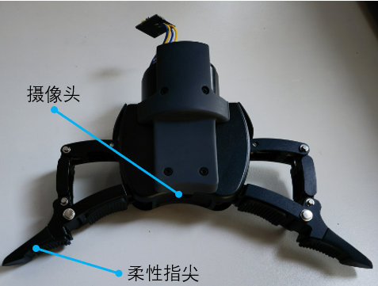

## 灵巧手（选配）

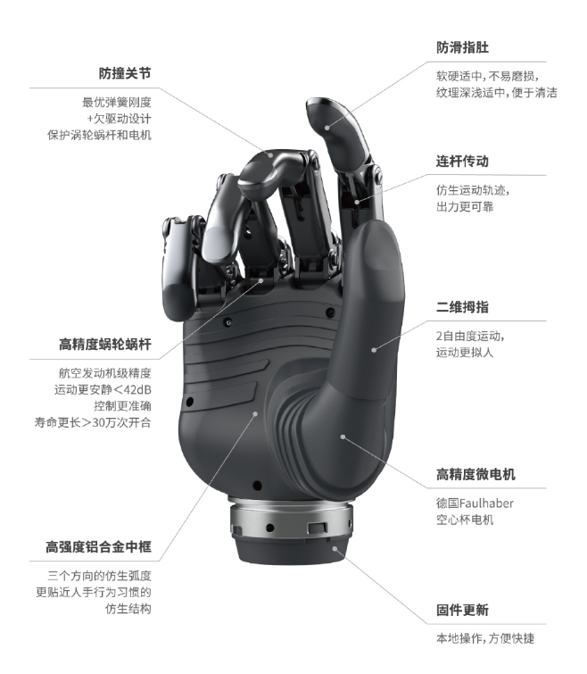
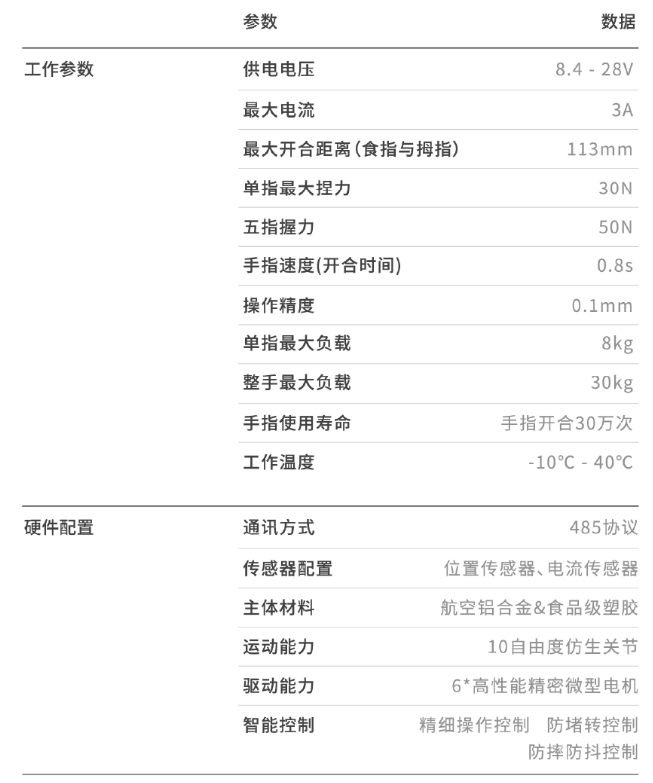

灵巧手产品说明手册：[app.brainco.cn/universal/stark-serialport-prebuild/docs/BC4-0100114095_20240521.pdf](https://app.brainco.cn/universal/stark-serialport-prebuild/docs/BC4-0100114095_20240521.pdf)

灵巧手官方文档网站：[灵巧手官方文档网站](https://www.brainco-hz.com/docs/revolimb-hand/guide/quick_start.html)