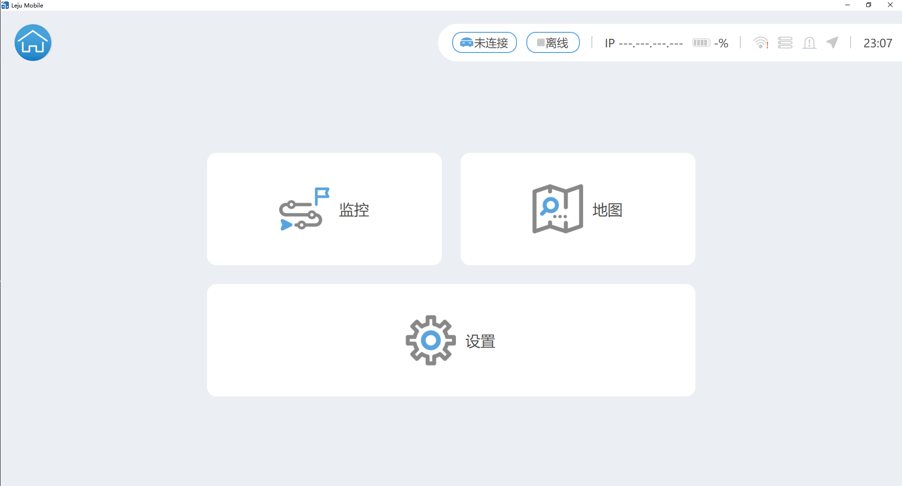
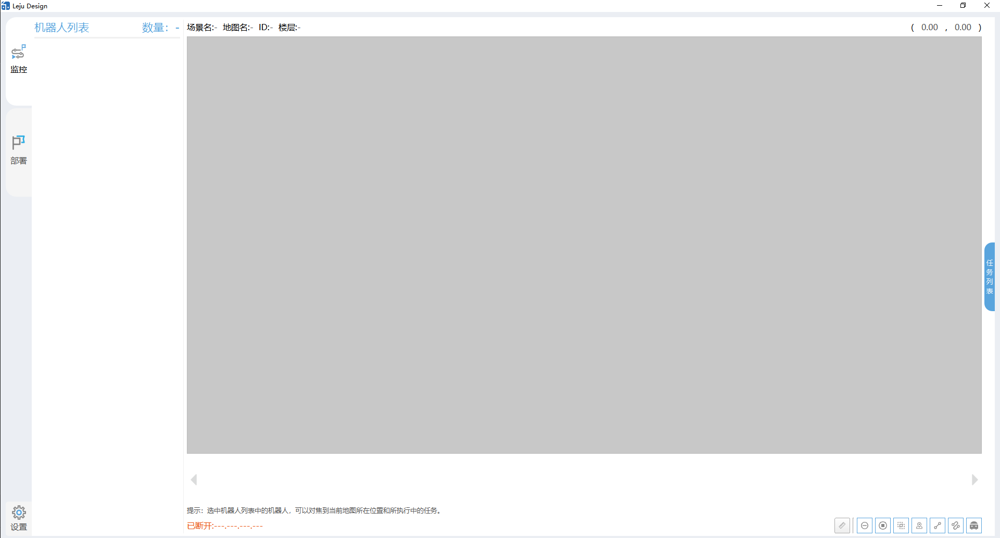

# 轮臂系列产品介绍
- [轮臂系列产品介绍](#轮臂系列产品介绍)
  - [说明](#说明)
  - [产品参数](#产品参数)
  - [配套软件](#配套软件)
  - [多机调度](#多机调度)
  - [开发接口](#开发接口)

## 说明
- 轮臂系列产品采用 `kuavo机器人上肢` + `轮式底盘` + `升降模组` 三合一模式组成，同时兼具人形上肢的灵活性以及轮式底盘的快速移动特点

   

## 产品参数

| 参数名称           | 参数值                          |
|--------------------|---------------------------------|
| 整机尺寸           | 699\*573\*1407mm                 |
| 整机自重           | 120kg                          |
| 高度升降           | 600mm垂直调节                  |
| 升降速度           | 0.15m/s                        |
| 头部自由度         | 2个                            |
| 手臂自由度         | 7个                            |
| 视觉感知传感器     | 2个(底盘1/头1)                 |
| 末端执行器负载     | 单只3kg                        |
| 驱动方式           | 四轮万向驱动                   |
| 导航方式           | 基于激光雷达的自主导航         |
| 导航最大速度       | 1.5m/s                         |
| 最小转弯半径       | 0mm(原地转弯)                  |
| 最小通过宽度       | 995mm                          |
| 续航时间           | ≥10h                           |
| 充电时间           | 2.5h                           |
| 充电方式           | 手动/自动                      |
| 爬坡角度           | 15°                            |
| 全局定位精度       | ±100mm/±3°                     |
| 二次定位精度       | ±5mm/±1°                       |
| 定位激光数量       | 2（2D双激光雷达，对角安装）    |
| 软件支持           | PC端、iPad端软件支持           |

## 配套软件

1. `Leju Mobile`
   - 下载链接：[软件下载链接](http://rustdesk.lejurobot.cn:8080/%E8%BD%AE%E8%87%82%E8%B5%84%E6%96%99/%E8%BD%AF%E4%BB%B6/)
   - 支持系统：安卓、windows
   

1. `Leju Design`
   - 下载链接：[软件下载链接](http://rustdesk.lejurobot.cn:8080/%E8%BD%AE%E8%87%82%E8%B5%84%E6%96%99/%E8%BD%AF%E4%BB%B6/)
   - 支持系统：windows
   

## 多机调度
- 底盘支持额外选配调度系统，实现多机任务智能调度，道路交管等功能

## 开发接口
- [轮臂基础使用](../5功能案例/轮臂案例/基础使用.md)