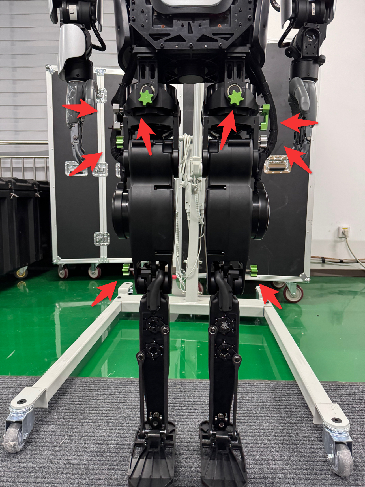
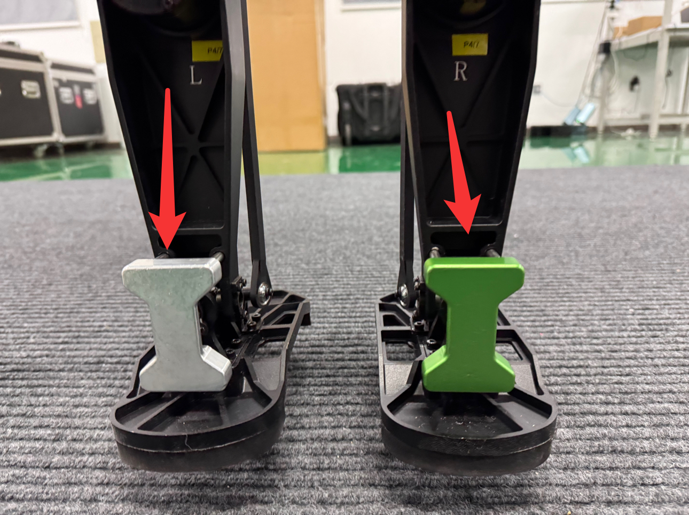
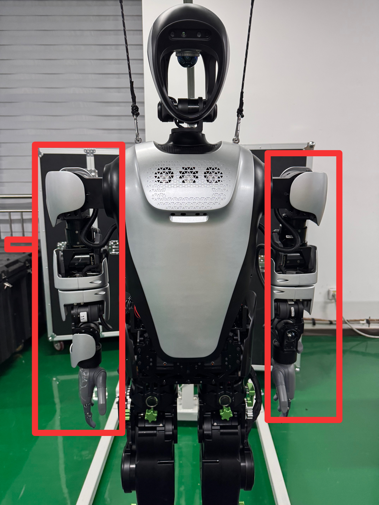
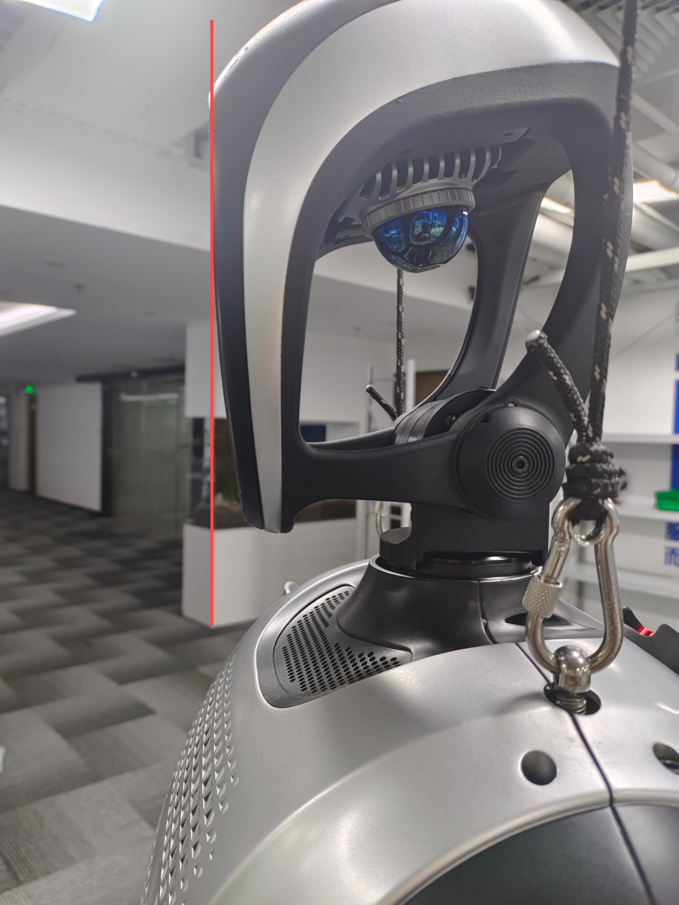

# 机器人关节标定

- [机器人关节标定](#机器人关节标定)
    - [零点校准](#零点校准)

### 零点校准

1. 请将工装插入机器人腿部, 如下图所示





2. 请将机器人手臂摆好，如下图所示



3. 摆好头部，头部左右居中，头部图示截面保持竖直



4. 启动机器人校准程序
新建终端
```bash
cd ~/kuavo-ros-opensource
sudo su
source devel/setup.bash
roslaunch humanoid_controllers load_kuavo_real.launch cali:=true cali_leg:=true cali_arm:=true
```

如果只需要校准手臂，则使用以下命令
新建终端
```bash
cd ~/kuavo-ros-opensource
sudo su
source devel/setup.bash
roslaunch humanoid_controllers load_kuavo_real.launch cali:=true cali_arm:=true
```

4. 在使能完腿部电机后(打印出如下图的位置之后), 零点校准之前电机运动可能会超出限位(如果没超出限位， 则按 `c` 加回车，保存腿部当前位置作为零点)

```bash
0000003041: Slave 1 actual position 9.6946716,Encoder 63535.0000000
0000003051: Rated current 39.6000000
0000003061: Slave 2 actual position 3.9207458,Encoder 14275.0000000
0000003071: Rated current 11.7900000
0000003081: Slave 3 actual position 12.5216674,Encoder 45590.0000000
0000003091: Rated current 42.4300000
0000003101: Slave 4 actual position -37.2605896,Encoder -244191.0000000
0000003111: Rated current 42.4300000
0000003121: Slave 5 actual position 15.8138275,Encoder 207275.0000000
0000003131: Rated current 8.4900000
0000003142: Slave 6 actual position -2.7354431,Encoder -35854.0000000
0000003151: Rated current 8.4900000
0000003161: Slave 7 actual position 5.8642578,Encoder 38432.0000000
0000003171: Rated current 39.6000000
0000003183: Slave 8 actual position -16.8491821,Encoder -61346.0000000
0000003192: Rated current 11.7900000
0000003201: Slave 9 actual position -18.9975585,Encoder -69168.0000000
0000003211: Rated current 42.4300000
0000003221: Slave 10 actual position -64.5283508,Encoder -422893.0000000
0000003231: Rated current 42.4300000
0000003241: Slave 11 actual position -31.0607147,Encoder -407119.0000000
0000003251: Rated current 8.4900000
0000003261: Slave 12 actual position 49.7427368,Encoder 651988.0000000
0000003272: Rated current 8.4900000
0000003281: Slave 13 actual position 26.8544311,Encoder 97774.0000000
0000003291: Rated current 14.9900000
0000003301: Slave 14 actual position -19.9171142,Encoder -72516.0000000
0000003311: Rated current 14.9900000
```

5. 将所有的 `Slave xx actual position ` 后的数字值记录到 `~/.config/lejuconfig/offset.csv` 文件中

⚠️ 注意：

- 如果机器人行走偏左，增大 `offset.csv` 文件中 1 号的值，每次修改幅度为0.5
- 如果机器人行走偏右，减少 `offset.csv` 文件中 7 号的值，每次修改幅度为0.5
- 如果机器人行走重心很低，请重新确认机器人质量后，重新执行设置机器人质量步骤