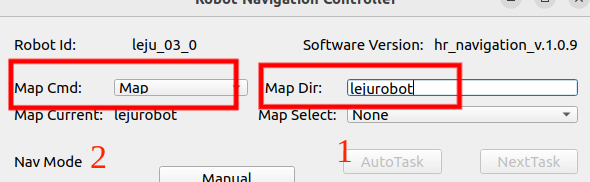
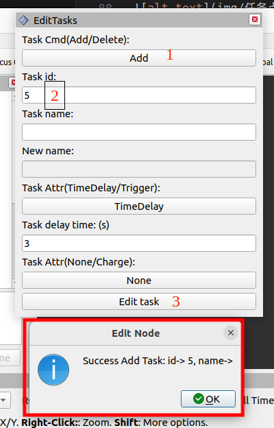

- [机器人导航案例](#机器人导航案例)
- [Kuavo 上位机导航程序编译手册](#kuavo-上位机导航程序编译手册)
  - [程序编译](#程序编译)
    - [1、获取代码](#1获取代码)
    - [2、导航功能包编译](#2导航功能包编译)
    - [3、添加source环境变量](#3添加source环境变量)
- [Kuavo 上位机导航GUI界面使用手册](#kuavo-上位机导航gui界面使用手册)
  - [GUI界面](#gui界面)
    - [1、程序启动](#1程序启动)
    - [2、GUI界面简介](#2gui界面简介)
    - [3、机器人系统信息显示模块](#3机器人系统信息显示模块)
    - [4、地图管理模块](#4地图管理模块)
      - [4.1 建图指令](#41-建图指令)
      - [4.2 当前地图名称](#42-当前地图名称)
      - [4.3 地图切换](#43-地图切换)
      - [4.4 地图删除](#44-地图删除)
    - [5、任务管理模块](#5任务管理模块)
      - [5.1 任务执行控制](#51-任务执行控制)
      - [5.2 当前任务状态](#52-当前任务状态)
      - [5.3 机器人基本信息](#53-机器人基本信息)
- [Kuavo 上位机导航程序建图与导航使用手册](#kuavo-上位机导航程序建图与导航使用手册)
  - [1、建图](#1建图)
    - [1.1 程序启动](#11-程序启动)
    - [1.2 建图步骤](#12-建图步骤)
    - [1.3 路径与路径点设置步骤](#13-路径与路径点设置步骤)
      - [1.3.1 路径点设置](#131-路径点设置)
        - [界面操作](#界面操作)
        - [使用代码操作](#使用代码操作)
      - [1.3.2 路径设置](#132-路径设置)
        - [界面操作](#界面操作-1)
        - [代码操作](#代码操作)
    - [1.4 任务点设置步骤](#14-任务点设置步骤)
        - [界面操作](#界面操作-2)
        - [代码操作](#代码操作-1)
  - [2、导航](#2导航)
    - [2.1 RVIZ 界面导航](#21-rviz-界面导航)
    - [2.2 任务点导航](#22-任务点导航)
      - [界面操作](#界面操作-3)
      - [代码操作](#代码操作-2)
- [导航接口说明手册](#导航接口说明手册)
  - [1、地图功能](#1地图功能)
    - [1.1 建图及地图管理指令](#11-建图及地图管理指令)
      - [MappingSrv.srv 定义](#mappingsrvsrv-定义)
    - [1.2 地图信息显示](#12-地图信息显示)
    - [1.3 机器人地图文件及列表获取](#13-机器人地图文件及列表获取)
      - [1.3.1 地图文件](#131-地图文件)
      - [1.3.2 获取地图列表](#132-获取地图列表)
      - [MapLists.msg 定义](#maplistsmsg-定义)
    - [1.4 数据包离线建图](#14-数据包离线建图)
    - [1.5 切换当前使用地图](#15-切换当前使用地图)
      - [SetParamsSrv.srv 定义](#setparamssrvsrv-定义)
  - [2、定位功能](#2定位功能)
    - [2.1 初始化定位](#21-初始化定位)
      - [2.1.1 初始化定位指令](#211-初始化定位指令)
      - [InitPose.msg 定义](#initposemsg-定义)
      - [Pose3D.msg 定义](#pose3dmsg-定义)
      - [2.1.2 使用 Rviz 初始化](#212-使用-rviz-初始化)
    - [2.2 定位实时信息显示](#22-定位实时信息显示)
    - [2.3 定位状态](#23-定位状态)
    - [2.4 关闭初始化定位](#24-关闭初始化定位)
  - [3、 路径编辑](#3-路径编辑)
    - [3.1 节点编辑](#31-节点编辑)
      - [3.1.1 编辑节点](#311-编辑节点)
      - [EditNode.srv 定义](#editnodesrv-定义)
      - [3.1.2 使用图像像素编辑节点](#312-使用图像像素编辑节点)
    - [3.2 道路编辑](#32-道路编辑)
      - [EditRoute.srv 定义](#editroutesrv-定义)
    - [3.3 当前道路信息](#33-当前道路信息)
  - [4、任务点编辑和测试](#4任务点编辑和测试)
    - [4.1 任务点编辑](#41-任务点编辑)
      - [4.1.1 编辑任务点](#411-编辑任务点)
      - [EditTask.srv 定义](#edittasksrv-定义)
      - [4.1.2 使用图像像素编辑节点](#412-使用图像像素编辑节点)
    - [4.2 当前地图任务点列表](#42-当前地图任务点列表)
      - [TaskNodes.msg 定义](#tasknodesmsg-定义)
  - [5、导航功能](#5导航功能)
    - [5.1 导航输出](#51-导航输出)
      - [5.1.1 规划路径输出](#511-规划路径输出)
      - [5.1.2 控制指令输出](#512-控制指令输出)
      - [5.1.3 障碍物状态输出](#513-障碍物状态输出)
    - [5.2 任务点导航](#52-任务点导航)
      - [SetTaskSrv.srv 定义](#settasksrvsrv-定义)


# 机器人导航案例
- 机器人导航案例包括功能有：雷达slam建图、路线规划、定位与导航、停障


# Kuavo 上位机导航程序编译手册
## 程序编译

### 1、获取代码

```bash
git clone https://www.lejuhub.com/ros-application-team/kuavo_ros_navigation.git 
或 
git clone ssh://git@www.lejuhub.com:10026/ros-application-team/kuavo_ros_navigation.git
```

### 2、导航功能包编译

* **注：若非第一次编译，需删使用命令 `sudo rm -rf build devel` 除编译文件**

* 使用以下命令编译即可

```bash
cd ~/kuavo_ros_navigation/
catkin_make
```

### 3、添加source环境变量

* **注：若~/.bashrc中已有该部分环境变量，可不用执行下述操作**

```bash
echo "# kuavo_ros_navigation 
source ~/kuavo_ros_navigation/devel/setup.bash --extend" >> ~/.bashrc
```

# Kuavo 上位机导航GUI界面使用手册

## GUI界面

### 1、程序启动

```bash
roslaunch dx_chassis_manager dx_chassis_manager.launch
```
```bash
roslaunch nav_gui nav_gui.launch 
```

### 2、GUI界面简介

* 程序启动以后出现以下界面

  

* 定位导航 GUI 界面是基于《定位导航系统 API 定义》里的 API 接口，开发的一款集地图管理、任务管理和图片保存功能的 GUI 界面，目的是方便快速测试机器人的功能，省去命令终端手敲命令行的烦恼。

  
* 其中导航 GUI 界面整体布局：黄色为机器人系统信息显示模块，红色为地图管理模块，绿色为任务管理模块

### 3、机器人系统信息显示模块

* 该部分连接机器人信息，显示机器人的ID以及机器人导航系统的版本号

  

### 4、地图管理模块

* 该部分为地图管理模块，主要功能有：建图指令、地图保存指令、设置机器人当前地图等

  

#### 4.1 建图指令
* 建图命令框，map cmd 中有以下类选项：

  

* 其中 
```bash
    --- None：无动作
    --- Map：新建地图
    ---MapAndRecord： 新建地图的同时记录 rosbag 包
    ---Save：保存新建的地图，然后自动切换为导航模式，并使用新建的地图
    ---Delete：删除地图
```
* 地图路径（地图名称）,该路径为地图的相对路径，地图基路径为 “/home/kuavo/maps” 
* 例：因此当地图名称为 “test” 时，机器人的地图绝对路径为 “/home/kuavo/maps/test” ，当地图名称缺省时，机器人地图绝对路径为“/home/drivex/maps”
* 建图之前，可以在 Map Dir 中输出此次建立地图的名称。例如我想要建立名为 lejurobot 的地图，可以在 Map Dir 中输入lejurobot

  
* 地图建立完成以后，在 map cmd 中，选择 Save 保存地图

  

#### 4.2 当前地图名称
* 在Map Current 标签中，可以看到机器人当前使用的地图名称 map cmd 中

  

#### 4.3 地图切换
* “Map Select” 下拉列表里是机器人内存储的所有有效地图名称列表，点击并选择相应条目，即可实现地图的切换。

  

#### 4.4 地图删除
* 首先，”Map Dir”栏里输入要删除的地图名称，如“test”，然后，“Map Cmd”下拉列表里选择“Delete”指令，删除指定地图

  
* 注意：为了防止定位程序出错，不允许删除当前使用的地图，也即“Map Current”栏显示的地图，否则会弹出警告信息，如果确实要删除该地图请先切换到其它地图，然后再重新执行删除

### 5、任务管理模块
* 任务管理模块主要由任务执行控制、当前任务状态显示和机器人基本信息三部分组成

  

#### 5.1 任务执行控制
* 按钮“Manual/Auto”：模式切换手动/自动运行任务
* 按钮“AutoTask”：开始执行自动任务
* 按钮“NextTask”：强制开始下一个任务
* 下拉列表“ManualTask”：手动选择要执行的任务

#### 5.2 当前任务状态
* Task id – 当前正在执行任务的 id 号
* Time delay – 当前任务点到达之后的等待时间，单位：s，当 time delay 大于 0 时，机器人到达该目标点之后等待时间超过 time delay 之后就会自动执行下一个任务点，当 time delay 小于 0 时，机器人将一直等待直到其它节点下发下一个任务点。
* Task State: 执行当前任务点的状态如下：
    1. IDEL – 机器人未执行任何任务
    2. FOLLOW – 机器人正在执行当前任务，且机器人离目标点较远
    3. ARRVING – 机器人正在执行当前任务，且机器人离目标点较近，此时机器人会降速
    4. ADJUSTDIRECTION – 机器人正在执行当前任务，机器人位置已经到达，正在调整航向角
    5. ARRIVED – 机器人成功到达目标点，机器人停止，直至下一个任务下发
    6. FAIL—机器人到达目标点失败，机器人停止，直至下一个任务下发

#### 5.3 机器人基本信息

* Robot vel-> 机器人实时速度信息：
  - vx(m/s): 行驶线速度（前后），前向为正，单位:m/s
  - vy(m/s): 行驶角速度（左右），左向为正，单位:m/s
  - wz(rad/s): 行驶角速度，逆时针为正，单位: rad/s

# Kuavo 上位机导航程序建图与导航使用手册

## 1、建图

### 1.1 程序启动

* **启动导航程序之前确保程序已经编译**

```bash
roslaunch dx_chassis_manager dx_chassis_manager.launch
```

```bash
roslaunch nav_gui nav_gui.launch
```

### 1.2 建图步骤

* 在GUI界面中，在 Map Dir 中添加本次建图的名称，然后将 Map Cmd 中切换为 Map ，之后打开 RVIZ ， 移动机器人进行建图

  

* RVIZ 建图界面

  

* 建图完成以后，在GUI界面 Map Cmd 中切换为 Save 保存地图

  

* 之后RVIZ界面效果如下图所示

  

### 1.3 路径与路径点设置步骤

* 地图建立完成以后，需要编辑道路，即告诉机器人哪部分道路为可行使区域。同理我们现实的道路，城市与城市之间通过道路相连，这就是道路（路径），城市就是路径点。

* 导航采用基于道路的搜索方式，道路包含包含连通关系（节点之间的连通）、道路宽度、道路最大限速、通行状态（正常/禁止通行）。编辑道路主要分为两个步骤：节点编辑和道路属性编辑。道路、节点和任务点都可以进行增加和删除操作，当新增节点/道路/任务点 id 与旧的相同时会对旧的站点/道路/任务点进行覆盖。

#### 1.3.1 路径点设置

* 路径点设置分为有两种操作方式：

##### 界面操作

* 在RVIZ界面左上角点击 panels -> add new panel -> Route 进入路径点编辑界面，其中红色部分为路径编辑，黄色部分为路径点编辑

  

  

  

* 可以拖动“Route”插件到任意位置

  

  

* 1、设置编辑命令，点击“Node Cmd（Add/Delete）”下方按钮，按钮显示会在“Add”和“Delete”之间切换，显示值即为当前命令状态；注意：当命令为“Add”时节点 ID 已存在时，会覆盖原来节点信息；

* 2、设置编辑的节点 ID，在“Target Node id:”下方输入框内输入节点 ID（>=0），当编辑完一个节点后，输入框内 ID 编号会自动+1，如果显示值与目标值一致则无需更改；

* 3、设置节点任务属性， 点击 “Node Attr Task（ None/Charge ）” 下方按钮 ，按钮显示会在“None“ 和“Charge”之间切换，同样显示值即为当前属性状态；

* 4、当设置完以上三项且确认机器人开到目标位姿后，点击“Edit Node”按钮，命令执行完后会弹出一条消息框，提示当前命令执行状态，阅读确认后请关闭消息框。

  

* 添加路径点示例

  

  

* 删除路径点示例

  

##### 使用代码操作

* 调用 /srv_edit_node 服务增加还是删除路径点

```bash
rosservice call /srv_edit_node "{cmd: '', id_node: 0, attr_task: '', x: 0.0, y: 0.0, theta: 0.0}"
```

* 增加或删除道路点使用说明，在 cmd 中输入 Add 或 Delete 选择此次是增加还是删除路径点，在 id_node 中输入此次操作的 id ，在 attr_task 部分可选择默认，在 x: 0.0, y: 0.0, theta: 0.0 中输入此次操作路径点的位置，以下是示例以及操作成功的提示（红色部分为路径点添加示例，黄色部分为添加成功示例）：

  

#### 1.3.2 路径设置

* 路径点设置完成以后，需要将路径点相连形成道路（即机器人可行使区域）

##### 界面操作

* 1、设置编辑命令，点击“Route Cmd（Add/Delete）”下方按钮，按钮显示会在“Add”和“Delete”之间切换，显示值即为当前命令状态；注意：当命令为“Add”时道路 ID 已存在，则覆盖原来道路信息；

* 2、设置编辑道路 ID，点击“Target Route id:”下方输入框内输入想要编辑的道路 ID，当编辑完一个道路后，输入框内 ID 编号会自动+1，如果显示值与目标值一致则无需更改；

* 3、设置道路形状属性，点击“Route Type（ Line/Circle）:”下方按钮，按钮显示会在 “Line”和“Circle”之间切换，显示值即为当前属性；

* 4、输入组成道路的节点 ID，分别在“node1 id:”、“node2 id:”和“node3 id:”输入栏中输入相应 ID 值。注意：当命令为“Delete”时，此处设置无效，可以不填；当命令为“Add”，形状属性为“Line”时，1 和 2 分别为直线起点和终点 ID，3 可以缺省；当命令为“Add”，形状属性为“Circle”时，1 和 3 为圆弧起点和终点， 2 为圆弧上其它任意一点（建议选在圆弧中间附近）

* 5、设置编辑道路属性，点击“Traffic Attribute（None/Forbidden）”下方按钮，按钮显示值会在“None”和“Forbidden”之间切换，显示值即为当前属性值；

* 6、设置道路宽度，在“Route Width（m） >= 0.4:”下方输入框内输入道路宽度，单位：m，输入数值必须>=0.4（当数值小于 0.4 时会弹出错误提示框，请关闭提示框后输入有效值）；

* 7、设置道路上机器人最大速度，在“max speed(m/s) >= 0.1:”下方输入框内输入机器人在该道路段最大速度，单位：m/s，输入值必须>=0.1（当数值小于 0.1 时会弹出错误提示框，请关闭提示框后输入有效值）；

* 8、确认以上步骤的设置无误后，点击按钮“Edit Route”，命令执行完会弹出一条消息框，提示当前命令执行状态，阅读确认后请关闭消息框。

* 示例：增加道路 5：起点->1，终点->2，通行状态->正常，道路宽度->2.0m，最大速度->0.6m/s，则编辑框和消息提示框如图

  

* 删除道路示例

  

* 道路宽度说明：道路生成以后可以为其设置道路宽度。例如在道路点2与道路点3之间生成一条路径，可以为该路径设置宽度与最大速度，即在建立道路时在 Route Width 中设置道路宽度(可根据实际宽度设置)，在RVIZ中看到的蓝色线为道路中心线，道路宽度则在该中心线两边各平分一半，道路边界是虚拟的，不会显示出来。假设该道路宽度为2m,即在蓝色线两边各延伸1米。

  

* 道路最大速度说明：道路生成以后可以为其设置最大速度，即限制当前道路机器人的速度。例如设置最大速度为 0.6m/s， 则导航时，机器人在该道路上的最大速度就不会操作 0.6m/s。

* 另外限制机器人的最大速度有两部分，第一部分为道路限速，第二部分为机器人配置文件(src/hr_nav_controller/00_contoller/dx_chassis_manager/cfg/leju_03/params_motion_control.yaml)限速，两则限速取最低。例如道路限速为 0.6m/s，机器人配置文件限速为 0.4m/s, 则在行使时的最大速度则为 0.4m/s，总之机器人的最终速度取决于两则最低速度。


##### 代码操作

* 调用 /srv_edit_route 服务增加还是删除路径

```bash
rosservice call /srv_edit_route "{cmd: '', id_route: 0, type_route: '', id_node1: 0, id_node2: 0, id_node3: 0, attr_traffic: '',
  width: 0.0, max_speed: 0.0}" 
```

* 增加或删除道路使用说明，在 cmd 中输入 Add 或 Delete 选择此次是增加还是删除路径，在 id_node1 与 id_node2 中输入此次操作的 id ,id_node3不输入任何值，在 attr_traffic 部分可选择默认，在 width 中输入当前路径的宽度，在 max_speed 中输入当前道路的最大速度，以下是示例以及操作成功的提示：

  

### 1.4 任务点设置步骤

* 可以通过设置任务点让机器人到达指定位置完成指定任务

##### 界面操作

* 在RVIZ界面左上角点击 panels -> add new panel -> EditTasks 然后点击右下方“OK”，在 Rviz 左侧列表中将出现“EditTasks”插件，如果需要挪动“EditTasks”插件位置，可以鼠标光标放置在插件上方灰色区域。单击鼠标左键拖动到任意位置。进入任务点编辑界面

  

* 1、设置编辑命令，点击“Task Cmd（Add/Delete）”下方按钮，按钮显示会在“Add”和“Delete”之间切换，显示值即为当前命令状态；注意：当命令为“Add”时节点 ID 已存在时，会覆盖原来节点信息；

* 2、设置编辑的任务 ID，在“Task id:”下方输入框内输入节点 ID（>=0），当编辑完一个节点后，输入框内 ID 编号会自动+1，如果显示值与目标值一致则无需更改；

* 3、设置节点任务属性，点击“Task Attr（None/Charge）”下方按钮，按钮显示会在“None“ 和“Charge”之间切换，同样显示值即为当前属性状态；

* 4、当设置完 a.b.c 三项且确认机器人开到目标位姿后，点击“Edit Node”按钮，命令执行完后会弹出一条消息框，提示当前命令执行状态，阅读确认后请关闭消息框。

  

* 删除任务点与重命名任务点上述操作相似

  

##### 代码操作

* 调用 /srv_edit_task 服务增加、删除、重命名任务点

```bash
rosservice call /srv_edit_task "{cmd: '', name_task: '', id_task: 0, attr_task: '', name_new: '', time_delay: 0.0,
  x: 0.0, y: 0.0, theta: 0.0}" 
```

* 增加或删除道路使用说明，在 cmd 中输入 Add 或 Delete 或在 ReName 选择此次是增加、删除还是重命名任务点，在 id_task 中输入此次操作的 id ,在 x: 0.0, y: 0.0, theta: 0.0 中输入任务点坐标，其他均可选择默认，以下是示例以及操作成功的提示：

  

## 2、导航

* 注意：导航目标点和当前点必须在道路网范围内

### 2.1 RVIZ 界面导航

* 在 RVIZ 界面中 使用 2D nav Goal 完成目标点设置，目标点设置完成以后就会出现路径规划（即绿色的线）

  

  

### 2.2 任务点导航

#### 界面操作

* 任务点设置完成以后，可以在界面中导航去对应的任务点，即在 manualtask 中选择要去的任务点，选择完成以后机器人就会导航到该位置。

  

#### 代码操作

* 调用 /srv_set_task 服务增加、删除、重命名任务点

```bash
rosservice call /srv_edit_task "{cmd: '', name_task: '', id_task: 0, attr_task: '', name_new: '', time_delay: 0.0,
  x: 0.0, y: 0.0, theta: 0.0}" 
```


# 导航接口说明手册

## 1、地图功能

### 1.1 建图及地图管理指令

**功能：** 建立三维地图  
**名称：** `/srv_mapping`  
**格式：** `dx_nav_common/MappingSrv`

#### MappingSrv.srv 定义

| 类别     | 格式      | 名称       | 说明 |
|----------|-----------|------------|------|
| Request  | string     | cmd_attr   | 命令（Map/MapAndRecord/Record/Cancel/Save/Delete），Map—建图，MapAndRecord—建图同时录数据，Record—录数据，Cancel—取消建图/录数据，Save—保存（结束）建图/录数据，Delete—删除地图 |
|          | string     | map_dir    | 地图名称 |
|          | string     | bag_name   | 数据名称（缺省则用时间命名） |
|          | float32    | map_resolution | 地图分辨率/m |
| Response | string     | cmd_res    | 返回 server 接收到的命令 |
|          | int32      | state_execute | 命令执行状态 |
|          | string     | map        | 地图名称 |
|          | string     | bag        | bag 数据名称 |
|          | string     | info       | 反馈信息 |

### 1.2 地图信息显示

- **实时地图输出**
    - **名称：** `/map_3d`
    - **格式：** `sensor_msgs::PointCloud2`
  
- **实时 2D 地图输出**
    - **名称：** `/map_2d`
    - **格式：** `nav_msgs::OccupancyGrid`
  
- **匹配点云输出**
    - **名称：** `/lidar_pts_matched`
    - **格式：** `sensor_msgs::PointCloud2`
  
- **机器人实时位姿**
    - **名称：** `/fuse_pose_lidar_link`
    - **格式：** `nav_msgs::Odometry`

### 1.3 机器人地图文件及列表获取

#### 1.3.1 地图文件

地图文件存储路径：`~/maps/map_name`

- 地图点云：`map.pcd`
- 建图轨迹点云：`trajectory.pcd`
- 2D 地图图片：`map_2d.pgm`
- 2D 地图解析文件：`map_2d.yaml`（注意内含 `map_2d.pgm` 的绝对路径）

如果有录数据包：`***.bag`

#### 1.3.2 获取地图列表

**功能：** 获取机器人地图列表信息  
**名称：** `/map_lists`  
**格式：** `dx_nav_common/MapLists`

#### MapLists.msg 定义

| 格式       | 名称   | 说明 |
|------------|--------|------|
| Header     | header | 消息头 |
| string[]   | maps   | 地图列表：其中信息为地图名称 `map_name`；地图完整路径为基础路径：`/home/user_name/maps/ + map_name`；“/”表示基础路径 |

### 1.4 数据包离线建图

1. 启动建图程序，`test` 改成自己的地图名
    ```bash
    roslaunch hr_slam sim_mapping.launch map_dir:=/home/robodriver/maps/test
    ```

2. 播放 rosbag
    ```bash
    rosbag play --clock  *.bag
    ```

3. 保存地图
    ```bash
    rosservice call /srv_save_map "data: true"
    ```
    如果返回：
    ```
    success: True
    message: ''
    ```
    说明保存 3D 地图成功

4. 3D 地图转换为 2d 地图
    ```bash
    roslaunch dx_chassis_manager pcd_to_map_2d.launch map_dir:=/home/robodriver/maps/test
    ```
    生成 `map_2d.pgm` 和 `map_2d.yaml`

### 1.5 切换当前使用地图

**功能：** 初始化机器人位姿  
**名称：** `/srv_set_params`  
**格式：** `dx_nav_common/SetParamsSrv`

#### SetParamsSrv.srv 定义

| 类别     | 格式      | 名称        | 说明 |
|----------|-----------|-------------|------|
| Request  | string     | map_dir     | 使用地图文件夹地址 |
|          | float32    | vel_max_linear | 机器人最大线速度，单位：m/s |
|          | float32    | vel_max_angular | 机器人最大角速度，单位：rad/s |
|          | string     | method_nav  | 导航方法（暂未开启） |
|          | string     | method_obstacle_avoid | 避障方法 (Stop/Detour/None)，Stop—停止，Detour—绕障，None—忽略障碍物 |
| Response | string     | cur_map_dir | 当前值 |
|          | float32    | cur_vel_max_linear | 当前值 |
|          | float32    | cur_vel_max_angular | 当前值 |
|          | string     | cur_method_nav | 当前值 |
|          | string     | cur_method_obstacle_avoid | 当前值 |
|          | string     | info         | 反馈信息 |

```bash
rosservice call /srv_set_params "{map_dir: 'map_name', vel_max_linear: 0.0, vel_max_angular: 0.0, method_nav: '', method_obstacle_avoid: ''}"
```

## 2、定位功能

### 2.1 初始化定位

#### 2.1.1 初始化定位指令


**功能：**  初始化机器人位姿

**名称：**  `/init_pose`  

**格式：**  `dx_nav_common/InitPose`

#### InitPose.msg 定义

| 格式   | 名称          | 说明 |
|--------|---------------|------|
| string | method         | 初始化方法（Manual/RTK/GPS/Station），Manual—手动初始化，RTK—使用RTK初始化，GPS—使用GPS初始化，Station—使用地图任务点初始化 |
| Pose3D | pose           | 初始化位姿，手动时有效（格式详见下表） |
| int32  | station_id     | 节点ID，使用Station初始化时有效 |
| string | station_name   | 站点名称，使用Station初始化时有效且station_id <= 0 时候有效 |

#### Pose3D.msg 定义

| 格式     | 名称    | 说明 |
|----------|---------|------|
| float32  | x       | 3D 位姿：x/y/z – 位置，单位：m；roll/pitch/yaw – 姿态，单位: rad |
| float32  | y       | |
| float32  | z       | |
| float32  | roll    | |
| float32  | pitch   | |
| float32  | yaw     | |

#### 2.1.2 使用 Rviz 初始化

说明：绿色建图的根部表示机器人的位置，箭头朝向代表机器人的方向。


### 2.2 定位实时信息显示

- **实时地图输出**
    - **名称：** `/map_3d`
    - **格式：** `sensor_msgs::PointCloud2`
  
- **实时 2D 地图输出**
    - **名称：** `/map_2d`
    - **格式：** `nav_msgs::OccupancyGrid`
  
- **匹配点云输出**
    - **名称：** `/lidar_pts_matched`
    - **格式：** `sensor_msgs::PointCloud2`
  
- **实时位姿输出**
    - **名称：** `/fuse_pose_lidar_link`
    - **格式：** `nav_msgs::Odometry`
    - **频率：** 100~110hz

### 2.3 定位状态

**功能：** 机器人定位状态  
**名称：** `/state_location`  
**格式：** `std_msgs::Int32` (0 – None, 1 – Success, 2 – Localizing, 3 – Failure)

### 2.4 关闭初始化定位

**功能：** 关闭初始化定位  
**名称：** `/ignore_init_location`  
**格式：** `std_msgs::Bool` (true – 关闭初始化定位，false – 打开初始化定位)

## 3、 路径编辑

导航采用基于道路的搜索方式，道路包含连通关系（节点之间的连通）、道路宽度、道路最大限速、通行状态（正常/禁止通行）。编辑道路主要分为两个步骤：节点编辑和道路属性编辑。

道路、节点和任务点都可以进行增加和删除操作，当新增节点/道路/任务点ID与旧的相同时会对旧的站点/道路/任务点进行覆盖。

### 3.1 节点编辑

#### 3.1.1 编辑节点

**功能：** 编辑节点  
**名称：** `/srv_edit_node`  
**格式：** `dx_nav_common/EditNode`

#### EditNode.srv 定义

| 类别     | 格式     | 名称        | 说明 |
|----------|----------|-------------|------|
| Request  | string    | cmd         | 命令（Add/Delete），Add—增加节点，如果该节点已存在（id_node相同）则覆盖；Delete—删除节点 |
|          | int32     | id_node     | 节点ID编号（当数值<=0时，编辑器会从上一个编辑节点的ID往后查找，返回第一个未使用的ID） |
|          | string    | attr_task   | 节点属性（None/Charge），None—普通节点，Charge—充电节点 |
|          | float32   | x           | 节点的x坐标值（删除节点时可缺省），单位：m |
|          | float32   | y           | 节点的y坐标值（删除节点时可缺省），单位：m |
|          | float32   | theta       | 节点的theta角度（删除节点时可缺省），单位：rad |
| Response | string    | cmd_res     | 返回server接收到的命令 |
|          | int32     | state       | 当>=0时，返回编辑节点的id；-1 –表示编辑节点失败 |
|          | string    | info        | 反馈信息 |

#### 3.1.2 使用图像像素编辑节点

**名称：** `/srv_edit_node_from_pixel`  
**格式：** `dx_nav_common/EditNode`

### 3.2 道路编辑

**功能：** 编辑节点  
**名称：** `/srv_edit_route`  
**格式：** `dx_nav_common/EditRoute`

#### EditRoute.srv 定义

| 类别     | 格式     | 名称        | 说明 |
|----------|----------|-------------|------|
| Request  | string    | cmd         | 命令（Add/Delete），Add—增加节点，如果该节点已存在（id_node相同）则覆盖；Delete—删除节点 |
|          | int32     | id_route    | 道路ID编号（当数值<=0时，编辑器会从上一个编辑道路的ID往后查找，返回第一个未使用的ID） |
|          | string    | type_route  | 道路形状属性（Line/Circle），Line—直线道路，需要两个节点（id_node1和id_node2有效）；Circle—圆弧道路，需要三个节点都有效 |
|          | int32     | id_node1    | 道路起始节点ID编号（>=0） |
|          | int32     | id_node2    | 直线道路时终止节点ID编号，圆弧道路时的中间节点编号（>=0） |
|          | int32     | id_node3    | 圆弧道路的终止节点编号，（>=0） |
|          | string    | attr_traffic| 道路通行属性（None/Forbidden），None—正常道路，Forbidden—道路禁止通行 |
|          | float32   | width       | 道路宽度，单位：m |
|          | float32   | max_speed   | 道路最大通行速度，单位：m/s |
| Response | string    | cmd_res     | 返回server接收到的命令 |
|          | int32     | state       | 当>=0时，返回编辑道路的id；<0表示编辑失败：-1/-2/-3分别表示，id_node无效（不存在），-4—无效的宽度（负值或小于最小有效值0.4），-5—无效的最大速度（负值或小于最小有效值0.1） |
|          | string    | info        | 反馈信息 |

### 3.3 当前道路信息

**名称：** `/routes_stations`  
**格式：** `dx_nav_common/RoutesAndStations`

## 4、任务点编辑和测试

任务点为机器人要去执行任务的位姿点，包含任务点ID、任务属性（是否充电）、停顿时间（任务执行完到执行下一个任务间隔时间，负值表示下一个任务是事件触发机制）。

注意：任务点要部署在道路宽度范围内！否则无法规划和自主导航到达。

### 4.1 任务点编辑

#### 4.1.1 编辑任务点

**功能：** 编辑任务点  
**名称：** `/srv_edit_task`  
**格式：** `dx_nav_common/EditTask`

#### EditTask.srv 定义

| 类别     | 格式     | 名称        | 说明 |
|----------|----------|-------------|------|
| Request  | string    | cmd         | 命令 (Add/ReName/Delete)，Add—增加任务，如果该任务已存在（id_node相同）则覆盖；ReName—重命名；Delete—删除任务 |
|          | string    | name_task   | 任务点名称：用来标记和查找任务点，可以缺省（缺省时不能使用名称查找任务） |
|          | int32     | id_task     | 任务点ID编号（当数值<=0时，编辑器会从上一个编辑任务点的ID往后查找，返回第一个未使用的ID） |
|          | string    | name_new    | 修改后的新名称 |
|          | string    | attr_task   | 任务点属性（None/Charge），None—普通任务点，Charge—充电任务点 |
|          | float32   | time_delay  | 底盘执行任务后等待时间，单位：s，如果为负值，表示执行下个任务是触发机制，机器人将一直等待直至下一个任务下发 |
|          | float32   | x           | 任务点的x坐标值（删除节点时可缺省），单位：m |
|          | float32   | y           | 任务点的y坐标值（删除节点时可缺省），单位：m |
|          | float32   | theta       | 任务点的theta角度（删除节点时可缺省），单位：rad |
| Response | string    | cmd_res     | 返回server接收到的命令 |
|          | int32     | state       | 当>=0时，返回编辑任务点的id；-1 –表示编辑节点失败 |
|          | string    | info        | 反馈信息 |

#### 4.1.2 使用图像像素编辑节点

**名称：** `/srv_edit_task_from_pixel`  
**格式：** `dx_nav_common/EditTask`

### 4.2 当前地图任务点列表

**功能：** 当前地图任务点列表  
**名称：** `/task_nodes`  
**格式：** `dx_nav_common/TaskNodes`

#### TaskNodes.msg 定义

| 格式       | 名称   | 说明 |
|------------|--------|------|
| Header     | header | 消息头 |
| TaskInfo[] | tasks  | 当前地图任务列表，TaskInfo信息详见上表 |

## 5、导航功能

注意：导航目标点和当前点必须在道路网范围内。

### 5.1 导航输出

#### 5.1.1 规划路径输出

**名称：** `/route_plan_pose_array`  
**格式：** `geometry_msgs::PoseArray`

#### 5.1.2 控制指令输出

**名称：** `/cmd_vel_nav`  
**格式：** `geometry_msgs::Twist`  
**频率：** 约100hz

#### 5.1.3 障碍物状态输出

**名称：** `/state_obstacle`  
**格式：** `dx_nav_common::ObstaclesState`（自定义格式）

### 5.2 任务点导航

**功能：** 发布/取消任务点  
**名称：** `/srv_set_task`  
**格式：** `dx_nav_common/SetTaskSrv`

#### SetTaskSrv.srv 定义

| 类别     | 格式     | 名称        | 说明 |
|----------|----------|-------------|------|
| Request  | string    | cmd_attr    | 命令（New/Cancel），New—发布一个新的任务点，Cancel—取消任务点 |
|          | string    | task_attr   | 任务类型（None/Charge），None—普通任务，Charge—充电任务 |
|          | int32     | task_id     | 任务ID：当ID > 0时有效；当ID<=0时无效，此时使用pose_task信息 |
|          | Pose3D    | pose_task   | 任务点位姿（格式见上表） |
| Response | string    | cmd_res     | 返回server接收到的命令 |
|          | int32     | state_execute | 命令执行状态: 1—机器人当前位姿未知；2—当前位姿不在道路内；3—目标位姿不在道路内 |
|          | string    | info        | 反馈信息 |
