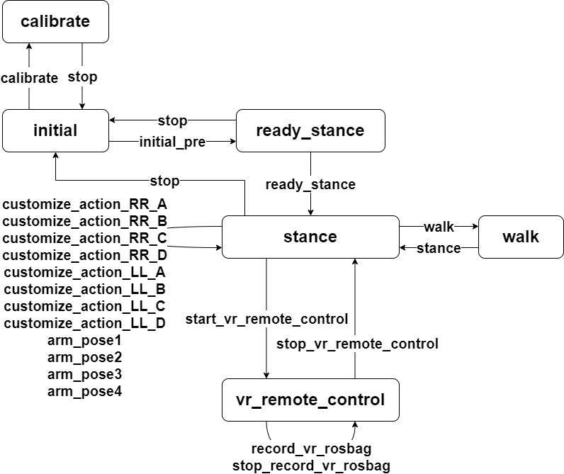

# H12遥控器使用开发案例

- [H12遥控器使用开发案例](#h12遥控器使用开发案例)
  - [1. 部署流程](#1-部署流程)
  - [2. 状态机概述](#2-状态机概述)
  - [3. 遥控器配置](#3-遥控器配置)

## 1. 部署流程

1. 执行部署脚本

    ⚠️ **注意: h12pro 遥控器的程序以及机器人程序，vr 程序都会使用部署时的 ROS_MASTER_URI 与 ROS_IP，请确保部署时的 ROS_MASTER_URI 与 ROS_IP 正确。确认ROS主从通信正确后再进行部署**

    1.1 下位机部署

      ```bash
      cd <kuavo-ros-opensource>
      git checkout beta
      cd <kuavo-ros-opensource>/src/humanoid-control/h12pro_controller_node/scripts
      sudo su
      ./deploy_autostart.sh
      ```

      执行后，会自动安装依赖，并启动 h12pro 遥控器程序。

    1.2 上位机部署

      ```bash
      cd <kuavo_ros_application>
      git checkout dev
      cd <kuavo_ros_application>/src/ros_audio/kuavo_audio_player/scripts
      ./deploy_autostart_h12pro.sh
      ```

      执行后会自动编译功能包，将h12遥控播放语音动作的服务设置为开机自启动并启动。根据终端中的提示选择y或n。


2. H12PRO 遥控器服务管理

- `ocs2_h12pro_monitor`服务位于下位机集成了遥控器节点和监控功能，会根据系统状态自动管理遥控器程序的启停。当用户手动启动机器人程序时，h12pro 遥控器程序会自动下线。

  开启服务：

  ```bash
  sudo systemctl start ocs2_h12pro_monitor.service
  ```

  关闭服务：

  ```bash
  sudo systemctl stop ocs2_h12pro_monitor.service
  ```

  开机自启动：

  ```bash
  sudo systemctl enable ocs2_h12pro_monitor.service
  ```

  关闭开机自启动：

  ```bash
  sudo systemctl disable ocs2_h12pro_monitor.service
  ```

  查看服务日志：

  ```bash
  sudo journalctl -u ocs2_h12pro_monitor.service -f
  ```

- `start_h12pro_play_node`服务位于上位机,将h12遥控器播放语音的相关服务设置成开机自启动。

3. 查看机器人程序运行 LOG

```bash
sudo su
tmux attach -t humanoid_robot
```

4. 检查遥控器数据是否正常

```bash
cd <kuavo-ros-opensource>
source devel/setup.bash
rostopic echo /h12pro_channel
```

5. 注意事项

- 由于`ocs2_h12pro_monitor`服务 priority 比较低, 如果用户**手动启动** `roslaunch humanoid_controllers load_kuavo_real.launch` 程序时，`ocs2_h12pro_node` 程序将会自动下线，直到用户结束机器人程序后， `ocs2_h12pro_node` 程序才会自动重新上线。
- 存在可能用户结束机器人程序后， `ocs2_h12pro_node` 仍然没有上线或者没响应，请先 `pkill ros` 或者 `sudo pkill ros` 结束所有 ros 进程后，再重新启动 `sudo systemctl restart ocs2_h12pro_monitor.service` 服务。
- 如果使用的是遥控器外接模块(一个接着遥控器接收器的 **USB 的设备**)去接收器遥控器的数据，请在机器人上电后大概20-30秒后，再将外接模块插到机器人上。
- 如果重启机器人 NUC 后，遥控器数据无法正常接收，请热插拔外接模块后再试。

## 2. 状态机概述

1. 基本状态

- `initial`: 初始状态(机器人 NUC 开机， 程序未启动状态)
- `calibrate`: 校准状态(启动机器人程序带上校正参数的状态)
- `ready_stance`: 准备姿态(启动机器人程序后，尚未站立的状态)
- `stance`: 站立姿态
- `walk`: walk 状态
- `vr_remote_control`: VR 遥控器控制状态

2. 状态转换流程图

    

- `Source` 表示当前机器人状态，上图中线段的起点
- `Trigger` 表示触发状态转换，上图中线段上的文字
- `Dest` 表示机器人目标状态，上图中线段箭头的终点


状态转换如下：

- 从 initial 状态:
   - `initial_pre` -> ready_stance
   - `calibrate` -> calibrate

- 从 ready_stance 状态:
   - `ready_stance` -> stance
   - `stop` -> initial

- 从 stance 状态:
   - `walk` -> walk
   - `arm_pose1/2/3/4` -> stance (手臂姿态控制)
   - `customize_action_RR/LL_A/B/C/D` -> stance (播放语音和动作)
   - `stop` -> initial
   - `start_vr_remote_control` -> vr_remote_control

- 从 walk 状态:
   - `stance` -> stance
   - `stop` -> initial

- 从 vr_remote_control 状态:
   - `stop_vr_remote_control` -> stance
   - `stop` -> initial
   - `record_vr_rosbag` -> vr_remote_control
   - `stop_record_vr_rosbag` -> vr_remote_control

## 3. 遥控器配置

1. 按键示意图

    

2. 状态转换按键组合

- Initial (机器人 NUC 开机， 程序未启动状态) 状态转换

| 目标状态 | 按键组合 | 开关位置 |
|---------|---------|---------|
| ready_stance | C_PRESS | E_LEFT + F_RIGHT |
| calibrate | D_PRESS | E_LEFT + F_RIGHT |

- Ready_stance (启动机器人程序后，尚未站立的状态) 状态转换

| 目标状态 | 按键组合 | 开关位置 |
|---------|---------|---------|
| stance | C_PRESS | E_LEFT + F_RIGHT |
| initial | C_LONG_PRESS + D_LONG_PRESS | 任意 |

- Calibrate (启动机器人程序带上校正参数的状态)状态转换

| 目标状态 | 按键组合 | 开关位置 |
|---------|---------|---------|
| initial | C_LONG_PRESS + D_LONG_PRESS | 任意 |

- Stance 状态转换

| 目标状态 | 按键组合 | 开关位置 |
|---------|---------|---------|
| walk | A_PRESS | E_MIDDLE + F_MIDDLE |
| arm_pose1 | A_PRESS | E_RIGHT + F_LEFT |
| arm_pose2 | B_PRESS | E_RIGHT + F_LEFT |
| arm_pose3 | C_PRESS | E_RIGHT + F_LEFT |
| arm_pose4 | D_PRESS | E_RIGHT + F_LEFT |
| customize_action_RR_A | A_PRESS | E_RIGHT + F_RIGHT |
| customize_action_RR_B | B_PRESS | E_RIGHT + F_RIGHT |
| customize_action_RR_C | C_PRESS | E_RIGHT + F_RIGHT |
| customize_action_RR_D | D_PRESS | E_RIGHT + F_RIGHT |
| customize_action_LL_A | A_PRESS | E_LEFT + F_LEFT |
| customize_action_LL_B | B_PRESS | E_LEFT + F_LEFT |
| customize_action_LL_C | C_PRESS | E_LEFT + F_LEFT |
| customize_action_LL_D | D_PRESS | E_LEFT + F_LEFT |
| start_vr_remote_control | A_LONG_PRESS | 任意 |
| initial | C_LONG_PRESS + D_LONG_PRESS | 任意 |

- Walk 状态转换

| 目标状态 | 按键组合 | 开关位置 |
|---------|---------|---------|
| stance | D_PRESS | E_MIDDLE + F_MIDDLE |
| initial | C_LONG_PRESS + D_LONG_PRESS | 任意 |


- VR_remote_control 状态转换

| 目标状态 | 按键组合 | 开关位置 |
|---------|---------|---------|
| stance  | B_LONG_PRESS | 任意 |
| initial | C_LONG_PRESS + D_LONG_PRESS | 任意 |
| record_vr_rosbag | C_PRESS | 任意 |
| stop_record_vr_rosbag | D_PRESS | 任意 |

**NOTE**

- 遥控器按键组合中，长按(LONG_PRESS)表示按键按下后持续保持按下状态，直到听到遥控器发出 “滴” 的一声
- 在Stance状态下`arm_pose`这4组目标状态仅支持自定义播放动作,其动作文件存放在 `/home/lab/.config/lejuconfig/action_files` 路径下，文件名格式为 `arm_pose1.tact`, `arm_pose2.tact`, `arm_pose3.tact`, `arm_pose4.tact`
- 手臂动作做完后，假设手臂没有回到初始位置，可以通过 E中+F中+D键，将手臂回到初始位置
- 在Stance状态下`customize_action`这8组目标状态支持自定义播放语音和动作,需修改下位机路径为`<kuavo-ros-control>/src/humanoid-control/h12pro_controller_node/config/customize_config.json`的配置文件中对应目标状态的`arm_pose_name`动作文件的文件名(不加后缀)以及`music_name`音频文件名(加后缀),并且需要将对应的音频文件放到上位机路径为`/home/kuavo/.config/lejuconfig/music`文件夹中,tact动作文件放到下位机路径为`/home/lab/.config/lejuconfig/action_files`文件夹中
- 进入 VR 遥控遥操作状态后，遥控器将不再响应遥控器按键组合（除了紧急停止按键组合和退出 VR 遥控遥操作按键组合），直到退出 VR 遥控遥操作状态
- VR 录制的 rosbag 文件存放在 `~/.log/vr_remote_control/rosbag` 路径下, 按照日期和时间命名
- VR 录制指定的话题配置文件存放在 `<kuavo-ros-opensource>/src/humanoid-control/h12pro_controller_node/config/record_topics.json` 路径下
- 指定录制的话题如下：
  - `/kuavo_arm_traj` #手臂关节值
  - `/control_robot_hand_position` #手指
  - `/robot_head_motion_data` #头部

  - 深度相机
    - `/camera/depth/image_rect_raw` # 深度相机图像
    - `/camera/depth/camera_info`    # 深度相机内参（由realsense出厂前设置标定好）
    - `/camera/depth/color/points`   # 带有深度的RGB点云（Point2D）

  - RGB相机
    - `/camera/color/image_raw`    # RGB相机图像
    - `/camera/color/camera_info`  # RGB相机内参（由realsense出厂前设置标定好）

  - 深度对齐RGB相机
    - `/camera/aligned_depth_to_color/image_raw`   # 深度对齐RGB后的深度图像
    - `/camera/aligned_depth_to_color/camera_info` # 深度对齐RGB后的相机内参


3. 摇杆配置

- 摇杆支持在以下状态使用：
  - stance
  - walk

- 左摇杆
  - 垂直方向: X轴移动
  - 水平方向: Y轴移动

- 右摇杆
  - 垂直方向: 躯干高度控制
  - 水平方向: 旋转控制

- 紧急停止
  - 组合键: C_LONG_PRESS + D_LONG_PRESS
  - 适用状态: 所有状态(除了 initial 状态)
  - **假如在站立状态下触发停止，机器人会先下蹲再停止**
