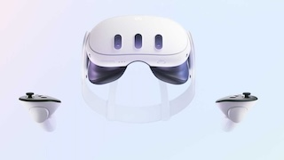
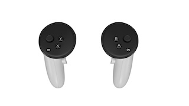
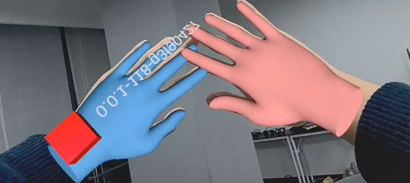

# VR使用开发案例

- [VR使用开发案例](#vr使用开发案例)
  - [说明](#说明)
    - [QUEST 3 设备](#quest-3-设备)
    - [手柄](#手柄)
  - [Quest3 相关使用](#quest3-相关使用)
    - [介绍](#介绍)
    - [安装 SideQuest](#安装-sidequest)
    - [如何更新 Quest3 的系统固件](#如何更新-quest3-的系统固件)
    - [如何启动已安装的程序](#如何启动已安装的程序)
    - [如何导出已录制的视频](#如何导出已录制的视频)
    - [如何去除空间限制](#如何去除空间限制)
    - [如何实时查看到 Quest3 投屏的屏幕](#如何实时查看到-quest3-投屏的屏幕)
  - [QUEST3 VR控制](#quest3-vr控制)
    - [准备](#准备)
    - [使用](#使用)
    - [QUEST3 视频流](#quest3-视频流)


## 说明

- 本案例使用VR设备为Quest3，可以通过VR手柄实现机器人手臂和灵巧手的遥操以及机器人的基本运动，可用于具身智能的数据采集。

### QUEST 3 设备

- 

### 手柄

- 


## Quest3 相关使用
### 介绍

在使用遥操作的时候我们需要用到 Quest3 的设备来捕捉用户的动作控制机器人来搜集数据。在这个文档中我们会介绍在使用 Quest3 的过程中会遇到的几个问题或者需要用到的操作

### 安装 SideQuest

如果无法下载，可以使用我们提供的源来安装。我们提供的地址是：[SideQuest下载地址](https://kuavo.lejurobot.com/Quest_apks/SideQuest-Setup-0.10.42-x64-win.exe "SideQuest 下载地址")，请注意这个源不会和官方的版本同步更新，目前同步的日期是 2024/11/22。请大家如果在发现版本距离久的时候自行下载软件。

基本使用请参考官方视频，或者 Bilili 的视频： [SideQuest的基本使用](https://www.bilibili.com/video/BV1uY41157Ki/?share_source=copy_web&vd_source=2d815abfceff1874dd081e6eb77cc262 "SideQuest基本使用")

如何在 Quest3 里面授权的视频: [Quest3 允许授权](https://www.bilibili.com/video/BV1zzBiYqE8m/?share_source=copy_web&vd_source=2d815abfceff1874dd081e6eb77cc262 "Quest3 允许授权")

### 如何更新 Quest3 的系统固件

目前已知的是 V68 的系统固件版本会存在卡顿和遥控器定位的问题。大家的设备如果是 V68 需要升级系统固件。

升级系统固件需要把 Quest3 连接在一个可以访问 meta 服务器网络的环境下。

具体升级的方法请参考: [Quest3 更新系统固件](https://www.bilibili.com/video/BV1FBBiYMEp4/?share_source=copy_web&vd_source=2d815abfceff1874dd081e6eb77cc262 "Quest3 更新系统固件")

### 如何启动已安装的程序

手柄: [如何启动程序-手柄](https://www.bilibili.com/video/BV1EBBiYKE9B/?share_source=copy_web&vd_source=2d815abfceff1874dd081e6eb77cc262 "如何启动程序-手柄")

手势识别: [如何启动程序-手势](https://www.bilibili.com/video/BV1JBBiYMEmK/?share_source=copy_web&vd_source=2d815abfceff1874dd081e6eb77cc262 "如何启动程序-手势")

### 如何导出已录制的视频

在我们技术支持的时候工程师可能需要大家录制一段在软件里面的操作画面然后发送给我们。

录制视频的方法请参考：[Quest3 录制视频](https://www.bilibili.com/video/BV1U7411p7h2/?share_source=copy_web&vd_source=2d815abfceff1874dd081e6eb77cc262 "Quest3 录制视频")

导出视频的方法请参考: [Quest3 录屏分享](https://www.bilibili.com/video/BV1fzBiYiEa2/?share_source=copy_web&vd_source=2d815abfceff1874dd081e6eb77cc262 "Quest3 录屏分享")

### 如何去除空间限制

默认 Quest3 会需要用户建立一个虚拟空间，当你操作 VR 的时候走出这个空间就会自动暂停我们的程序提示回到虚拟空间上。在展馆之类的场景的时候就有限制。如果想要去掉这个限制，可以参考以下视频。注意：按照视频中说明操作之后主界面的 paththrough 会不起作用，但是进入程序里面是可以透视的，不影响使用。

参考视频：[Quest3 突破空间限制](https://www.bilibili.com/video/BV1iYzwYqEwt/?share_source=copy_web&vd_source=2d815abfceff1874dd081e6eb77cc262 "Quest3 突破空间限制")

### 如何实时查看到 Quest3 投屏的屏幕

1. 先完成授权的步骤，请参考前面: <如何在 Quest3 里面授权的视频>

2. 根据自己的系统安装 

- [scrcpy-linux-x86_64-v3.1.tar.gz](https://kuavo.lejurobot.com/statics/scrcpy-linux-x86_64-v3.1.tar.gz)
- [scrcpy-macos-aarch64-v3.1.tar.gz](https://kuavo.lejurobot.com/statics/scrcpy-macos-aarch64-v3.1.tar.gz)
- [scrcpy-macos-x86_64-v3.1.tar.gz](https://kuavo.lejurobot.com/statics/scrcpy-macos-x86_64-v3.1.tar.gz)
- [scrcpy-win64-v3.1.zip](https://kuavo.lejurobot.com/statics/scrcpy-win64-v3.1.zip)

3. 各自解压之后在对应的目录下启动终端，确保当前电脑已经通过 USB 连接 Quest3, 并且 Quest3 已经开机

4. 执行对应的 scrcpy 指令

示例视频

<iframe src="//player.bilibili.com/player.html?isOutside=true&aid=113683724243013&bvid=BV1kAk2Y1Edm&cid=27433897643&p=1" scrolling="no" border="0" frameborder="no" framespacing="0" allowfullscreen="true"></iframe>

## QUEST3 VR控制

### 准备
1. 设备准备：
   - QUEST 3 头显
   - KUAVO_HAND_TRACK VR 应用（请联系乐聚工作人员安装）

2. 网络准备：
   - 确保 VR 设备和机器人连接同一 WiFi

### 使用

- 正常启动机器人完成站立

- 启动VR节点
   - 运行
  > 旧版镜像如果没有包含VR相关依赖，需要手动安装：`cd src/manipulation_nodes/noitom_hi5_hand_udp_python && pip install -r requirements.txt && cd -`
  
  ```bash
   source devel/setup.bash

   # VR先和机器人连到同一局域网, VR 会广播 自身IP 到局域网中
   roslaunch noitom_hi5_hand_udp_python launch_quest3_ik.launch
  ```

  > 如果手动输入VR的IP地址, 在启动命令后追加参数 `ip_address:=192.168.3.32`(替换成VR的实际IP地址)

  > 现在 VR 头盔中的 APP 会自动广播自身IP，启动节点不需要手动输入 ip，但是假如 VR 节点程序关掉了，你需要在 VR 头盔中重新打开 VR 程序，才会重新广播IP


  > 如果希望同时映射躯干的运动（上下蹲和弯腰），可以增加选项`control_torso:=1`，使用前**务必在站立状态下长按VR右手柄的meta键**以标定躯干高度。**注意：不能长时间执行蹲下和弯腰动作，且在执行躯干运动时幅度不宜过大**

  > 启动程序之后，将手柄放置视野外，会触发启动VR中的手势识别功能，手臂跟随模式下可以控制机器人手臂和手指跟随运动，这时要注意避免视角中出现多个检测目标（多双手），手势检测效果如下图：

  > 

  > 默认控制双手，如果需要控制单手，可以增加选项`ctrl_arm_idx:=0`, 其中0，1，2分别对应左手，右手，双手
  - 参考[参考机器人VR控制教程](../../2快速开始/快速开始.md)
  
  > 开启手势识别，可以增加选项 `predict_gesture:=true`，利用神经网络预测手势，灵巧手会直接根据手势预测结果进行运动，目前支持的手势有（只有当预测结果同时满足：高置信度（>80%）明显优于第二预测（差值>0.3）预测分布集中（熵值<0.8）才会返回具体的手势类别。否则会认为预测失败，灵巧手会采用原来的方式控制）
  - 参考[灵巧手手势使用案例](灵巧手手势使用案例.md)
- 同时启动VR节点和机器人
  - 运行
  ```bash
  sudo su
  source devel/setup.bash
  roslaunch humanoid_controllers load_kuavo_real_with_vr.launch
  ```

### QUEST3 视频流

在使用 VR 控制时，可以将上位机的摄像头画面传输到 VR 设备中显示。具体设置步骤如下：

1. 在上位机（带有摄像头的设备）上安装依赖：
- 需要克隆下位机kuavo-ros-opensource仓库，然后配置依赖：
  ```bash
  cd <kuavo-ros-opensource>
  sudo apt install v4l-utils
  git clone https://github.com/ros-perception/image_common.git  --branch noetic-devel src/image_common
  git clone https://github.com/ros-perception/image_pipeline.git  --branch noetic src/image_pipeline
  git clone https://github.com/ros-drivers/usb_cam.git --branch develop src/usb_cam
  catkin build usb_cam noitom_hi5_hand_udp_python
  ```

2. 启动视频流：
- 在上位机运行：
   ```bash
   source devel/setup.bash
   roslaunch noitom_hi5_hand_udp_python usb_cam_node.launch
   ```
   
- 在下位机运行：
   ```bash
   roslaunch noitom_hi5_hand_udp_python launch_quest3_ik_videostream_usb_cam.launch
   ```