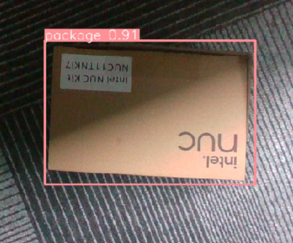

# yolov8目标检测案例

- [yolov8目标检测案例](#yolov8目标检测案例)
  - [说明](#说明)
  - [🎯 针对于 YOLOv8 训练模型检测调用](#-针对于-yolov8-训练模型检测调用)
  - [📁 模型路径及说明](#-模型路径及说明)
  - [📡 箱子识别 ROS 话题订阅](#-箱子识别-ros-话题订阅)
  - [💻 yolo\_box\_object\_detection 功能包代码说明 (头部 NUC)](#-yolo_box_object_detection-功能包代码说明-头部-nuc)
  - [🚀 启动](#-启动)
  - [🔧 识别姿态四元数说明](#-识别姿态四元数说明)
  - [示例代码](#示例代码)

## 说明
- 功能包：`yolo_box_object_detection` (位于上位机代码仓库)：`<kuavo_ros_application>/src/ros_vision/detection_industrial_yolo/yolo_box_object_detection`
- 📦 箱子识别

## 🎯 针对于 YOLOv8 训练模型检测调用

- 🔍 **yolo_box_object_detection** -- 箱子识别 YOLO ROS 功能包

## 📁 模型路径及说明

- 📂 路径：`<kuavo_ros_application>/src/ros_vision/detection_industrial_yolo/yolo_box_object_detection`
- 📄 模型格式：`.pt`
- 🗂️ 模型路径：`<kuavo_ros_application>/src/ros_vision/detection_industrial_yolo/yolo_box_object_detection/scripts/models/`
- 🧪 识别测试程序：
  - `test_detect.py` (实时检测)
  - `test_image.py` (指定图片检测)




## 📡 箱子识别 ROS 话题订阅

```bash
/object_yolo_box_segment_result   # 基于相机坐标系下的箱子中心点的3D位置
/object_yolo_box_segment_image    # 识别箱子的绘制结果
/object_yolo_box_tf2_torso_result # 基于机器人基坐标系下的箱子中心点的3D位置
```

## 💻 yolo_box_object_detection 功能包代码说明 (头部 NUC)

- `test_detect.py`: 使用 YOLOv8 模型进行实时检测
- `test_image.py`: 使用 YOLOv8 模型进行图片检测
- `yolo_box_segment_ros.py`: 
  - 调用模型检测并获取识别框中心点三维坐标位置
  - 发布到 `/object_yolo_box_segment_result`
  - 过滤低于 0.6 置信度的结果
- `yolo_box_transform_torso.py`: 
  - 订阅 `/object_yolo_box_segment_result` 
  - 将坐标转换到机器人基坐标系
  - 发布转换结果到 `/object_yolo_box_tf2_torso_result`

## 🚀 启动

```bash
# 进入工作目录
cd <kuavo_ros_application>

# 启动箱子识别
roslaunch yolo_box_object_detection yolo_segment_detect.launch
```

## 🔧 识别姿态四元数说明

- 📄 查看 `yolo_box_transform_torso.py` 文件第 71-74 行，由于检测只获取检测目标中心点空间位置无姿态信息，四元数为固定值非实际值

## 示例代码
- 路径：`<kuavo-ros-opensource>/src/demo/examples_code/yolo_detect/yolo_detect_info.py`
- `yolo_detect_info.py`: 获取一次 `/object_yolo_box_tf2_torso_result` 检测结果基于机器人基座标系的位姿