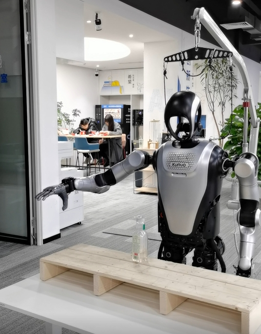
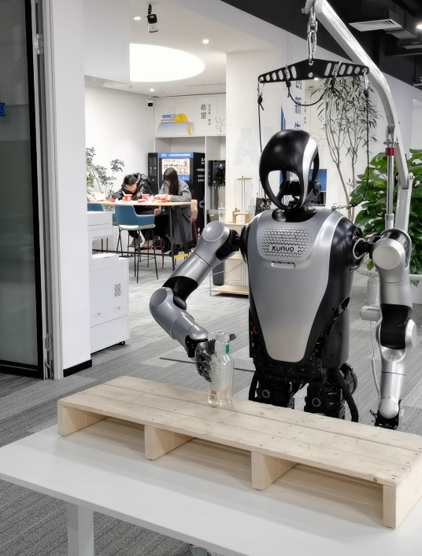
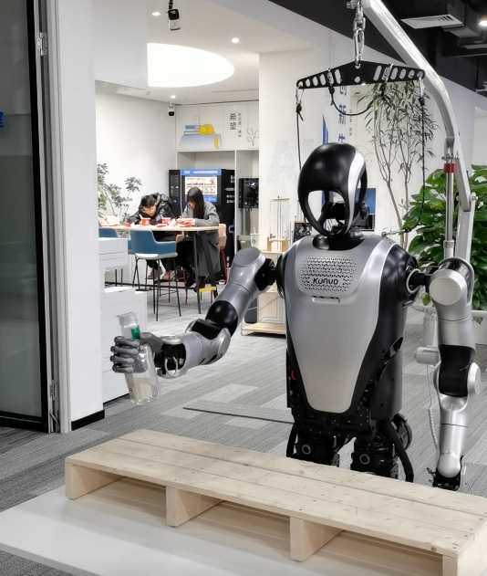

# 二维码抓取水瓶案例

- [二维码抓取水瓶案例](#二维码抓取水瓶案例)
  - [案例介绍](#案例介绍)
      - [简介](#简介)
      - [功能说明](#功能说明)
      - [流程逻辑](#流程逻辑)
      - [实机视频展示](#实机视频展示)
  - [准备](#准备)
    - [二维码准备](#二维码准备)
    - [代码路径](#代码路径)
    - [代码编译](#代码编译)
  - [ros话题与服务](#ros话题与服务)
      - [上位机](#上位机)
      - [下位机](#下位机)
  - [运行示例](#运行示例)
      - [启动参数](#启动参数)
      - [坐标偏移量](#坐标偏移量)
      - [欧拉角设定](#欧拉角设定)
    - [运行步骤](#运行步骤)
    - [实机结果示例](#实机结果示例)


## 案例介绍
#### 简介
  - 机器人通过头部摄像头识别二维码，解算二维码的坐标信息，并通过ik逆解计算手臂关节角度进行抓取
#### 功能说明
  
  - 通过识别AprilTag标签，得到抓取目标在坐标系中的位置
  - 自主判断左右手，并计算手臂末端期望位置与姿态
  - 通过ik逆解服务，得到手臂各关节的目标角度
  - 实现抓水、递水流程，过程流畅

#### 流程逻辑

1. 机器人低头，短暂延时后获取指定ID的AprilTag的平均数据
2. 设置手臂运动模式为外部控制
3. 松开手部，移动到准备姿态
4. 计算ik求解参数，进行ik求解，使用ik结果进行移动
5. 握紧手部，递水，松开手部，手臂复位，机器人抬头，流程结束

#### 实机视频展示
<iframe src="//player.bilibili.com/player.html?isOutside=true&aid=114257085603685&bvid=BV1VpZpYzE9E&cid=29167911338&p=1" width="320" height="640" scrolling="no" border="0" frameborder="no" framespacing="0" allowfullscreen="true"></iframe>

## 准备
### 二维码准备
1. 二维码下载
- [二维码下载网站](https://chev.me/arucogen/)
- 使用的二维码类型为apriltag，类型为36h11，id号与尺寸根据实际需要设置


2. 调整配置文件(上位机)
  - 配置文件位于 `<kuavo_ros_application>/src/ros_vision/detection_apriltag/apriltag_ros/config/tags.yaml`
  ```yaml
  standalone_tags:
  [
    {id: 0, size: 0.042, name: 'tag_0'},
    {id: 1, size: 0.042, name: 'tag_1'},
    ...
  ]
  ```
3. **注意**：
- 这里的size要和打印的二维码大小一致（二维码大小可在前面提到的网站设置）
- 默认的抓取点在二维码正下方，因此二维码要贴在瓶盖上面

### 代码路径
- 路径：`<kuavo-ros-opensource>/src/demo/arm_capture_apriltag`

### 代码编译
```bash
cd <kuavo-ros-opensource> #仓库目录
sudo su
catkin build kuavo_sdk
```
## ros话题与服务
#### 上位机
  - 启动传感器，实时识别二维码并解算出其在机器人基坐标系的位置
  - 发布`/robot_tag_info`话题，传递信息

#### 下位机
1. 设置手臂运动模式
  - 调用 ROS 服务 `/arm_traj_change_mode` ,设置手臂运动模式为外部控制模式
2. 启动ik逆解服务
  - 计算ik逆解参数，调用 ROS 服务 `/ik/two_arm_hand_pose_cmd_srv` 计算给定坐标与姿态的逆运动学解。
  - 获取ik逆解结果： q_arm: 手臂关节值,（单位弧度）
3. 控制机器人头部
  - 发布到`/robot_head_motion_data`话题
  - 设置关节数据，包含偏航和俯仰角
4. 控制机器人手部开合
  - 发布到`/control_robot_hand_position`话题
  - 设置握紧或松开的关节角度
5. 获取二维码标签信息
- 从话题`/robot_tag_info`接收到AprilTagDetectionArray消息
- 获取指定ID的AprilTag的平均位置(基于机器人基坐标系)
  - `avg_off_horizontal`对应x轴
  - `avg_off_camera`对应y轴
  - `avg_off_vertical`对应z轴


## 运行示例

#### 启动参数
- `offset_start` : 是否启动坐标偏移量
  - 参数输入 `True` ：启用坐标偏移量，一般在实机中使用，以观察抓取效果
  - 参数输入 `False` ：不启用坐标偏移量，一般在仿真中使用，以观察求解效果

#### 坐标偏移量
- 主要参数：
  - `offset_z`  z方向偏移量，默认默认的抓取点在二维码正下方，因此为负值
  - `temp_x_l temp_x_r` x方向偏移量，左右都为负值
  - `temp_y_l temp_y_r` y方向偏移量，均为正值，左加右减
  - `offset_angle` z轴角度偏移量，在进行ik求解时，若觉得yaw角不符合预期，可适当增加或降低该值
- 调参说明：（以右手为例，机器人面朝方向为前方）
  - 若抓取点偏上，则降低 `offset_z` 的值，反之则调高
  - 若抓取点偏右，则增大 `temp_y_r` 的值，反之则降低
  - 若抓取点偏前，则降低 `temp_x_r` 的值，反之则调高
- 参数位置：
  - `arm_capture_apriltag.py`文件，主函数中进行设置
  - 使用示例：
```
    # offset_start="True"表示启用偏移量 否则不启用偏移量
    if args.offset_start == "True":
        # 偏向侧后边一点
        offset_z=-0.10  # 抓取点位于标签正下方
        temp_x_l=-0.035
        temp_y_l=0.035
        temp_x_r=-0.045
        temp_y_r=0.035
    else :
        offset_z=0.00
        temp_x_l=0.00
        temp_y_l=0.00
        temp_x_r=0.00
        temp_y_r=0.00
    # 角度偏移量（修正绕z轴的偏移角度）
    offset_angle=1.00
```
#### 欧拉角设定
- 使用示例：
  - `quat=ToQuaternion(relative_angle*offset_angle, -1.57 , 0)`
  - `eef_pose_msg.hand_poses.left_pose.quat_xyzw = [quat.x,quat.y,quat.z,quat.w]`
- ToQuaternion参数：
  - 偏航角yaw：通过当前手臂末端位置与目标手臂末端位置计算
  - 俯仰角pitch：左右手均固定为负90度
  - 横滚角度roll：左手为负、右手为正，以右手为例：经过测试设置负(0~20)效果会比较好

### 运行步骤
1. **SDK环境构建**
  - 执行 `catkin build kuavo_sdk` 编译sdk功能包
  - 执行 `catkin build motion_capture_ik` 编译ik功能包

2. **下位机 使机器人站立**
  - 仿真：`roslaunch humanoid_controllers load_kuavo_mujoco_sim.launch`
  - 实物：`roslaunch humanoid_controllers load_kuavo_real.launch cali:=true`

3. **下位机 启动ik求解服务**
  - 在lab目录下新开一个终端执行 `cd <kuavo-ros-opensource>` ，
  - 执行 `sudo su` 进入root用户，
  - 执行 `source devel/setup.bash` ，
  - 执行 `roslaunch motion_capture_ik ik_node.launch ` ，

4. **发送tag信息（实机和仿真二选一，不要同时运行）**
- `仿真运行 下位机` 启动tag信息mock工具
  - 在lab目录下新开一个终端执行 `cd <kuavo-ros-opensource>` ，
  - 执行 `sudo su` 进入root用户，
  - 执行 `source devel/setup.bash` ， 
  - 执行 `python3 src/demo/arm_capture_apriltag/mock_tag_publisher.py`
- `实机运行 上位机` 启动传感器
  - 在lab目录下新开一个终端执行 `cd <kuavo_ros_application>` ，
  - 执行 `sros1` 切换到ros1环境 ，
  - 如果是远程连接上位机桌面 执行 `exp1`
  - 执行 `source devel/setup.bash` ， 
  - 执行 `roslaunch dynamic_biped load_robot_head.launch`

5. **检测下位机是否能收到标签信息**
- `下位机` 执行 `rostopic list | grep tag`
- 如果存在 `/robot_tag_info`
  - 执行 `rostopic echo /robot_tag_info`
  - 观察是否存在标签的坐标信息
- 注意事项:
  - 如果在实物上运行，需测量得到的坐标信息是否准确
  - 要启动下位机程序后，上位机才能检测到机器人各关节的角度，以计算出基于机器人坐标系的结果

6. **下位机 启动二维码抓取流程**
- 在lab目录下新开一个终端执行 `cd <kuavo-ros-opensource>` ，
- 执行 `sudo su` 进入root用户，
- 执行 `source devel/setup.bash` ， 
- 机器人实物运行
  - 执行 `python3 src/demo/arm_capture_apriltag/arm_capture_apriltag.py --offset_start True` 
- 机器人仿真运行  
  - 执行 `python3 src/demo/arm_capture_apriltag/arm_capture_apriltag.py --offset_start False` 
- 注意：若仿真环境卡顿，可适当增加延时，以确保机器人手臂每个动作都能执行到位，示例如下：
  - `publish_arm_target_poses([1.5], [20.0, ...])`修改为`publish_arm_target_poses([3], [20.0, ...])`
  - `time.sleep(2.5)`修改为`time.sleep(5)`

### 实机结果示例

  - 准备姿态



  - ik逆解移动



  - 递水


