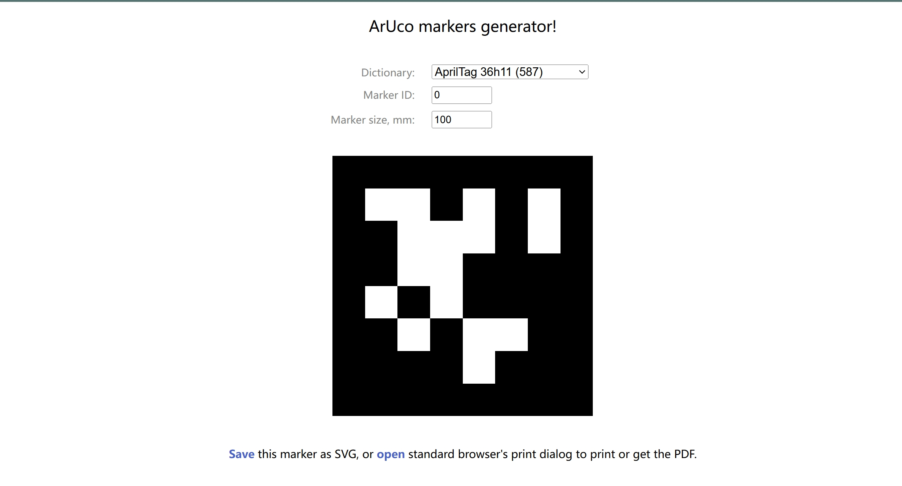

# 二维码检测使用案例

- [二维码检测使用案例](#二维码检测使用案例)
  - [二维码](#二维码)
  - [使用](#使用)
  - [示例程序](#示例程序)
  - [获取检测结果](#获取检测结果)
  - [示例代码说明](#示例代码说明)

## 二维码
- [二维码下载网站](https://chev.me/arucogen/)
- 使用的二维码类型为apriltag，类型为36h11


## 使用
- 调整配置文件
  - 配置文件位于 `<kuavo_ros_application>/src/ros_vision/detection_apriltag/apriltag_ros/config/tags.yaml`
  ```yaml
  standalone_tags:
  [
    {id: 0, size: 0.042, name: 'tag_0'},
    {id: 1, size: 0.042, name: 'tag_1'},
    {id: 2, size: 0.042, name: 'tag_2'},
    {id: 3, size: 0.04, name: 'tag_3'},
    {id: 4, size: 0.04, name: 'tag_4'},
    {id: 5, size: 0.04, name: 'tag_5'},
    {id: 6, size: 0.04, name: 'tag_6'},
    {id: 7, size: 0.04, name: 'tag_7'},
    {id: 8, size: 0.04, name: 'tag_8'},
    {id: 9, size: 0.04, name: 'tag_9'},
  ]
  ```
  修改/添加对应要识别的目标二维码id以及尺寸，单位为m

- rqt观察识别效果

```
rqt_image_view
```
选择 `/tag_detections_image` topic

<iframe src="//player.bilibili.com/player.html?isOutside=true&aid=113667282572395&bvid=BV1d1k7YWE6g&cid=27387363930&p=1" 
        width="320" height="320" 
        scrolling="no" border="0" frameborder="no" framespacing="0" allowfullscreen="true">
</iframe>

## 示例程序
- 路径：`<kuavo-ros-opensource>/src/demo/examples_code/tag_detect/get_tag_info.py`

## 获取检测结果
- 基于相机坐标系：`/tag_detections_image`;基于机器人基坐标系：`/robot_tag_info`
- 修改示例程序中订阅话题可以获取二维码基于相机坐标系和基于机器人基坐标系的不同位姿信息

## 示例代码说明

- **`AprilTagProcessor`类**：负责处理AprilTag的检测数据，包括初始化ROS节点、转换四元数到欧拉角、获取AprilTag数据、根据ID查找AprilTag以及计算AprilTag的平均数据。
- **`quaternion_to_euler`函数**：将四元数转换为欧拉角中的yaw角，用于表示旋转。
- **`get_apriltag_data`函数**：从ROS话题中获取AprilTag检测数据，并提取每个标签的ID、位置和姿态。
- **`get_apriltag_by_id`函数**：根据指定的ID查找AprilTag数据。
- **`get_averaged_apriltag_data`函数**：获取指定ID的AprilTag的多次检测数据，并计算其平均位置和姿态。
- **主程序**：创建`AprilTagProcessor`实例，初始化ROS节点，并获取指定ID的AprilTag的平均数据。