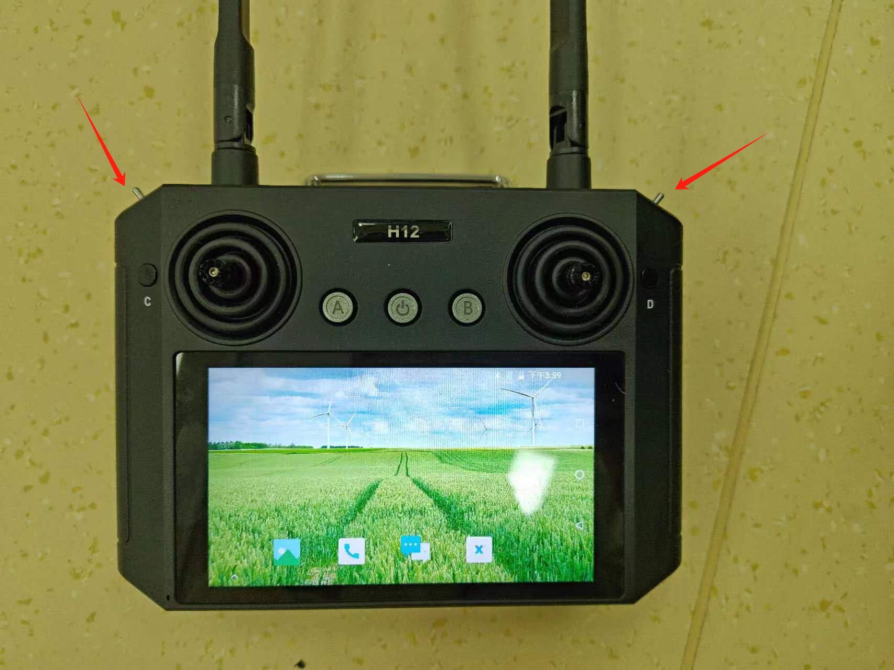

# 动作语音快速上手案例

## 目录
- [动作语音快速上手案例](#动作语音快速上手案例)
  - [目录](#目录)
  - [简介](#简介)
  - [脚本位置](#脚本位置)
  - [使用说明](#使用说明)
    - [工具介绍](#工具介绍)
    - [出厂动作语音设置](#出厂动作语音设置)
    - [自定义动作语音设置](#自定义动作语音设置)
  - [注意事项](#注意事项)
  - [故障排查](#故障排查)

## 简介

本文档介绍如何快速配置乐聚机器人的动作和语音功能，执行完脚本以后可以实现遥控器按下快捷键播放预设动作和语音。
支持以下机器人型号:

- 4代标准
- 4pro短手
- 4pro长手

## 脚本位置
- 下位机脚本位置：`<kuavo-ros-opensource>/src/demo/examples_code/action_scripts`
- 上位机脚本位置: `<kuavo_ros_application>/demo_test/action_scripts`
## 使用说明

### 工具介绍

本文提供了一个便捷的配置工具`kuavo_tools.sh`,可以帮助您快速完成动作语音的配置。该工具支持:

1. 动作语音出厂化设置
2. 自定义动作文件设置

运行工具:
```bash
./kuavo_tools.sh
```

工具会自动检测:
- 当前用户类型(上位机/下位机)
- Git仓库状态
- 机器人版本(下位机)

### 出厂动作语音设置

1. 在下位机执行:
```bash
chomd +x kuavo_tools.sh
./kuavo_tools.sh
# 选择 1: 动作语音出厂化设置
```
工具会自动:
- 下载对应机器人型号的动作文件到`/home/lab/.config/lejuconfig/action_files`
- 更新配置文件`customize_config.json`

1. 在上位机执行:
```bash
chomd +x kuavo_tools.sh
./kuavo_tools.sh  
# 选择 1: 动作语音出厂化设置
```
工具会自动:
- 下载语音文件到`/home/kuavo/.config/lejuconfig/music`

### 自定义动作语音设置
> 注意：本操作需要连接显示屏
1. 在下位机执行:
```bash
chomd +x kuavo_tools.sh
./kuavo_tools.sh
# 选择 2: 自定义动作文件设置
# 第一步会打开动作文件所在目录，将你编写的tact文件拖入该目录即可，拖入以后可以关掉目录，在终端输入y，按下enter
# 第二步会用打开配置文件文本，直接修改，保存以后，关掉文本文件，在终端输入y，按下enter
```
- 手动将动作文件(.tact)放入`/home/lab/.config/lejuconfig/action_files`
- 编辑配置文件,设置动作与语音的对应关系

1. 在上位机执行:
```bash
chomd +x kuavo_tools.sh
./kuavo_tools.sh
# 选择 2: 自定义动作文件设置
```
- 将语音文件(.mp3/.wav)放入`/home/kuavo/.config/lejuconfig/music`

## 注意事项

1. 配置顺序:
   - 建议先在下位机配置动作文件和对应关系
   - 再在上位机配置语音文件

2. 文件路径:
   - 下位机动作文件: `/home/lab/.config/lejuconfig/action_files`
   - 上位机语音文件: `/home/kuavo/.config/lejuconfig/music`
   - 配置文件: `/home/lab/kuavo-ros-opensource/src/humanoid-control/h12pro_controller_node/config/customize_config.json`
3. json文件示例
```json
{
  "customize_action_RR_A": {
    "arm_pose_name": [
      "1_挥手"
    ],
    "music_name": [
      "1_welcome.mp3"
    ]
  },
  "customize_action_RR_B": {
    "arm_pose_name": [
      "2_抱拳"
    ],
    "music_name": [
      "2_hello.mp3"
    ]
  },
  "customize_action_RR_C": {
    "arm_pose_name": [
      "3_点赞"
    ],
    "music_name": [
      "3_good.mp3"
    ]
  }
}
```

> 在机器人打开时h12的E、F拨杆位于两边，RR_A代表把E、F都拨到最右边，然后按A就能播放对应动作和语音，而LL_D就是把E、F都拨到最左边，然后按D，其余动作语音也是同理，RR意思是right，LL意思是lift。
> 目前仅包含出厂动作RR_A、RR_B、RR_C三套动作语音。

- E和F拨杆位置：


- 最多支持8个自定义动作：
  - RR_A 到 RR_D
  - LL_A 到 LL_D
- 脚本支持的语音格式：mp3、wav

## 故障排查
遇到问题时，请检查：
- [ ] 文件命名是否符合规范
- [ ] 主从机关系是否正确设置
- [ ] 目录结构是否完整
- [ ] 文件访问权限是否充足
- [ ] 下位机是否设置了 ROBOT_VERSION 环境变量

