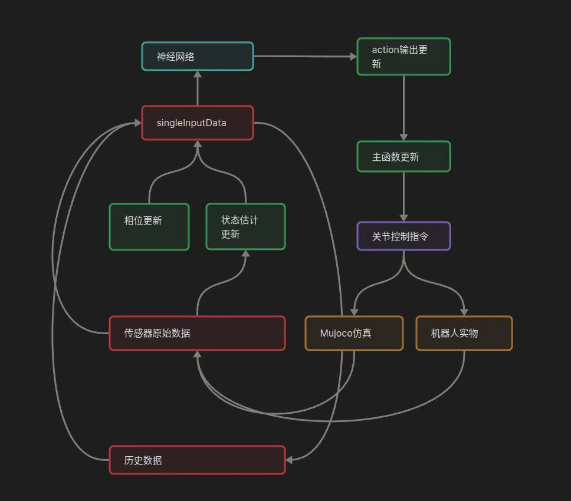

# 强化学习案例

- [强化学习案例](#强化学习案例)
- [强化学习案例](#强化学习案例-1)
  - [代码拉取和编译](#代码拉取和编译)
  - [参数修改](#参数修改)
  - [程序启动及手柄控制](#程序启动及手柄控制)
  - [手柄控制说明](#手柄控制说明)
  - [核心代码humanoidController说明](#核心代码humanoidcontroller说明)
    - [1. **初始化**](#1-初始化)
    - [2. **状态估计**](#2-状态估计)
    - [3. **控制模式切换**](#3-控制模式切换)
    - [4. **WBC 控制**](#4-wbc-控制)
    - [5. **RL 控制**](#5-rl-控制)
    - [6. **传感器数据处理**](#6-传感器数据处理)
    - [7. **关节命令发布**](#7-关节命令发布)
    - [8. **键盘控制**](#8-键盘控制)
    - [9. **状态机逻辑**](#9-状态机逻辑)
    - [10. **主要控制流程**](#10-主要控制流程)
    - [11. **关键数据结构**](#11-关键数据结构)


# 强化学习案例

> 本案例使用强化学习算法接收手柄信号控制机器人运动，运动方向包括：前后左右平移、左转、右转。

- 实现逻辑框架如下图：



## 代码拉取和编译
```bash
git clone -b beta https://gitee.com/leju-robot/kuavo-rl-opensource.git

cd kuavo-rl-opensource
sudo su
source installed/setup.bash
catkin build humanoid_controllers
```
## 参数修改

修改 `kuavo-rl-opensource/src/kuavo_assets/config/kuavo_v42/kuavo.json`中的第40行：
```json
# "use_anthropomorphic_gait":false,
# 改为：
"use_anthropomorphic_gait":true,

```

## 程序启动及手柄控制
```bash
#新开终端
cd kuavo-rl-opensource
sudo su
source devel/setup.bash
# 仿真
roslaunch humanoid_controllers load_kuavo_mujoco_sim.launch joystick_type:=bt2pro # 启动rl控制器、wbc、仿真器
# 实物
roslaunch humanoid_controllers load_kuavo_real.launch cali:=true cali_arm:=true joystick_type:=bt2pro # 可以选择cali:=true 进行标定，cali_arm:=true 进行机械臂标定。
```
> 注意：仿真和实物选择一个启动即可
- 程序启动以后，确保手柄连接上仿真pc，或实物下位机。按下北通遥控器`lb`解锁，解锁后可以进行踏步或者其他动作。
- 第二步需要按下`X`，进入强化学习控制模式。
- 此时可以通过摇杆控制机器人。

## 手柄控制说明
- 参考的遥控器键位如下，其他型号需要自行修改遥控器节点：
- 该遥控器沿用了kuavo-ros-opensource的遥控器控制，但有些按钮和功能有所不同：

  - A: STANCE 同时会上锁
  - B: TROT / STANCE 切换
  - X: INTO RL-Control
  - Y: NONE
  - LB: 解锁，解锁后可以进行踏步或者其他动作
  - 摇杆控制腿部运动

  - 左摇杆控制前后左右
  - 右摇杆控制左右转
  - start键实物控制时用于从悬挂准备阶段切换到站立
  - back键用于退出所有节点


## 核心代码humanoidController说明

> 程序参阅: `<kuavo-rl-opensource>/src/humanoid-control/humanoid_controllers/src/humanoidController.cpp`
### 1. **初始化**
在 `humanoidController::init` 函数中，控制器完成了以下初始化工作：
- **硬件接口初始化**：加载机器人硬件配置（如关节数量、电机参数等）。
- **OCS2 初始化**：加载任务文件、URDF 文件、参考文件等，初始化 OCS2（Optimal Control for Switched Systems）框架。
- **WBC 初始化**：初始化 `WeightedWbc` 和 `StandUpWbc`，加载任务设置。
- **状态估计器初始化**：初始化状态估计器（如卡尔曼滤波器）。
- **传感器数据缓冲区初始化**：创建传感器数据缓冲区，用于存储和处理传感器数据。
- **键盘控制线程**：启动键盘控制线程，用于接收用户输入。
- **推理线程**：启动推理线程，用于 RL 控制的神经网络推理。

---

### 2. **状态估计**
在 `humanoidController::updateStateEstimation` 函数中，控制器通过传感器数据（如 IMU、关节位置、速度等）估计机器人的状态：
- **传感器数据处理**：从传感器数据缓冲区中获取最新的传感器数据。
- **状态更新**：使用卡尔曼滤波器或其他状态估计器更新机器人的状态（如基座姿态、关节位置、速度等）。
- **接触力估计**：估计脚部的接触力，用于 WBC 控制。
- **模式更新**：根据当前状态和接触力更新控制模式（如单脚支撑、双脚支撑等）。

---

### 3. **控制模式切换**
控制器支持多种控制模式，包括：
- **WBC 控制模式**：使用 WBC 计算关节扭矩。
- **RL 控制模式**：使用强化学习模型生成控制命令。
- **站立控制模式**：使用 `StandUpWbc` 控制机器人从蹲姿到站姿的过渡。

控制模式的切换可以通过键盘输入或 ROS 服务调用来实现。

---

### 4. **WBC 控制**
在 `humanoidController::update` 函数中，控制器调用 WBC 计算关节扭矩：
- **WBC 更新**：调用 `wbc_->update` 函数，根据当前状态、输入和模式计算关节扭矩。
- **关节命令生成**：将 WBC 计算出的扭矩转换为关节命令，发布到硬件接口。

---

### 5. **RL 控制**
在 `humanoidController::inference_thread_func` 和 `humanoidController::updateRLcmd` 函数中，控制器使用强化学习模型生成控制命令：
- **神经网络推理**：在推理线程中，使用神经网络模型生成控制命令。
- **命令更新**：将神经网络输出的命令转换为关节扭矩或位置命令。
- **关节命令生成**：将 RL 控制命令发布到硬件接口。

---

### 6. **传感器数据处理**
在 `humanoidController::sensorsDataCallback` 函数中，控制器处理传感器数据：
- **关节数据**：获取关节位置、速度、加速度和电流数据。
- **IMU 数据**：获取基座的姿态、角速度和线加速度数据。
- **数据滤波**：对传感器数据进行滤波处理，去除噪声。
- **数据存储**：将处理后的传感器数据存储到缓冲区中，供状态估计和控制使用。

---

### 7. **关节命令发布**
在 `humanoidController::update` 函数中，控制器生成关节命令并发布到硬件接口：
- **关节命令生成**：根据 WBC 或 RL 控制的结果生成关节位置、速度和扭矩命令。
- **头部控制**：如果机器人有头部关节，生成头部关节的命令。
- **命令发布**：将关节命令发布到 ROS 话题 `/joint_cmd`，供硬件接口执行。

---

### 8. **键盘控制**
在 `humanoidController::keyboard_thread_func` 函数中，控制器通过键盘输入实现控制：
- **用户输入**：接收用户输入的键盘命令（如 `w`、`s`、`a`、`d` 等）。
- **命令更新**：根据键盘命令更新控制参数（如速度、姿态等）。
- **模式切换**：通过键盘命令切换控制模式（如 WBC 模式、RL 模式等）。

---

### 9. **状态机逻辑**
控制器的状态机逻辑如下：
1. **初始化**：加载配置、初始化硬件接口、WBC、状态估计器等。
2. **状态估计**：通过传感器数据估计机器人状态。
3. **控制模式选择**：根据当前状态和用户输入选择控制模式（WBC 或 RL）。
4. **控制计算**：调用 WBC 或 RL 模型生成控制命令。
5. **命令发布**：将控制命令发布到硬件接口。
6. **循环更新**：不断重复状态估计、控制计算和命令发布的过程。

---

### 10. **主要控制流程**
1. **启动控制器**：
   - 初始化硬件接口、WBC、状态估计器等。
   - 启动键盘控制线程和推理线程。
2. **状态估计**：
   - 从传感器数据缓冲区获取最新的传感器数据。
   - 使用状态估计器更新机器人状态。
3. **控制模式选择**：
   - 根据当前状态和用户输入选择控制模式（WBC 或 RL）。
4. **控制计算**：
   - 如果选择 WBC 模式，调用 `wbc_->update` 计算关节扭矩。
   - 如果选择 RL 模式，调用神经网络模型生成控制命令。
5. **命令发布**：
   - 将控制命令发布到硬件接口。
6. **循环更新**：
   - 不断重复状态估计、控制计算和命令发布的过程。

---

### 11. **关键数据结构**
- **SensorData**：存储传感器数据（如关节位置、速度、IMU 数据等）。
- **CommandData**：存储控制命令（如速度、姿态等）。
- **Observation**：存储机器人状态（如基座姿态、关节位置、速度等）。
- **JointCmd**：存储关节命令（如位置、速度、扭矩等）。
