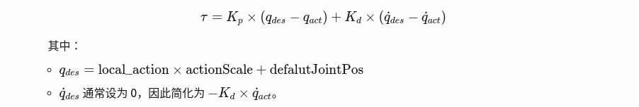

# 强化学习案例

- [强化学习案例](#强化学习案例)
  - [概述](#概述)
  - [效果展示](#效果展示)
  - [部署](#部署)
    - [代码拉取和编译](#代码拉取和编译)
    - [H12遥控器控制说明](#h12遥控器控制说明)
    - [程序启动及控制说明](#程序启动及控制说明)
      - [启动说明](#启动说明)
    - [电机控制话题说明](#电机控制话题说明)
      - [1. 控制指令输出方式](#1-控制指令输出方式)
      - [2. 控制模式选择](#2-控制模式选择)
      - [3. 混合控制实现](#3-混合控制实现)
      - [4. 底层硬件交互](#4-底层硬件交互)
      - [总结](#总结)
    - [PD 控制实现分析](#pd-控制实现分析)
      - [1. 参数配置模块](#1-参数配置模块)
        - [1.1 关节参数加载](#11-关节参数加载)
        - [1.2 滤波器参数](#12-滤波器参数)
      - [2.1 RL 控制器关节力矩计算](#21-rl-控制器关节力矩计算)
        - [RL 控制器中的 PD 力矩计算](#rl-控制器中的-pd-力矩计算)
        - [头部关节的独立 PD 控制](#头部关节的独立-pd-控制)
    - [程序参阅](#程序参阅)
      - [主要控制流程](#主要控制流程)
  - [训练](#训练)
    - [安装](#安装)
      - [isaacgym](#isaacgym)
      - [conda](#conda)
      - [配置环境](#配置环境)
    - [Training and Playing](#training-and-playing)
      - [示例](#示例)
      - [按照指定的pt文件继续训练](#按照指定的pt文件继续训练)
    - [参数说明](#参数说明)
      - [自定义参数详解](#自定义参数详解)
        - [1. 训练任务控制](#1-训练任务控制)
        - [2. 实验版本管理](#2-实验版本管理)
        - [3. 硬件资源配置](#3-硬件资源配置)
        - [4. 可视化与调试](#4-可视化与调试)
        - [5. 参数优先级逻辑](#5-参数优先级逻辑)


## 概述

> 本案例简单介绍如何使用乐聚开源的强化学习运动控制仓库kuavo-rl-opensource实现对乐聚夸父机器人的训练和部署。

## 效果展示

  - sim2sim

<iframe src="//player.bilibili.com/player.html?isOutside=true&aid=114257018492493&bvid=BV13bZpYvEa9&cid=29167583731&p=1" scrolling="no" border="0" frameborder="no" framespacing="0" allowfullscreen="true"></iframe>

  - sim2real

<iframe src="//player.bilibili.com/player.html?isOutside=true&aid=114257018557523&bvid=BV1hbZpYvEQ1&cid=29167583514&p=1" scrolling="no" border="0" frameborder="no" framespacing="0" allowfullscreen="true"></iframe>


## 部署

### 代码拉取和编译
```bash
git clone -b beta https://gitee.com/leju-robot/kuavo-rl-opensource.git

cd kuavo-rl-opensource/kuavo-robot-deploy/
sudo su
source installed/setup.bash
catkin build humanoid_controllers
```

### H12遥控器控制说明

- 启动说明
  - 实物启动 
    - 启动前确保`E`建在最左边，`F`建在最右边。
    - 机器人缩腿后`F`键拨到最左边是站立。
    - 在机器人站立后，依次按下对应进入强化学习模式和解锁的按键。此时可以通过摇杆控制机器人。
    - `E`键拨到最右边是停止程序（注意此时机器人不会自动下蹲）

  - 强化学习H12遥控器建位说明： [跳转](../../2快速开始/快速开始.md)

### 程序启动
```bash
#新开终端
cd kuavo-rl-opensource
sudo su
source devel/setup.bash
# 仿真
roslaunch humanoid_controllers load_kuavo_mujoco_sim.launch joystick_type:=h12 # 启动rl控制器、wbc、仿真器。
# 实物
roslaunch humanoid_controllers load_kuavo_real.launch joystick_type:=h12 # 可以选择cali:=true和cali_arm:=true进行校准启动，但校准启动不会自动缩腿，需要把F键拨到最左边两次，第一次是执行缩腿，第二次是执行站立 。
```
> 注意：仿真和实物选择一个启动即可。也可通过键盘控制，joystick_type参数指定为sim即可，终端有按键功能提示。

### 电机控制话题说明

   - 电机控制指令通过ROS话题`/joint_cmd`发布，消息类型为`kuavo_msgs::jointCmd`。控制方式根据`control_modes`字段决定是力矩控制（力控）还是位置控制（位控），具体实现如下：

#### 1. 控制指令输出方式
- **消息结构**：`jointCmd`消息包含以下字段：

| 字段               | 类型                        | 描述                              |
| ----------------- | -------------------------- | ------------------------------- |
| joint_q       | float64[]                       | 目标关节位置（弧度）                           |
| joint_v        | float64[]       | 目标关节速度（弧度/秒） |
| tau          | float64[]         | 目标关节力矩（Nm） |
| tau_max | float64[] | 最大关节扭矩                |
| tau_ratio | float64[] | 扭矩系数                |
| joint_kp | float64[] | kp参数                |
| joint_kd | float64[] | kd参数                |
| control_modes | int32[] | 控制模式（0-力矩，1-速度，2-位置）                |

- **发布逻辑**：在`update()`函数中，根据控制模式填充消息并发布到`/joint_cmd`。

#### 2. 控制模式选择
- **力矩控制（CST）**：`control_modes=0`
- 直接发送`tau`值到底层驱动器。
- 示例代码段：
```cpp
jointCmdMsg.control_modes.push_back(0); // CST模式
jointCmdMsg.tau.push_back(calculated_torque);
```

- **位置控制（CSP）**：`control_modes=2`
- 发送目标位置`joint_q`和PID参数`kp/kd`，由底层驱动器闭环控制。
- 示例代码段：
```cpp
jointCmdMsg.control_modes.push_back(2); // CSP模式
jointCmdMsg.joint_q.push_back(target_position);
jointCmdMsg.joint_kp.push_back(kp_value);
```

#### 3. 混合控制实现
- **模式切换**：通过`JointControlMode_`数组配置每个关节的控制模式。
- **RL控制器**：根据策略输出选择力矩或位置指令，例如：
```cpp
if (JointControlMode_(i) == 0) { // 力矩控制
cmd[i] = kp*(目标位置 - 当前位置) - kd*速度;
} else if (JointControlMode_(i) == 2) { // 位置控制
发送目标位置和PID参数;
}
```

#### 4. 底层硬件交互
- **驱动器配置**：驱动器需根据`control_modes`切换控制模式（如CSP/CST），并应用对应的PD参数。

#### 总结
- **力控**：直接发送关节力矩值，驱动器闭环控制电流。
- **位控**：发送目标位置和PD参数，驱动器闭环控制位置。
- **混合控制**：通过每个关节独立的`control_modes`实现不同关节的力控/位控混合。

### PD 控制实现分析

#### 1. 参数配置模块
##### 1.1 关节参数加载
```cpp
// 从referenceFile加载主关节参数
loadData::loadEigenMatrix(referenceFile, "jointKp", jointKp_);
loadData::loadEigenMatrix(referenceFile, "jointKd", jointKd_);

// 头部关节特殊配置
if (headNum_ > 0) {
  loadData::loadEigenMatrix(referenceFile, "head_kp_", head_kp_);
  loadData::loadEigenMatrix(referenceFile, "head_kd_", head_kd_);
}
```

  - 参数维度：(jointNum_ + jointArmNum_)，支持不同关节独立配置
  - ​头部特殊处理：单独加载 head_kp_ 和 head_kd_

##### 1.2 滤波器参数
```cpp
// 关节指令滤波器配置
Eigen::VectorXd jointCmdFilterCutoffFreq_(jointNum_ + jointArmNum_);
loadData::loadEigenMatrix(rlParamFile, "jointCmdFilterCutoffFreq", jointCmdFilterCutoffFreq_);
jointCmdFilter_.setParams(dt, jointCmdFilterCutoffFreq_);
```
   - 平滑RL输出动作，防止力矩突变

#### 2.1 RL 控制器关节力矩计算
##### RL 控制器中的 PD 力矩计算
```cpp
// updateRLcmd() 函数中的 PD 计算
jointTor_(i) = jointKp_(i) * (local_action[i] * actionScale_ - jointPos_[i] + defalutJointPos_[i]) - jointKd_(i) * jointVel_[i];

//其中(local_action[i] * actionScale_ - jointPos_[i] + defalutJointPos_[i])是关节位置误差，-jointVel_[i]是速度误差
```
   - 公式：
    

   - actionScale_ 缩放 RL 输出动作值
   - clipActions_ 限制动作范围，防止过大

##### 头部关节的独立 PD 控制
```cpp
// 头部力矩计算
vector_t head_feedback_tau = head_kp_.cwiseProduct(desire_head_pos_ - sensor_data_head_.jointPos_) 
                           + head_kd_.cwiseProduct(-sensor_data_head_.jointVel_);
```
   - 公式：
    

   - 独立于身体控制回路，直接使用传感器反馈数据

### 程序参阅

   - 路径:`<kuavo-rl-opensource>/src/humanoid-control/humanoid_controllers/src/humanoidController.cpp`

#### 主要控制流程
1. **启动控制器**：
   - 初始化硬件接口、WBC、状态估计器等。
   - 启动键盘控制线程和推理线程。
2. **状态估计**：
   - 从传感器数据缓冲区获取最新的传感器数据。
   - 使用状态估计器更新机器人状态。
3. **控制模式选择**：
   - 根据当前状态和用户输入选择控制模式（WBC 或 RL）。
4. **控制计算**：
   - 如果选择 WBC 模式，调用 `wbc_->update` 计算关节扭矩。
   - 如果选择 RL 模式，调用神经网络模型生成控制命令。
5. **命令发布**：
   - 将控制命令发布到硬件接口。
6. **循环更新**：
   - 不断重复状态估计、控制计算和命令发布的过程。


## 训练

### 安装
#### isaacgym
```bash
wget https://developer.nvidia.com/isaac-gym-preview-4
tar -xvzf isaac-gym-preview-4  #将名字改为 isaacgym 并存放在'kuavo-robot-train'同级目录下
```
#### conda
推荐使用MiniConda，轻量化使用更灵活。
```bash
#安装
mkdir -p ~/miniconda3
wget https://repo.anaconda.com/miniconda/Miniconda3-latest-Linux-x86_64.sh -O ~/miniconda3/miniconda.sh
bash ~/miniconda3/miniconda.sh -b -u -p ~/miniconda3
rm ~/miniconda3/miniconda.sh
#初始化
~/miniconda3/bin/conda init --all
source ~/.bashrc
```
#### 配置环境
```bash
conda create -n humanoid-gym-op python=3.8
conda activate humanoid-gym-op
cd kuavo-rl-opensource/kuavo-robot-train
pip install -e ../isaacgym/python
pip install -e .
```

### Training and Playing
#### 示例
```bash
python scripts/train.py --task=kuavo_s42_sk_ppo --run_name v1 --headless --num_envs 4096
python scripts/play.py --task=kuavo_s42_sk_ppo --run_name v1
```
#### 按照指定的pt文件继续训练
```bash
python scripts/train.py --task=kuavo_s42_sk_ppo --run_name v1 --headless --num_envs 4096 --resume --load_run Feb07_11-27-10_v1 --checkpoint 0 #该例子表示文件保存在'kuavo-robot-train/logs/Kuavo_s42_sk_ppo/Feb07_11-27-10_v1'目录下，选择了model_0.pt文件进行继续训练，headless选项关闭了GUI显示。
python scripts/play.py --task=kuavo_s42_sk_ppo --run_name v1 --load_run Feb07_11-27-10_v1 --checkpoint 0
```

### 参数说明
#### 自定义参数详解

##### 1. 训练任务控制
| 参数名 | 类型 | 默认值 | 关键作用 | 使用场景示例 |
|--------|------|--------|----------|--------------|
| `--task` | str | `XBotL_free` | 定义训练任务类型 | 切换机器人型号（如`XBotL_walking`）|
| `--max_iterations` | int | - | 最大训练迭代次数 | 限制训练时长 |
| `--resume` | flag | False | 从检查点恢复训练 | 训练意外中断后继续 |

##### 2. 实验版本管理
| 参数名 | 类型 | 关键作用 | 数据存储逻辑 |
|--------|------|----------|--------------|
| `--experiment_name` | str | 标识实验项目 | 对应 `experiments/` 下的文件夹 |
| `--run_name` | str | 单次运行标识 | 同一实验的不同参数对比 |
| `--load_run` | str | 加载历史运行记录 | `-1` 表示加载最新运行 |
| `--checkpoint` | int | 指定模型检查点 | `-1` 加载最新检查点 |

##### 3. 硬件资源配置
| 参数名 | 类型 | 默认值 | 技术细节 | 典型配置 |
|--------|------|--------|----------|----------|
| `--rl_device` | str | `cuda:0` | RL算法运行的设备 | `cuda:1` 指定第二块GPU |
| `--num_envs` | int | - | 并行环境数 | 4096（需根据显存调整）|
| `--horovod` | flag | False | 启用分布式训练 | 多GPU训练时使用 |

##### 4. 可视化与调试
| 参数名 | 类型 | 关键作用 | 典型使用场景 |
|--------|------|----------|--------------|
| `--headless` | flag | 禁用图形渲染 | 服务器无显示器环境 |
| `--seed` | int | 固定随机种子 | 实验可复现性保障 |

##### 5. 参数优先级逻辑
  - 命令行参数 > 配置文件 > 代码默认值
