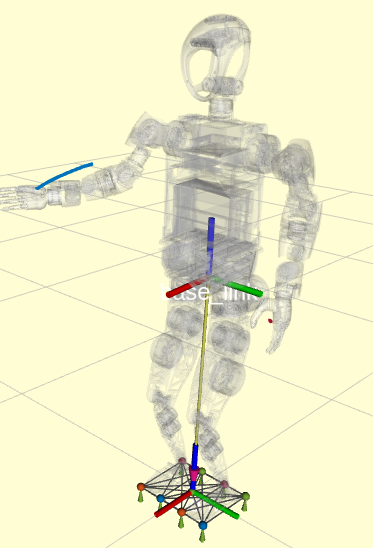
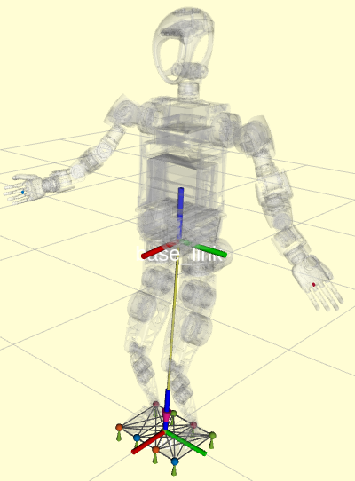

# 手臂轨迹规划案例
- [手臂轨迹规划案例](#手臂轨迹规划案例)
  - [1. 描述](#1-描述)
  - [2. 编译与启动](#2-编译与启动)
    - [2.1 编译](#21-编译)
    - [2.2 启动参数](#22-启动参数)
    - [2.3 启动示例](#23-启动示例)
  - [3. ROS 接口](#3-ros-接口)
    - [3.1 话题](#31-话题)
      - [发布的话题](#发布的话题)
        - [`/<interpolate_type>/arm_traj`](#interpolate_typearm_traj)
        - [`/<interpolate_type>/arm_traj_state`](#interpolate_typearm_traj_state)
        - [`/kuavo_arm_traj`](#kuavo_arm_traj)
    - [3.2 服务](#32-服务)
        - [`/<interpolate_type>/plan_arm_trajectory`](#interpolate_typeplan_arm_trajectory)
        - [`/<interpolate_type>/stop_plan_arm_trajectory`](#interpolate_typestop_plan_arm_trajectory)
  - [4. 使用指南](#4-使用指南)
    - [4.1 三次样条插值器](#41-三次样条插值器)
      - [4.1.1 功能概述](#411-功能概述)
      - [4.1.2 主要步骤](#412-主要步骤)
      - [4.1.3 注意事项](#413-注意事项)
    - [4.2 贝塞尔曲线插值器](#42-贝塞尔曲线插值器)
      - [4.2.1 功能概述](#421-功能概述)
      - [4.2.2 主要步骤](#422-主要步骤)
      - [4.2.3 注意事项](#423-注意事项)
  - [5. 补充说明](#5-补充说明)
    - [5.1 TACT文件格式说明](#51-tact文件格式说明)

## 1. 描述

- 本文介绍用于规划人形机器人的手臂关节状态轨迹的实现
- 示例代码位于 `<kuavo-ros-opensource>/src/demo/examples_code/hand_plan_arm_trajectory`
- 目前提供两种插值方法用于实现手臂关节状态轨迹规划:
  1. 三次样条插值器 (`plan_arm_traj_cubicspline_demo.py`)
  2. 贝塞尔曲线插值器 (`plan_arm_traj_bezier_demo.py`)

## 2. 编译与启动

### 2.1 编译

```bash
catkin build humanoid_plan_arm_trajectory
```

### 2.2 启动参数

以下是轨迹规划模块启动时可选的参数:

- `joint_state_topic`: 发布关节状态的话题名称, 默认值为 `kuavo_arm_traj`
- `joint_state_unit`: 关节角度单位, 可选 `rad` 或 `deg`, 默认值为 `deg`
- `use_nodelet`: 是否使用 nodelet 方式启动, 默认值为 `false`

### 2.3 启动示例

启动轨迹规划器:
```bash
roslaunch humanoid_plan_arm_trajectory humanoid_plan_arm_trajectory.launch
```
三次样条法：
```bash
python3 plan_arm_traj_cubicspline_demo.py
```
效果图如下：




贝塞尔曲线法：
```bash
python3 plan_arm_traj_bezier_demo.py
```
效果图如下：




## 3. ROS 接口

### 3.1 话题

#### 发布的话题

##### `/<interpolate_type>/arm_traj`

话题描述: 发布规划的手臂轨迹

消息类型: `trajectory_msgs/JointTrajectory`

| 字段 | 类型 | 描述 |
|------|------|------|
| header | std_msgs/Header | 消息头 |
| joint_names | string[] | 关节名称数组 |
| points | JointTrajectoryPoint[] | 轨迹点数组,只有points[0]包含最新的关节值 |

##### `/<interpolate_type>/arm_traj_state`

话题描述: 发布轨迹执行状态

消息类型: `humanoid_plan_arm_trajectory/planArmState`

| 字段 | 类型 | 描述 |
|------|------|------|
| progress | int32 | 轨迹执行进度,单位毫秒 |
| is_finished | bool | 轨迹是否执行完成 |

##### `/kuavo_arm_traj`

话题描述: 控制手部关节位置

消息类型: `sensor_msgs/JointState`

| 字段 | 类型 | 描述 |
|------|------|------|
| header | std_msgs/Header | 消息头 |
| name | string[] | 关节名称 |
| position | float64[] | 关节位置 |
| velocity | float64[] | 关节速度 |
| effort | float64[] | 关节力矩(未使用) |

### 3.2 服务

##### `/<interpolate_type>/plan_arm_trajectory`

话题描述: 轨迹规划服务

其中 `<interpolate_type>` 可以是:
- `bezier`: 贝塞尔曲线插值
- `cubic_spline`: 三次样条插值

**贝塞尔曲线插值服务**

消息类型: `humanoid_plan_arm_trajectory/planArmTrajectoryBezierCurve`

请求参数:

| 字段 | 类型 | 描述 |
|------|------|------|
| multi_joint_bezier_trajectory | jointBezierTrajectory[] | 多个关节的贝塞尔轨迹数组 |
| start_frame_time | float64 | 轨迹的开始时间,单位秒 |
| end_frame_time | float64 | 轨迹的结束时间,单位秒 |
| joint_names | string[] | 关节名称数组 |

返回结果:

| 字段 | 类型 | 描述 |
|------|------|------|
| success | bool | 规划是否成功 |

**三次样条插值服务**

消息类型: `humanoid_plan_arm_trajectory/planArmTrajectoryCubicSpline`

请求参数:

| 字段 | 类型 | 描述 |
|------|------|------|
| joint_trajectory | trajectory_msgs/JointTrajectory | 关节轨迹规范 |

返回结果:

| 字段 | 类型 | 描述 |
|------|------|------|
| success | bool | 规划是否成功 |

##### `/<interpolate_type>/stop_plan_arm_trajectory`

话题描述: 停止轨迹执行服务

消息类型: `std_srvs/Trigger`

## 4. 使用指南

### 4.1 三次样条插值器

#### 4.1.1 功能概述
`plan_arm_traj_cubicspline_demo.py` 使用三次样条插值器来规划机器人的手臂轨迹。

#### 4.1.2 主要步骤
1. **初始化节点和服务**:
   - 初始化ROS节点 `arm_trajectory_cubicspline_demo`
   - 订阅 `/cubic_spline/arm_traj` 话题
   - 发布 `/kuavo_arm_traj` 话题

2. **服务调用**:
   - 设置手臂控制模式
   - 使用轨迹规划服务

3. **轨迹规划**:
   - 定义关节位置和时间点
   - 将当前关节状态作为起始点
   - 发送轨迹请求

#### 4.1.3 注意事项
- 确保所有服务和话题配置正确
- 确保 `mpc_observation` 消息可用

### 4.2 贝塞尔曲线插值器

#### 4.2.1 功能概述
`plan_arm_traj_bezier_demo.py` 使用贝塞尔曲线插值器来规划机器人的手臂轨迹。

#### 4.2.2 主要步骤
1. **初始化节点和服务**:
   - 初始化ROS节点 `arm_trajectory_bezier_demo`
   - 订阅 `/bezier/arm_traj` 话题
   - 发布 `/kuavo_arm_traj` 话题

2. **服务调用**:
   - 设置手臂控制模式
   - 使用轨迹规划服务

3. **轨迹规划**:
   - 读取JSON动作数据
   - 定义贝塞尔曲线控制点
   - 发送轨迹请求

#### 4.2.3 注意事项
- 确保所有服务和话题配置正确
- 确保JSON文件路径正确且数据有效

## 5. 补充说明
贝塞尔曲线插值法也可以不读取welcome.tact文件(tact文件是预设动作文件，该文件可以通过手部编辑软件导出，welcome.tact是欢迎动作,放在同目录下的action_files文件夹下)，用户也可以自定义动作帧，具体可以参考`plan_arm_traj_bezier_no_tact_demo.py`。

### 5.1 TACT文件格式说明
TACT文件是一个JSON格式的动作文件，其结构如下：

```json
{
    "frames": [
        {
            "servos": [角度1, 角度2, ...],  // 各关节的角度值数组
            "keyframe": 时间值,              // 关键帧的时间点(单位:毫秒)
            "attribute": {
                "1": {                      // 关节索引(1-14,对应14个手臂关节)
                    "CP": [                 // 贝塞尔曲线控制点
                        [x1, y1],           // 左控制点[时间偏移量, 角度偏移量]
                        [x2, y2]            // 右控制点[时间偏移量, 角度偏移量]
                    ]
                },
                "2": {
                    "CP": [[x1, y1], [x2, y2]]
                }
                // ... 其他关节的控制点配置
            }
        },
        // ... 更多关键帧
    ]
}
```

主要字段说明：
- `servos`: 包含所有关节角度值的数组，对应14个手臂关节
- `keyframe`: 关键帧的时间点，单位为毫秒
- `attribute`: 包含每个关节的贝塞尔曲线控制点配置
  - `CP`: 每个关节有两个控制点(左右各一个)，用于调整曲线形状
