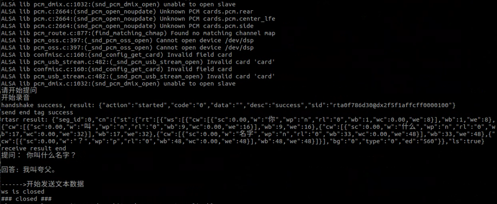

# 接入deepseek大模型语音交互案例

## 描述

  - 接入deepseek大模型，实现了一个语音交互系统，包括录音、语音转写、对话生成和语音播放功能。
  
  - 示例代码路径:`<kuavo_ros_application>/src/kuavo_large_model/rtasr_python3_demo.py`

## 程序逻辑

1. 导入模块及定义全局变量

  - 作用：导入所需的Python标准库和第三方库并定义录音和音频处理的全局参数。

2. chat 函数

  - 作用：实现录音功能，根据音量阈值和静默时间自动开始和结束录音。

  - 关键逻辑：

    - 使用 pyaudio 打开音频流并读取数据。

    - 通过 audioop.rms 计算音频数据的音量。

    - 如果音量超过阈值，开始录音；如果静默时间超过设定值，结束录音。

    - 录音数据保存为PCM文件。

3. deepseek_chat 函数

  - 作用：调用deepseek_chat的API进行对话，并将回复通过TTS转换为语音播放。

  - 关键逻辑：

    - 构造请求体，发送到deepseek_chat的API。

    - 解析API返回的回复内容。

    - 调用 tts_xunfei 将回复转换为语音并播放。

4. Client 类

  - 作用：实现与讯飞实时语音转写（RTASR）服务的WebSocket通信。

  - 关键逻辑：

    - 初始化WebSocket连接并生成签名。

    - 发送音频数据到RTASR服务。

    - 接收并解析RTASR返回的转写结果。

5. 主程序

  - 作用：主程序逻辑，循环录音、转写、对话和播放。

  - 关键逻辑：

    - 调用 chat 录音。

    - 使用 Client 类将录音发送到RTASR服务。

    - 调用 deepseek_chat 进行对话并播放回复。

## 说明

   - 该案例所使用的语音，文字转换模型为： https://www.xfyun.cn/

   - 该案例所使用的对话大模型为深度求索(deepseek)推出的deepseek-chat： https://www.deepseek.com/

   - 获取DeepSeek API Key：
     - https://platform.deepseek.com/usage
     - 充值，获取API Key    
     - 将程序第101行的api-key替换成获取到的即可

   ⚠️ **注意: 使用该案例时，需要机器人上位机连接外网**

## 执行

  - 启动
    ```bash
    cd kuavo_ros_application  # 进入上位机工作空间(根据实际部署目录切换)
    source /opt/ros/noetic/setup.bash
    source devel/setup.bash
    python3 src/kuavo_large_model/rtasr_python3_demo.py 
    ```

  - 效果
    
