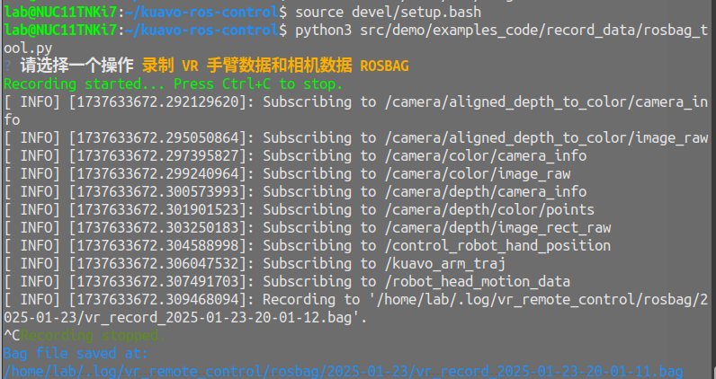

# 数据采集案例

- [数据采集案例](#数据采集案例)
  - [说明](#说明)
  - [示例代码](#示例代码)
  - [关键函数说明](#关键函数说明)
    - [1 `record_rosbag(config)`](#1-record_rosbagconfig)
    - [2 `playback_rosbag()`](#2-playback_rosbag)
    - [3 `main()`](#3-main)
  - [程序逻辑](#程序逻辑)
    - [初始化阶段](#初始化阶段)
    - [主菜单](#主菜单)
    - [录制 ROS Bag 文件](#录制-ros-bag-文件)
    - [回放 ROS Bag 文件](#回放-ros-bag-文件)
  - [JSON配置文件说明](#json配置文件说明)
  - [执行及效果](#执行及效果)


## 说明
- 数据采集方式为通过rosbag包录制目标需求的机器人信息话题，如相机图像、手臂位置轨迹等等

## 示例代码
- 路径：`<kuavo-ros-opensource>/src/demo/examples_code/record_data/rosbag_tool.py`
- 描述：该程序是一个用于录制和回放rosbag文件


## 关键函数说明

### 1 `record_rosbag(config)`
- 功能：录制 ROS bag 文件。
- 参数：
  - `config`：包含录制主题列表的字典。
- 流程：
  1. 创建保存路径。
  2. 生成文件名。
  3. 构建录制命令。
  4. 启动录制并等待用户中断。
  5. 保存录制结果。

### 2 `playback_rosbag()`
- 功能：回放 ROS bag 文件。
- 流程：
  1. 列出日期文件夹。
  2. 列出 bag 文件。
  3. 启动回放。

### 3 `main()`
- 功能：程序入口，显示主菜单并调用相应功能。


## 程序逻辑

### 初始化阶段
1. 检查依赖：
   - 程序首先检查是否安装了 `questionary` 和 `rich` 库。
   - 如果未安装，则通过 `pip` 自动安装。

2. 加载配置文件：
   - 从 `record_topics.json` 文件中加载需要录制的 ROS 主题列表。
   - 配置文件路径为 `record_topics_path`，与脚本文件在同一目录下。

3. 设置保存路径：
   - 定义 ROS bag 文件的保存路径为 `~/.log/vr_remote_control/rosbag`。

### 主菜单
1. 显示主菜单：
   - 使用 `questionary.select` 显示主菜单，提供两个选项：
     - 录制 VR 手臂数据和相机数据 ROSBAG
     - 回放 VR 手臂数据和相机数据 ROSBAG

2. 用户选择操作：
   - 根据用户选择，调用相应的功能函数（`record_rosbag` 或 `playback_rosbag`）。

### 录制 ROS Bag 文件
1. 准备录制路径：
   - 获取当前日期，并创建对应的文件夹，如果文件夹已存在，则直接使用。

2. 生成文件名：
   - 使用当前时间戳生成唯一的 bag 文件名。

3. 构建录制命令：
   - 如果配置文件中指定了主题列表，则录制这些主题。
   - 如果未指定主题，则录制所有主题（使用 `-a` 参数）。

4. 启动录制：
   - 使用 `subprocess.Popen` 启动 `rosbag record` 命令。
   - 录制过程中，用户可以通过 `Ctrl+C` 停止录制。

5. 保存录制结果：
   - 录制完成后，程序会输出保存路径。

### 回放 ROS Bag 文件
1. 选择日期文件夹：
   - 列出 `~/.log/vr_remote_control/rosbag` 目录下的所有日期文件夹。
   - 用户选择一个日期文件夹。

2. 选择 bag 文件：
   - 列出所选日期文件夹中的所有 `.bag` 文件。
   - 用户选择一个 bag 文件。

3. 启动回放：
   - 使用 `subprocess.Popen` 启动 `rosbag play` 命令。
   - 回放过程中，程序会输出回放文件的路径。


## JSON配置文件说明
```bash
# 当前录制的话题如下
# "record_topics": [
#   "/kuavo_arm_traj",
#   "/control_robot_hand_position",
#   "/robot_head_motion_data",
#   "/camera/depth/image_rect_raw",
#   "/camera/depth/camera_info",
#   "/camera/depth/color/points",
#   "/camera/color/image_raw",
#   "/camera/color/camera_info",
#   "/camera/aligned_depth_to_color/image_raw",
#   "/camera/aligned_depth_to_color/camera_info"
# ],
```
配置录制话题有哪些的 json 文件在 `<kuavo-ros-opensource>/src/demo/examples_code/record_data/record_topics.json` 中


## 执行及效果

  - 启动
  ```
  先启动想录制的话题相关程序
  cd kuavo-ros-opensource
  source devel/setup.bash
  python3 /src/demo/examples_code/record_data/rosbag_tool.py
  ```

  - 采集效果
    