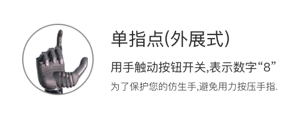
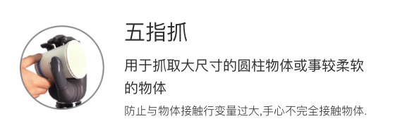
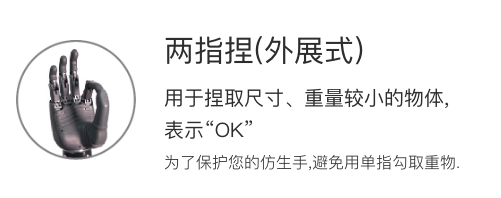
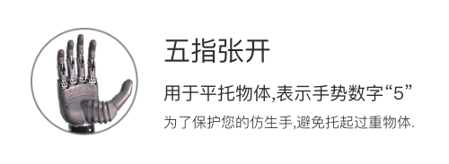
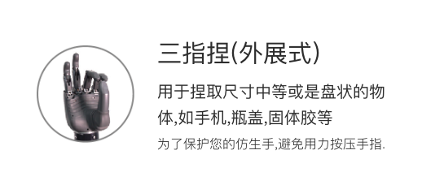
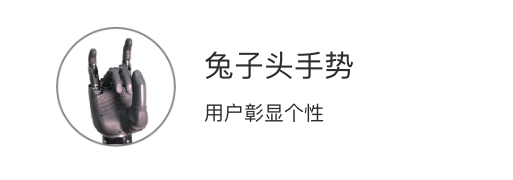
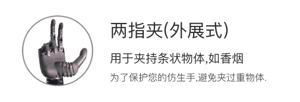

# 灵巧手手势使用案例

- [灵巧手手势使用案例](#灵巧手手势使用案例)
  - [预设手势](#预设手势)
    - [手势图例](#手势图例)
  - [执行预设手势](#执行预设手势)
  - [查询是否有预设手势执行](#查询是否有预设手势执行)
  - [示例代码](#示例代码)

## 预设手势
- `/gesture/list`：列出所有手势
    

    
<b> 点击展开查看所有手势列表, 注意:如与服务接口返回不一致, 请以实际情况为准!</b>

    <table>
    <tr><th>名称</th><th>名称</th><th>别名</th><th>描述</th></tr>
    <tr><td>单指点（内收式）</td><td>"finger-pointing-opposed"</td><td>"number_1"</td><td>用于触动按钮开关、点击键盘、鼠标、指示方向。该手势也可用于表示数字“1”</td></tr>
    <tr><td>单指点（外展式）</td><td>"finger_pointing-unopposed"</td><td>"number_8"</td><td>用于触动按钮开关，表示数字“8”。</td></tr>
    <tr><td>两指夹（内收式）</td><td>"two-finger-spread-opposed"</td><td>"number_2", "victory"</td><td>用于夹持条状物体，如香烟，也可表示“胜利”、数字“2”。</td></tr>
    <tr><td>两指夹（外展式）</td><td>"two-finger-spread-unopposed"</td><td>"hold-cigarette"</td><td>用于夹持条状物体，如香烟。</td></tr>
    <tr><td>两指捏（外展式）</td><td>"precision-pinch-unopposed"</td><td>"ok","number_3"</td><td>用于捏取尺寸、重量较小的物体，表示“OK”。</td></tr>
    <tr><td>两指捏（内收式）</td><td>"precision-pinch-opposed"</td><td></td><td>用于捏取尺寸、重量较小的物体，如硬币、卡片、钥匙、固体胶、花生、葡萄。</td></tr>
    <tr><td>鼠标手势</td><td>"mouse-control"</td><td></td><td>用于控制鼠标，选定该手势以后，仿生手形成对鼠标的包络。</td></tr>
    <tr><td>兔指</td><td>"rock-and-roll"</td><td></td><td>用于彰显个性。</td></tr>
    <tr><td>三指捏（外展式）</td><td>"tripod-pinch-unpposed"</td><td></td><td>用于捏取尺寸中等或是盘状的物体，如手机，瓶盖，固体胶等。</td></tr>
    <tr><td>三指捏（内收式）</td><td>"tripod-pinch-opposed"</td><td>"number_7"</td><td>捏取物体，表示手势数字七。</td></tr>
    <tr><td>食指弹</td><td>"flick-index-finger"</td><td></td><td>用于利用电机和扭簧配合弹出食指。</td></tr>
    <tr><td>中指弹</td><td>"flick-middle-finger"</td><td></td><td>用于利用电机和扭簧配合弹出中指。</td></tr>
    <tr><td>托夹式（大拇指内收）</td><td>"inward-thumb"</td><td>"number_4"</td><td>多用于托碗、盘子等。表示手势数字四。</td></tr>
    <tr><td>四指拿</td><td>"four-finger-straight"</td><td></td><td>用于端取碗或大直径的圆柱物体，物体不接触手心。</td></tr>
    <tr><td>五指张开</td><td>"palm-open"</td><td>"number_5"</td><td>用于平托物体，表示手势数字五。</td></tr>
    <tr><td>握拳</td><td>"fist"</td><td></td><td>握持各类不同大小、形状的物体，如水杯、网球、球拍、苹果。</td></tr>
    <tr><td>虎克提</td><td>"thumbs-up"</td><td>"thumbs-up"</td><td>用于提取物体，如手提袋、包等。同时表达：真棒！点个赞！</td></tr>
    <tr><td>侧边捏</td><td>"side-pinch"</td><td></td><td>用于拿接名片、捏物品等。</td></tr>
    <tr><td>夹笔1</td><td>"pen-grip1"</td><td></td><td>用于夹普通笔、毛笔等写字。</td></tr>
    <tr><td>夹笔2</td><td>"pen-grip2"</td><td></td><td>用于夹普通笔、毛笔等写字。</td></tr>
    <tr><td>五指抓</td><td>"cylindrical-grip"</td><td>"five-finger-grab"</td><td>用于抓取物体，手心不完全接触物体。</td></tr>
    <tr><td>666</td><td>"shaka-sign"</td><td>"number_6", "666"</td><td>表示数字六，同时也是网路用语666。</td></tr>
    <tr><td>五指捏</td><td>"five-finger-pinch"</td><td></td><td>用于抓握物体。</td></tr>
    <tr><td>两指侧捏</td><td>"two-finger-side-pinch"</td><td>"pen-grip3"</td><td>利用食指侧边配合大拇指完成物品捏取。</td></tr>
    </table>
    

### 手势图例
1. **单指点（外展式）**  
   

2. **五指抓取**  
   

3. **666手势**  
   

4. **两只捏（外展式）**  
   

5. **握拳**  
   `fist`

6. **点赞**  
   `thumbs-up`

7. **五指张开**  
   

8. **三指捏**  
   

9. **兔子头手势**  
   

10. **二指夹（外展式）**  
    

## 执行预设手势
- `/gesture/execute`服务
  - 该服务用于执行预设手势
  - 请求值：`gesture_name`预设的手势名称和`hand_side`选择要使用的手。
  - 响应值：是否成功（bool类型）。
  - 该服务用于**抢占式**执行预设的手势(假如有手势正在执行则会中断该执行)，通过 gesture_names 来选择手势，手势名称可以通过 `/gesture/list` 查看
  - **警告:不要在使用 `/control_robot_hand_position`控制灵巧手的同时调用该接口, 否则会出现无法预料的效果.**

## 查询是否有预设手势执行
- `/gesture/execute_state`服务
  - 该服务用于查询是否有手势正在执行
  - 请求值： 无。
  - 响应值： 是否有预设手势执行（bool类型）。

## 示例代码
- 路径：`<kuavo-ros-opensource>/src/demo/examples_code/hand_gesture/gesture_client.py`