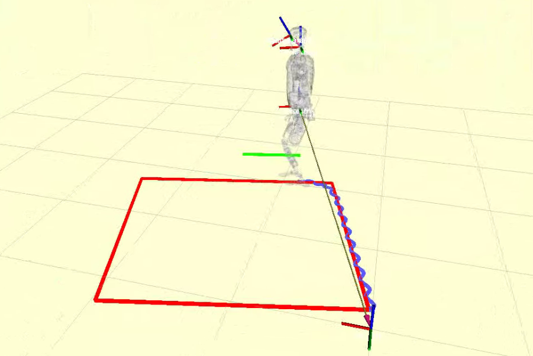
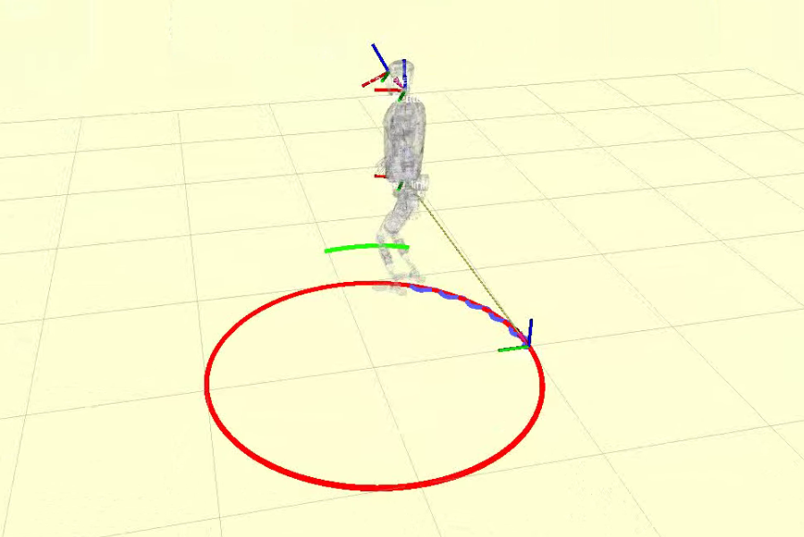
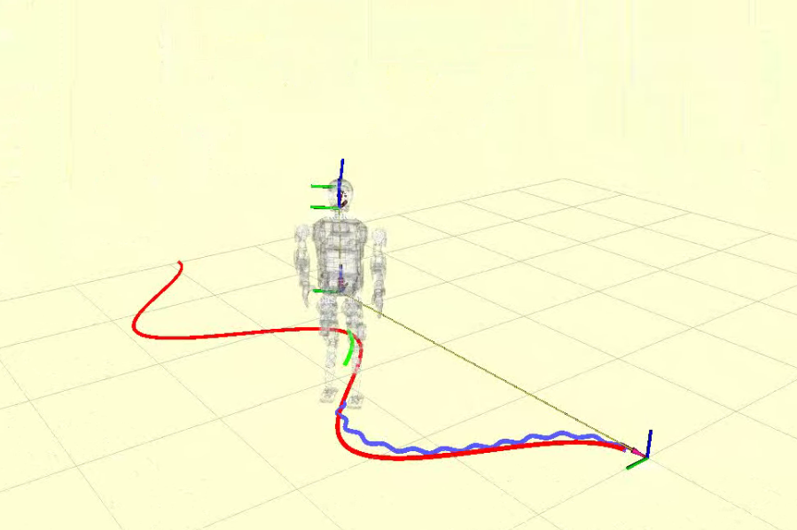

# 路径轨迹规划案例
- [路径轨迹规划案例](#路径轨迹规划案例)
  - [描述](#描述)
  - [目录结构](#目录结构)
  - [参数设置](#参数设置)
    - [路径参数](#路径参数)
      - [直线](#直线)
      - [正方形](#正方形)
      - [圆形](#圆形)
      - [S 曲线](#s-曲线)
    - [控制器](#控制器)
      - [MPC](#mpc)
  - [编译](#编译)
  - [启动](#启动)

## 描述
- 功能包：`trace_path` (位于下位机代码仓库): `<kuavo-ros-opensource>/src/demo/trace_path`
使用 MPC 控制器跟踪给定的固定轨迹示例，包括:
- 直线：从机器人当前的位置和朝向为起点，生成指定长度的轨迹
- 正方形：从机器人当前的位置和朝向为起点，逆时针生成指定长度的轨迹
- 圆形：从机器人当前的位置和朝向为起点，逆时针生成指定半径的轨迹
- “S” 曲线：从机器人当前的位置和朝向为起点，生成正弦曲线轨迹

## 目录结构
```bash
# tree -L 2 -d
.
├── CMakeLists.txt
├── docs      # 文档/图片
├── include 
│   └── trace_path  # 头文件
├── launch        
│   ├── follow_circle_traj.launch  # 跟踪圆形轨迹-启动文件
│   ├── follow_s_curve_traj.launch # 跟踪S曲线轨迹-启动文件
│   └── follow_sqaure_traj.launch  # 跟踪正方形轨迹-启动文件
├── package.xml
├── README.md
├── rviz
│   └── trace_path_demo.rviz
└── src
    ├── circle_path_generator.cpp   # 圆形路径生成器
    ├── common                      # 公共方法
    ├── line_path_generator.cpp     # 直线路径生成器
    ├── mpc_path_tracer.cpp         # MPC 控制器
    ├── path_tracer.cpp             # 路径跟踪器基类
    ├── pid_path_tracer.cpp
    ├── s_curve_path_generator.cpp  # 正方形路径生成器
    ├── square_path_generator.cpp   # S曲线路径生成器
    └── tests                       # *_main.cc 入口
```
## 参数设置
### 路径参数
公共参数：
- speed: 速度，单位 m/s
- dt: 时间间隔，单位 s
即每隔`speed * dt`距离在路径上生成一个点
#### 直线
- length: 长度，单位 m
#### 正方形
- side_length： 边长 ，单位 m
#### 圆形
- radius: 半径，单位 m
#### S 曲线
- length: 总长度的一半，单位 m
- amplitude： 振幅

| 正方形路径 | 圆形路径|S曲线路径 |
| -- | -- | -- |
||||

### 控制器

#### MPC 
可通过`set_max_linear_velocity`和`set_max_angular_velocity`设置最大线性速度和最大角速度来约束求解

## 编译
修改 `src/demo/trace_path/src/tests/*_main.cc` 对应文件的的路径参数和控制器参数，然后编译运行：
```bash
cd ~/kuavo_ros_opensource
sudo su
catkin build trace_path # 编译
```

## 启动
**终端1**：启动机器人程序

```bash
source devel/setup.bash # 如果使用zsh，则使用source devel/setup.zsh
# 仿真环境运行
roslaunch humanoid_controllers load_kuavo_mujoco_sim.launch # 启动控制器、mpc、wbc、仿真器
# 实物请运行
roslaunch humanoid_controllers load_kuavo_real.launch # 启动实物节点
```

**终端2**：生成轨迹并跟踪

启动参数:
- `rviz` 可视化参考路径和实时路径(可选): `rviz:=true`

```bash
source devel/setup.bash

# 正方形轨迹跟踪
roslaunch trace_path follow_sqaure_traj.launch

# 圆形轨迹跟踪
roslaunch trace_path follow_circle_traj.launch

# S曲线轨迹跟踪
roslaunch trace_path follow_s_curve_traj.launch
```


