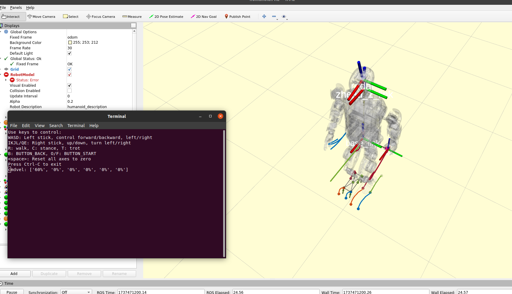

# 键盘控制案例


## 描述

  - 使用键盘控制机器人的运动
  
  - 示例代码路径:`<kuavo-ros-opensource>/src/kuavo_sdk/scripts/keyboard_control/robot_keyboard_control.py`

## 程序逻辑

1. 程序初始化

    - 程序启动时，初始化ROS节点，节点名称为simulated_joystick

    - 创建一个SimulatedJoystick类的实例

    - 订阅/stop_robot话题，用于接收停止机器人的信号

    - 发布/joy话题，用于发送模拟的遥控器信号

    - 使用termios库设置键盘输入为非阻塞模式，以便实时读取键盘输入

2. 键盘输入处理
    - getKey函数：

      使用select库监听键盘输入，设置超时时间为0.1秒

      如果有键盘输入，读取单个字符并返回；否则返回空字符串

      恢复键盘的原始设置，避免程序退出后键盘输入异常

    - update_joy函数：

      根据键盘输入更新模拟遥控器的状态（按钮和摇杆信号）

3. 信号发布
    - 主循环：

      在run函数中，程序进入主循环，不断监听键盘输入。

      如果有键盘输入，调用update_joy函数更新遥控器状态。

      将更新后的遥控器信号（joy_msg）发布到/joy话题。

    - 退出条件：

      如果按下Ctrl-C，程序退出主循环。

      如果接收到/stop_robot话题的消息，程序调用rospy.signal_shutdown关闭ROS节点。

4. 程序退出

    - 资源清理：

      程序退出时，恢复键盘的原始设置，避免键盘输入异常。


## 参数说明

  - `joystick_sensitivity`:灵敏度,无单位.

  - 修改路径:`<kuavo-ros-opensource>/src/humanoid-control/humanoid_controllers/launch/joy/joy_control_sim.launch`


## 执行

  - 启动
    ```bash
    cd kuavo-ros-opensource  # 进入下位机工作空间(根据实际部署目录切换)
    source devel/setup.bash
    # 仿真环境运行
    roslaunch humanoid_controllers load_kuavo_mujoco_sim.launch 
    # 实物运行
    roslaunch humanoid_controllers load_kuavo_real.launch 
    ```

  - 操作说明
    
    按键盘WASD为左操纵杆，控制前进/后退，左/右横移；IKJL/QE为右操纵杆、上/下、左转/右转,每按动一次值增加或减小10%；R是walk；C是stance；T是trot；B是back；O/F是start；空格是将左右操纵杆的输入重置为零。

  - 运行效果 
    
