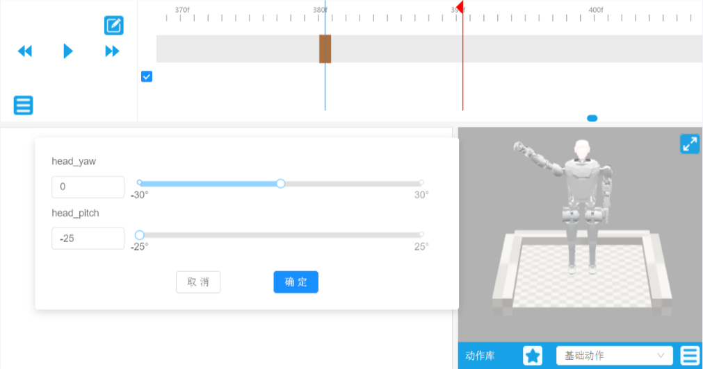
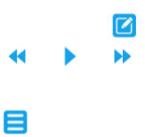
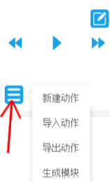

# 手臂动作编辑工具使用手册

> 本工具是一个可视化的机器人动作编辑软件，支持机械臂、手指和头部的动作编辑，可以直观地设计和预览机器人动作，并导出为可执行的动作文件。

- [手臂动作编辑工具使用手册](#手臂动作编辑工具使用手册)
  - [描述](#描述)
  - [下载和安装](#下载和安装)
  - [使用](#使用)
    - [使用须知](#使用须知)
    - [关节点编辑学习](#关节点编辑学习)
    - [实际动作设计](#实际动作设计)
    - [手指控制](#手指控制)
    - [头部控制](#头部控制)
  - [应用](#应用)

## 描述
工具用于实现机器人机械臂的一些常规动作预设，生成对应帧的关节角度数据，并保存为.tact文件，后续可以通过程序调用，生成的动作可以有很多，如挥手、欢迎、招手等。

## 下载和安装
工具是Windows平台下的应用程序，下载exe文件即可使用。
- 下载地址为： [手臂编辑工具](https://kuavo.lejurobot.com/kuavo-desktop-beta/Kuavo-0.0.3-35-gc24d6f6-win.exe)  
下载完成后，双击exe文件，即可运行，运行打开后如下图所示：


## 使用
### 使用须知
- 电机的旋转方向和机器人的坐标系正方向一致，符合右手定则。用右手握住电机旋转轴，让拇指指向旋转轴的正方向（旋转轴正方向和机器人的坐标系正方向一致）其余四指的弯曲方向表示旋转的正方向。
- 时间轴上的帧率为100帧/秒
- 建议在编辑前保存当前工作，避免意外丢失
- 动作设计时注意机械臂的运动范围限制，避免碰撞
- 工具界面说明：
  - 右侧区域：3D机器人模型预览
  - 头部时间轴：用于编辑关键帧
  - 右下角：基础动作库
  - 右上角工具栏：包含播放、保存等功能按钮

### 关节点编辑学习

- 首先单击机器人手臂，左侧会弹出机器人可以编辑的关节点，如下图所示：


- 为了更直观地学习和编辑动作，在开始编辑前可以将各个关节的角度归零。这是因为在机械臂的坐标系中，一个关节的角度变化会影响其他关节的运动。当所有关节角度归零时，可以更清晰地观察和理解单个关节的独立运动效果，了解单个关节的转动情况后，可以开始编辑动作。

### 实际动作设计
- 机器人手臂的动作是由多个独立的关节动作组合而成的。每个关节的动作可以看作是一个子动作，这些子动作按照一定的顺序和逻辑组合在一起，形成一个完整的手臂动作。例如，挥手动作可以分解为肩关节的抬起、肘关节的弯曲和手腕的旋转等多个子动作。通过精确控制每个关节的运动，可以实现复杂的手臂动作。下面通过一个案例来说明如何设计挥手动作。

- 设置机械臂角度，然后点击确定：


- 在约60帧位置右键鼠标，选择插入关键帧，然后点击全身：


- 此时再次右键，收藏动作亮起，点击收藏动作，将动作命名为挥手1：


- 此时右下角基础动作库中会多出一个动作：


- 开始设计第二个子动作，操作流程同上，以下给出机械臂角度和关键帧数，具体操作步骤参考挥手1：


- 关键帧数155左右：


- 收藏动作，命名为挥手2。  
- 现在开始设计第三个子动作，流程如上。角度：


- 关键帧数240：


- 收藏动作，命名为挥手3。

### 手指控制
- 工具还可以实现手指和头部的控制，和手臂的控制类似，手指的关节点一共只有6个，大拇指两个，其余手指只有一个关节点，头部只有两个关节点，所以头部和手指的控制相对简单。

- 接着上面的240帧，在320帧插入一个握拳动作，关节点角度如下：


### 头部控制

- 在380帧插入一个头部抬头动作，关节点角度如下：



- 最后在最后一个动作帧右边一点，设置为结束帧，如图中红线所示：


- 现在点击播放按钮即可播放挥手握拳抬头动作。



- 单击下图按钮，然后点击生成模块，将模块命名为挥手握拳抬头：



- 此时在界面中会出现一个挥手模块握拳抬头模块，各个模块间可以相互组合。
- 再次单击下图按钮，然后点击导出动作，即可生成程序可以读取的.tact文件：


- 生成文件如下图所示：


## 应用
- 将生成的.tact文件复制到指定路径：
  ```bash
  <kuavo-ros-opensource>/src/demo/examples_code/hand_plan_arm_trajectory/action_files
  ```
- 修改配置文件：
  - 打开 `<kuavo-ros-opensource>/src/demo/examples_code/hand_plan_arm_trajectory/robot_comprehensive_demo.py`
  - 更新文件路径：
    ```python
    file_path = rospy.get_param('~tact_file', './action_files/你的动作文件名.tact')
    ```
- 注意事项：
  - 手臂、手指、头部控制使用不同的话题
  - 运行前确保机器人处于安全位置