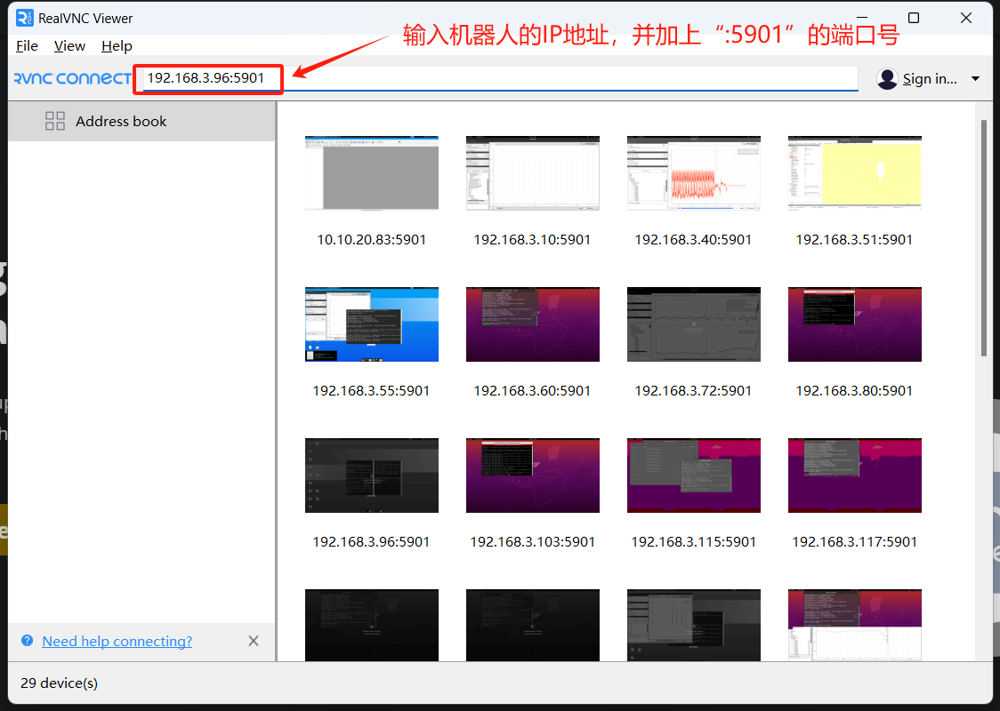
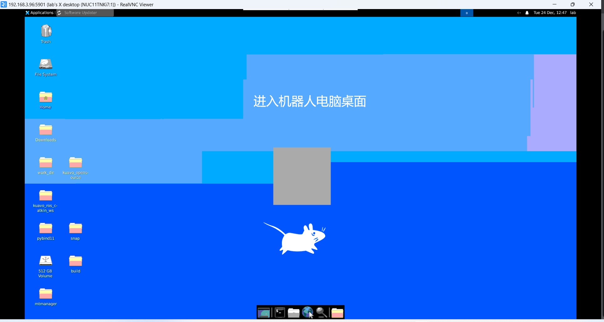
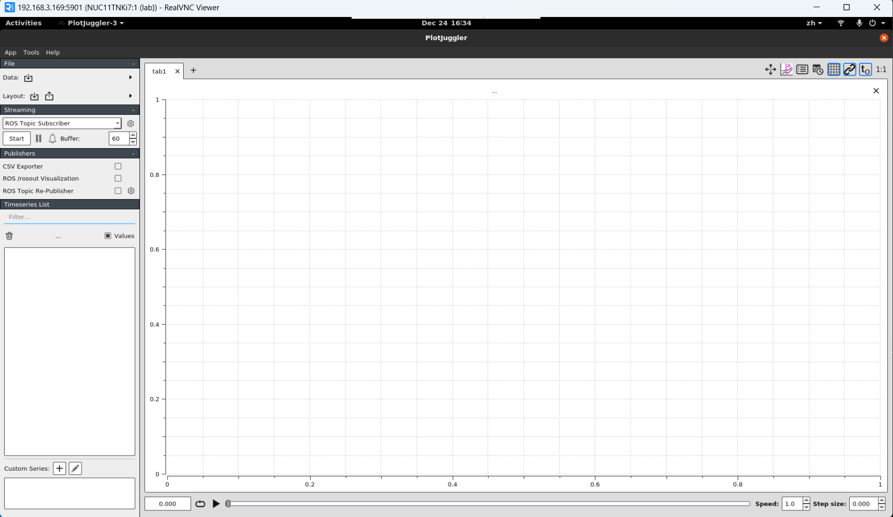
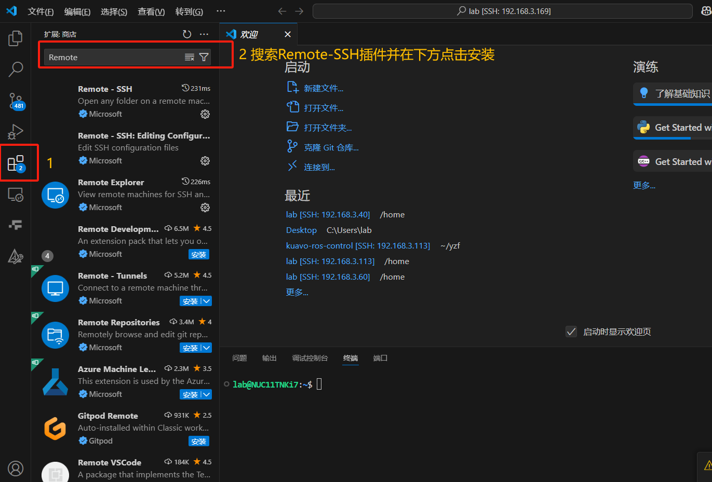
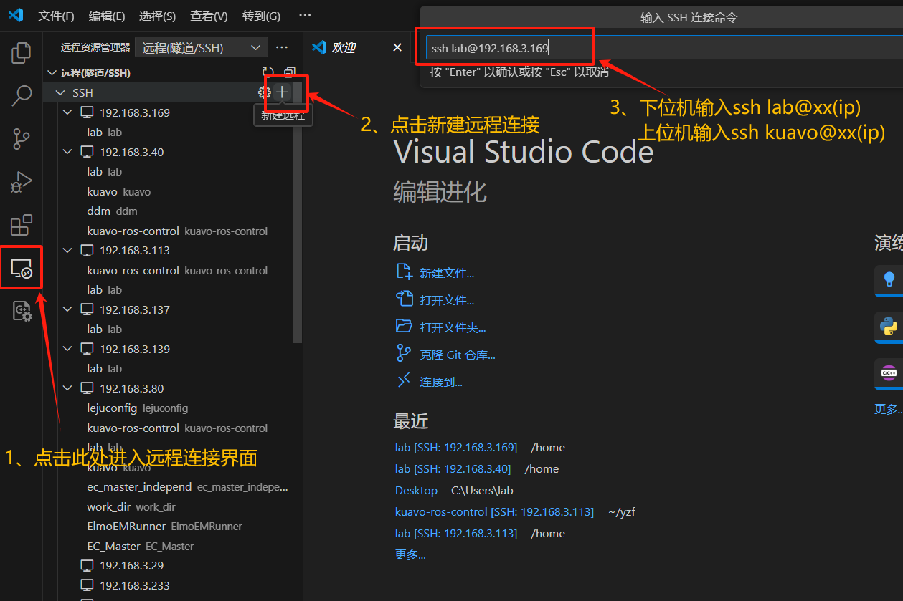
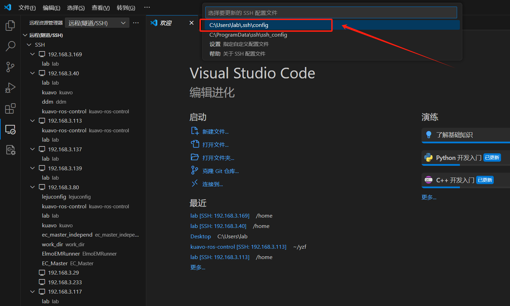
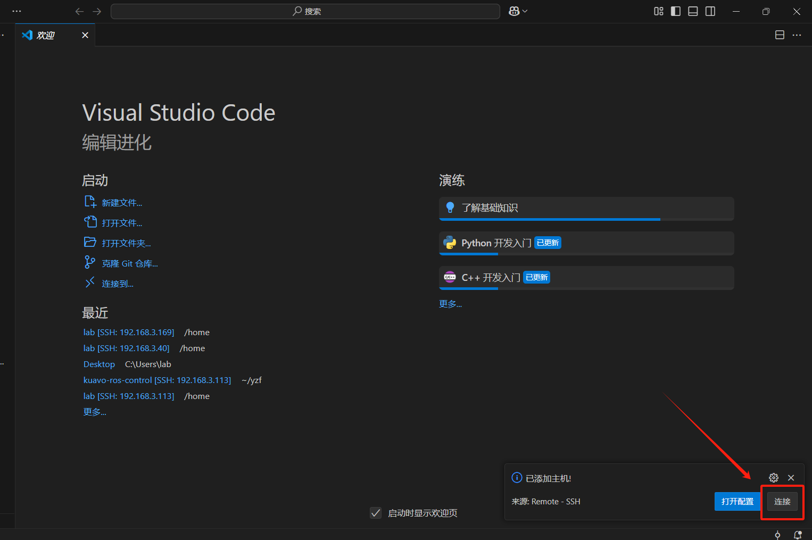
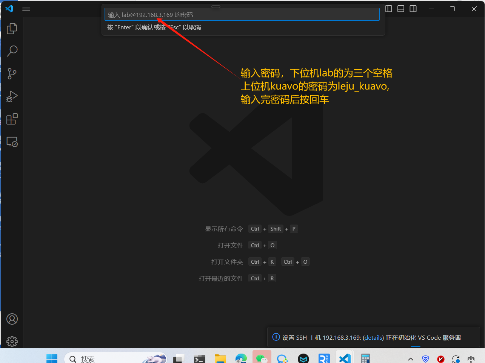
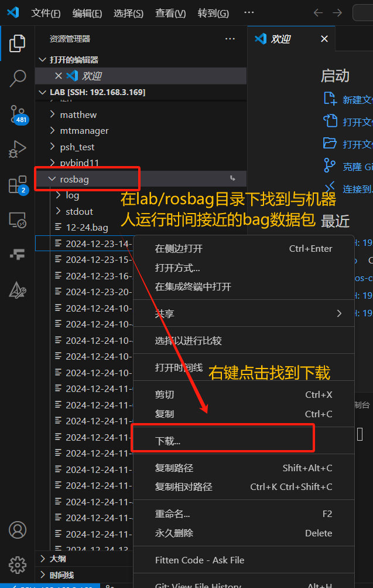
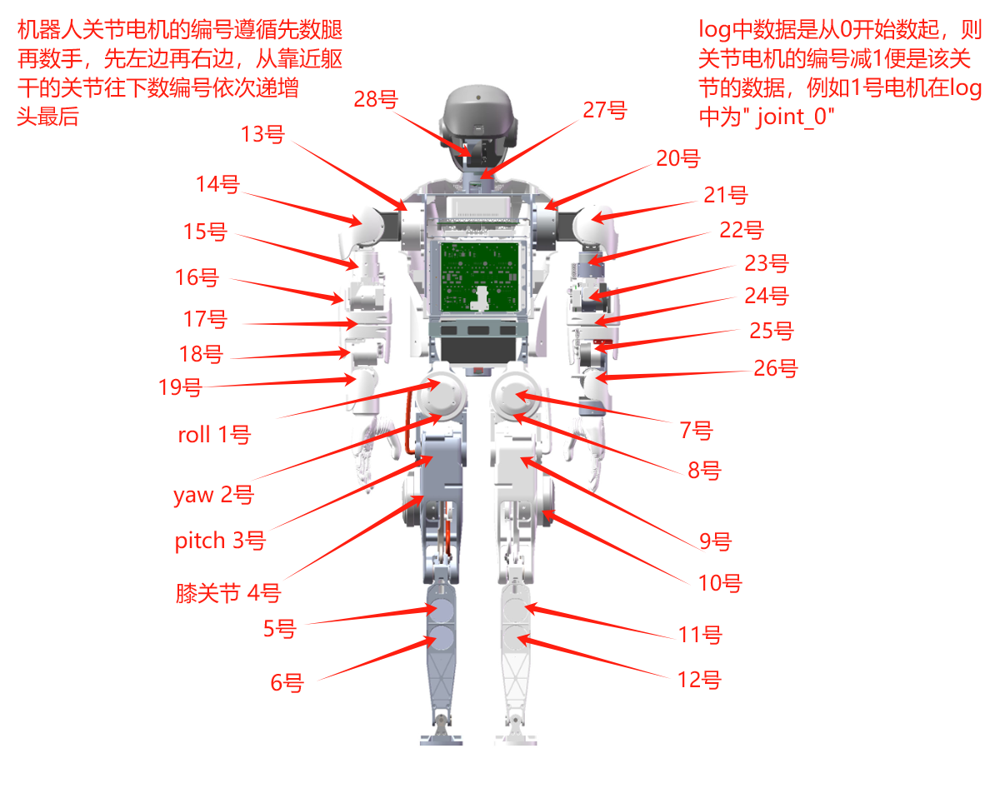

# 日志工具使用

- [日志工具使用](#日志工具使用)
  - [日志查看及导出](#日志查看及导出)
    - [远程连接](#远程连接)
    - [下载日志](#下载日志)
    - [日志数据说明](#日志数据说明)


## 日志查看及导出

查看bag包需要用到ros的插件PlotJuggler，目前可以选择通过VNC远程连接机器人上的电脑或是选择把bag包下载下来

### 远程连接

- 软件下载链接 https://www.realvnc.com/en/connect/download/viewer/

- 根据机器人IP连接机器人电脑界面
  
  
  
  

- 启动plotjuggler软件
  
  鼠标点击窗口进入VNC内部，按Ctrl+Alt+T打开终端，输入以下指令并按回车打开软件
  
  ```
  rosrun plotjuggler plotjuggler
  ```

- plotjuggler界面
  
  

### 下载日志

- 用VScode下载远程连接的插件
  
  

- 用ssh远程连接机器人电脑
  
  

- 点击配置ssh config
  
  

- 点击连接开始连接机器人电脑
  
  

- 输入密码进入远程连接
  
  

- 找到~/rosbag目录并右击文件下载bag包
  
  

### 日志数据说明

一般在查询的时候也是主要针对以下几组数据进行问题的排查

```
/monitor/system_info/cpu_frequency    #cpu内核运行频率
/monitor/system_info/cpu_temperature  #cpu内核温度
/monitor/system_info/cpu_usage        #cpu利用率占比

/motor_cmd/motor_cur  #算法下发的电机目标电流
/motor_cmd/motor_pos  #算法下发的电机目标位置
/motor_cmd/motor_vel  #算法下发的电机目标速度

/sensor_data/joint_data/error_vec         #驱动器报错信息
/sensor_data/joint_data/joint_cmd_torque  #驱动器收到的电流指令
/sensor_data/joint_data/num_cmd           #

/sensor_data_motor/motor_cur  #电机反馈的真实电流
/sensor_data_motor/motor_pos  #电机反馈的真实位置
/sensor_data_motor/motor_vel  #电机反馈的真实速度

/state_estimate/imu_data_flitered/angularVel   #经过滤波后的质心欧拉角数据
/state_estimate/imu_data_flitered/linearAccel  #经过滤波后的质心线加速度
```
1. 电机编号定义



2. 控制类相关的数据 `/humanoid_controller/*`

   - 机器人质心部分 `/humanoid_controller/com`

     - `/com/r`：质心位置，依次为x，y，z轴向的平移位置，单位 m

     - `/com/r_des`: 质心期望位置，同上，可与质心位置对比跟踪效果

     - `/com/rd`:质心速度 单位m/s

     - `/com/rd_des`:质心期望速度

3. 监控类型数据 `/monitor/*`

   - 监控wbc、mpc控制频率 `/monitor/frequency/*`

     - `/frequency/mpc`:mpc控制频率  单位: Hz

     - `/frequency/wbc`:wbc控制频率 单位：Hz

   - 监控wbc、mpc计算时间 `/monitor/time_cost/*`

     - `/time_cost/mpc`:mpc每次计算所花费的时间  单位：ms

     - `/time_cost/wbc`:wbc每次计算所花费的时间  单位：ms

   - 监控CPU `/monitor/system_info/*`

     - `/system_info/cpu_frequency`:运动控制电脑的CPU各个核心的运算频率  单位：MHz

     - `/system_info/cpu_temperature`:运动控制电脑的CPU各个核心的温度  单位：℃

     - `/system_info/cpu_usage`:运动控制电脑的CPU各个核心的使用占比 单位：%

4. IMU传感器的原始数据 `/sensor_data_raw/imu_data/*`

   - `imu_data/acc`:IMU反馈的加速度计数据   

   - `imu_data/free_acc`:去掉重力项的IMU加速度计数据

   - `imu_data/gyro`:IMU反馈的角速度计数据

   - `imu_data/quat`:IMU反馈的四元数数据

5. 实物电机的下发指令和反馈数据

  - 经过处理和换算后的下发给电机驱动层的数据 `/motor_cmd/*`

     - `motor_cmd/motor_cur`:经过换算、滤波等步骤后下发给驱动电机层的力矩 单位：N*m

     - `motor_cmd/motor_pos`:经过换算、滤波等步骤后下发给驱动电机层的角度 单位：rad

     - `motor_cmd/motor_vel`:经过换算、滤波等步骤后下发给驱动电机层的角速度 单位：rad/sec

  - 电机驱动层反馈回来的电机传感器数据 `/sensor_data_motor/*`

     - `sensor_data_motor/motor_cur`:电机驱动层反馈的电机电流值 单位：安培，A

     - `sensor_data_motor/motor_pos`:电机驱动层反馈的电机角度值 单位：rad

     - `sensor_data_motor/motor_vel`:电机驱动层反馈的电机角速度值 单位：rad/sec