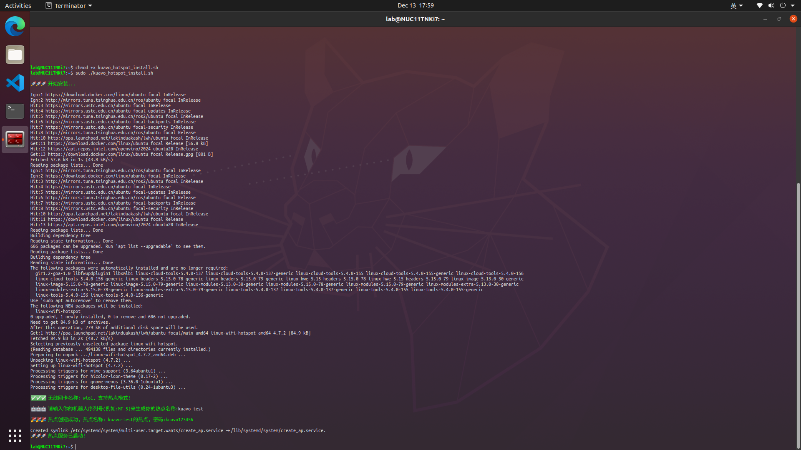
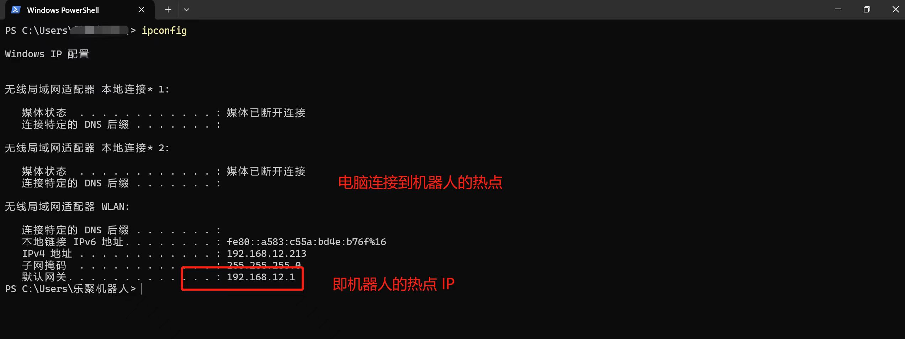
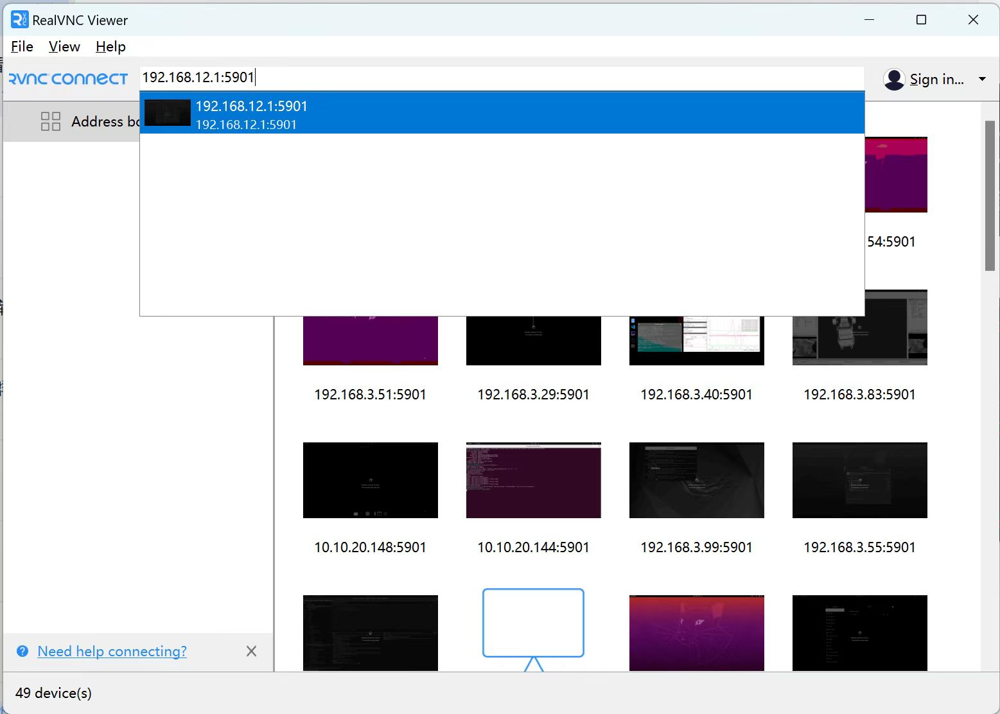
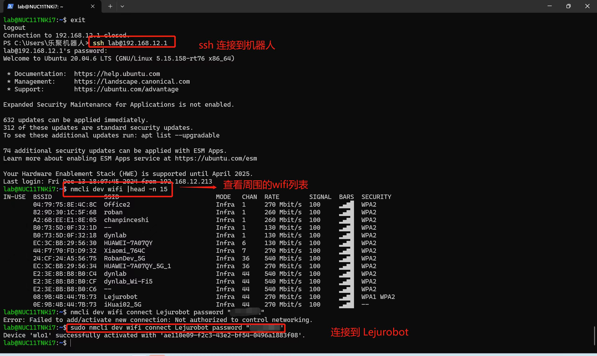

# 热点工具使用

- [热点工具使用](#热点工具使用)
  - [描述](#描述)
  - [安装\&启用](#安装启用)
  - [使用方法](#使用方法)
    - [使用 VNC 或 SSH 连接到机器人](#使用-vnc-或-ssh-连接到机器人)
  - [停用](#停用)
  - [卸载](#卸载)


## 描述
> 热点的名称: `XXX的热点`, 其中 XXX 是你输入的机器人名称。
> 热点的密码: `kuavo123456`

本工具用于在机器人上创建一个 WiFi 热点, 并将其名称设置为 `XXX的热点`, 密码为 `kuavo123456`. 你可以使用 VNC 或 SSH 连接到机器人.


## 安装&启用
执行以下命令安装:
```bash
cd ./tools/linux_wifi_hotspot/ # 请替换在你的仓库中的实际路径
chmod +x ./kuavo_hotspot_install.sh # 添加可执行权限
sudo ./kuavo_hotspot_install.sh
```


## 使用方法
**1. 连接到机器人的热点**
> 默认的热点 IP 地址是: 192.168.12.1

以 Windows 系统为例, `win +r ` 输入 `cmd` 打开命令行窗口:
```bat
# 输入以下命令查看当前连接的网络的网关地址 即机器人的热点 ip 地址
ipconfig 
```


### 使用 VNC 或 SSH 连接到机器人
**使用 VNC 连接到机器人**
你可以使用 VNC 连接到机器人, 然后切换 WIFI 或查看机器人的 IP 地址:


**或者也可以使用 SSH 连接到机器人**
以 Windows 系统为例, `win +r ` 输入 `cmd` 打开命令行窗口:
```bat
ssh lab@192.168.x.x # 192.168.x.x # 替换为机器人的 ip 地址
```

以下是通过 ssh 连接/切换机器人 WIFI 的示例:
```bash
ssh lab@192.168.x.x # 192.168.x.x # 替换为机器人的 ip 地址


# 查看周围的 WIFI
sudo nmcli dev wifi list

# 切换到指定 WIFI
sudo nmcli dev wifi connect "WIFI名称" password "WIFI密码"
```



## 停用
你可以执行以下命令来停用 kuavo 热点:

tips: 执行该命令会关闭热点, 但是开机后会再次开启热点.
```bash
sudo systemctl stop create_ap # 关闭热点, 但是开机后还是会自动开启热点
```
你也可以执行以下命令来停止开机自动开启 kuavo 热点:

tips: 执行该命令会关闭热点, 并且后续开机不会自动开启热点.
```bash
sudo systemctl disable create_ap # 关闭开机自动开启热点
```

如果您想重新设置开机自动开启热点, 您可以执行以下命令:
```bash 
sudo systemctl enable create_ap # 执行该命令后, 热点将在开机时自动开启
```

## 卸载
执行以下命令会卸载热点, 卸载后开机将不会有对应的热点开启, 如需再次使用本工具, 请重新安装.
```bash
cd ./tools/linux_wifi_hotspot/ # 请替换在你的仓库中的实际路径
chmod +x ./uninstall.sh # 添加可执行权限
sudo ./uninstall.sh

# 以下是卸载过程部分内容输出:
🚀🚀🚀 开始卸载...
...

🚀🚀🚀 卸载成功...
```
