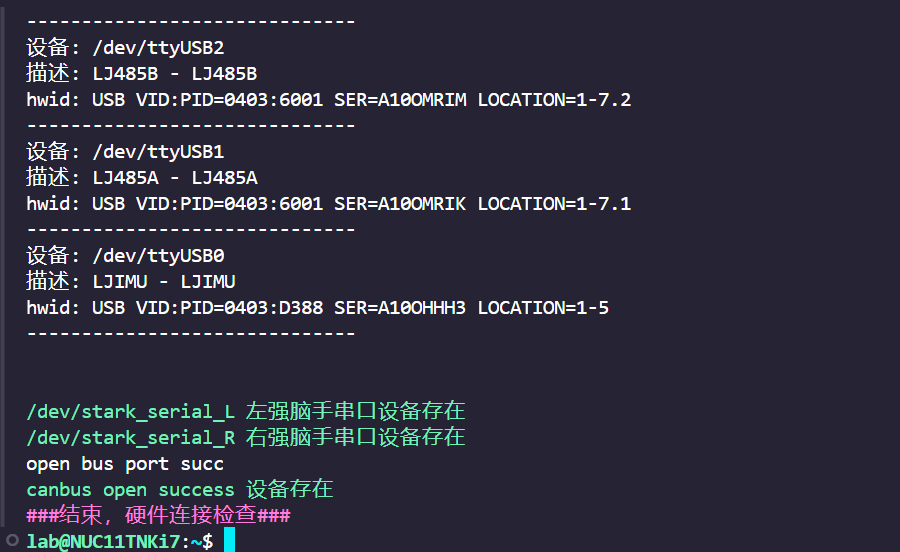
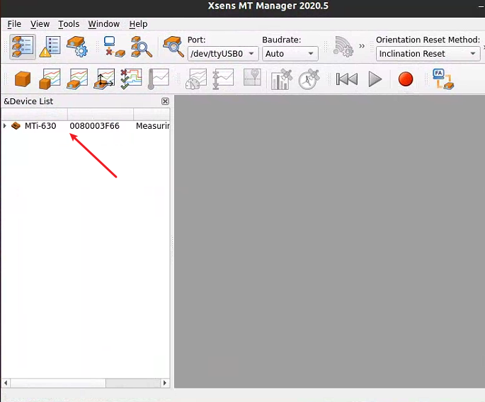
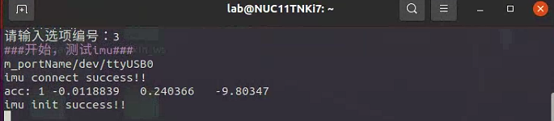

# 硬件测试工具

- [硬件测试工具](#硬件测试工具)
  - [说明](#说明)
  - [运行程序](#运行程序)
  - [主菜单功能介绍](#主菜单功能介绍)

## 说明

python 脚本程序用于检测硬件设备，包括：串口，IMU，舵机，夹爪，电机等。
通过一系列的选项操作，该脚本能够方便地进行硬件连接检查、ID和零点设置、USB配置等操作。

包含了一个主菜单（用户菜单）和二级菜单(开发者工具菜单)，其中二级菜单包含了更多细分的操作仅用于专业人员操作，用户可以使用主菜单内容根据需求选择不同的操作来执行。

## 运行程序

  使用 vscode ssh 连接机器人主机或者外接屏幕鼠标键盘，在机器人终端输入如下命令。

  $ sudo python3 tools/check_tool/Hardware_tool.py

  或

  $ sudo python3 Hardware_tool.py

  或

  $ sudo python3 ~/kuavo-ros-control/tools/check_tool/Hardware_tool.py

  运行程序后会有 ROBOT_VERSION / Number of CPU cores 提示，以及以下选项，依据需要输入选项序号按回车后即可执行相应功能。

## 主菜单功能介绍

- 0.打开零点文件
  打开零点配置文件进行编辑。

- 1.硬件连接检查

  检查各硬件组件的连接状态，包括伺服、抓手和手部的RS485 USB设备。尝试打开CAN总线并报告状态。
    通过打印确认 左/右灵巧手设备连接状态 通过打印确认 Canbus 设备 连接状态 如下打印则为 左右灵巧手设备连接正常， canbus 设备正常。
    

- 2.打开imu上位机软件(接屏幕)

  运行IMU上位机软件，用于与IMU设备进行交互。进行IMU模块的初始化配置（配置波特率等）。需要连接屏幕才能打开上位机软件。（IMU出厂已正确配置不需要重复配置）
  

- 3.测试imu(先编译)

  需要先编译当前文件夹内的程序.
    运行IMU测试命令，进行IMU设备的测试。有获取到数据，打印 connect success 则为IMU测试正常。 Ctrl + C 退出
    如下图：

    

- a.测试二指夹爪

  如果机器人配备的是二指夹爪，可以通过此选项进行测试，可看到左右二指夹爪正常开合即设备可正常使用。
  如未设置过可能会出现提示需要更新config文件则按照提示进行操作更新即可（如果正常出厂已配置正确不会出现该提示）。

- c.测试强脑手

  测试强脑手设备的抓握功能。
  先确认左右强脑手绿色灯亮灭交替闪烁为正常状态，然后测试强脑手设备的抓握功能。左右灵巧手会先左右手一起握，然后依次握左手，握右手，即为正常。

- f.零点文件备份

  备份零点配置文件及其他配置文件，会以压缩包的形式保存在/home/lab目录下。压缩包名称为confirm_backups.zip

- k.更新当前目录程序(注意：会重置文件内容，建议备份)

  更新当前目录中的程序。建议在继续之前备份文件。

