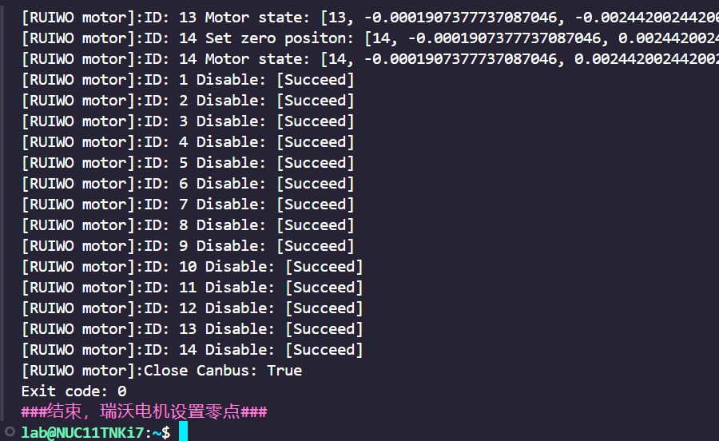

# 硬件测试工具

- [硬件测试工具](#硬件测试工具)
  - [说明](#说明)
  - [运行程序](#运行程序)
  - [主菜单功能介绍](#主菜单功能介绍)

## 说明

python 脚本程序用于检测硬件设备，包括：串口，IMU，舵机，夹爪，电机等。
通过一系列的选项操作，该脚本能够方便地进行硬件连接检查、ID和零点设置、USB配置等操作。

包含了一个主菜单（用户菜单）和二级菜单(开发者工具菜单)，其中二级菜单包含了更多细分的操作仅用于专业人员操作，用户可以使用主菜单内容根据需求选择不同的操作来执行。


## 运行程序

  使用 vscode ssh 连接机器人主机或者外接屏幕鼠标键盘，在机器人终端输入如下命令。

  $ sudo python3 tools/check_tool/Hardware_tool.py

  或

  $ sudo python3 Hardware_tool.py

  或


  $ sudo python3 ~/kuavo-ros-opensource/tools/check_tool/Hardware_tool.py


  运行程序后会有 ROBOT_VERSION / Number of CPU cores 提示，以及以下选项，依据需要输入选项序号按回车后即可执行相应功能。

## 主菜单功能介绍

- 0.打开零点文件
  打开零点配置文件进行编辑。

- 1.硬件连接检查

  检查各硬件组件的连接状态，包括伺服、抓手和手部的RS485 USB设备。尝试打开CAN总线并报告状态。
    通过打印确认 左/右灵巧手设备连接状态 通过打印确认 Canbus 设备 连接状态 如下打印则为 左右灵巧手设备连接正常， canbus 设备正常。
    

- 2.打开imu上位机软件(接屏幕)

  运行IMU上位机软件，用于与IMU设备进行交互。进行IMU模块的初始化配置（配置波特率等）。需要连接屏幕才能打开上位机软件。（IMU出厂已正确配置不需要重复配置）
  

- 3.测试imu(先编译)

  需要先编译当前文件夹内的程序.
    运行IMU测试命令，进行IMU设备的测试。有获取到数据，打印 connect success 则为IMU测试正常。 Ctrl + C 退出
    如下图：

    

- a.测试二指夹爪

  如果机器人配备的是二指夹爪，可以通过此选项进行测试，可看到左右二指夹爪正常开合即设备可正常使用。
  如未设置过可能会出现提示需要更新config文件则按照提示进行操作更新即可（如果正常出厂已配置正确不会出现该提示）。

- c.测试强脑手

  测试强脑手设备的抓握功能。
  先确认左右强脑手绿色灯亮灭交替闪烁为正常状态，然后测试强脑手设备的抓握功能。左右灵巧手会先左右手一起握，然后依次握左手，握右手，即为正常。

- f.零点文件备份

  备份零点配置文件及其他配置文件，会以压缩包的形式保存在/home/lab目录下。压缩包名称为confirm_backups.zip

- k.更新当前目录程序(注意：会重置文件内容，建议备份)

  更新当前目录中的程序。建议在继续之前备份文件。

- o.打开开发者工具

  在主菜单中选择 "o" 后，程序会进入二级菜单 (开发者工具菜单)，提供一系列开发者工具的操作
  现在添加常用的手臂电机设置零点和手臂电机辨识方向介绍
    - d.臂电机设置零点

      设置手臂电机的零点，并确保配置文件到位。 运行后，手臂电机和头部电机将以当前电机位置角度作为机器人程序运行后的初始角度。 如下打印 Canbus status: [ True ] 则 Canbus 正常，如果为 False 则 Canbus 异常，需要检查 Canbus。 如下打印 ID1 - ID14 Succeed 则为相应的手臂（头部）电机正常，否者需要检查相应存在异常的电机。
    
      ```json
        [RUIWO motor]:Canbus status: [ True ]
        [RUIWO motor]:ID: 1 Disable: [Succeed]
        [RUIWO motor]:ID: 2 Disable: [Succeed]
        [RUIWO motor]:ID: 3 Disable: [Succeed]
        [RUIWO motor]:ID: 4 Disable: [Succeed]
        [RUIWO motor]:ID: 5 Disable: [Succeed]
        [RUIWO motor]:ID: 6 Disable: [Succeed]
        [RUIWO motor]:ID: 7 Disable: [Succeed]
        [RUIWO motor]:ID: 8 Disable: [Succeed]
        [RUIWO motor]:ID: 9 Disable: [Succeed]
        [RUIWO motor]:ID: 10 Disable: [Succeed]
        [RUIWO motor]:ID: 11 Disable: [Succeed]
        [RUIWO motor]:ID: 12 Disable: [Succeed]
        [RUIWO motor]:ID: 13 Disable: [Succeed]
        [RUIWO motor]:ID: 14 Disable: [Succeed]
      ```

      手臂电机测试正常
      如下图：

      

    - e.手臂电机辨识方向
      > (注意电机限位不要堵转)辨识手臂电机的方向并记录。辨识手臂电机的方向并记录到文件中。出厂已正常配置，除非电机转向异常，否则不需要重复配置。

      首先确认关节电机轴的方向，轴的方向有三个方向 X Y Z，面对机器人前后：X轴（正前方为X轴正方向） ，左右：Y轴（机器人左手方向为Y轴正方向）， 上下：Z轴（机器人头顶上方向为Z轴正方向）

      依据电机轴的方向然后确定手臂电机的方向。
      
      可以使用以下步骤确定电机旋转的正负方向： 1.用右手的大拇指指向机器人坐标系的X轴正方向，并将四指弯曲，四指指向的方向即电机旋转的正方向。 2.用右手的大拇指指向机器人坐标系的Y轴正方向，并将四指弯曲，四指指向的方向即为世界坐标系的轴正方向。 3.用右手的大拇指指向机器人坐标系的Z轴正方向，并将四指弯曲，四指指向的方向即电机旋转的正方向。
      
      由此我们确定了手臂关节的电机旋转正方向，在运行程序输入电机 ID 后，相应 ID 号的电机会缓慢旋转，观察电机旋转的方向是否与我们需要的方向一致，并按照提示输入 Y or N 进行配置即可。配置完成后，电机会往反方向运动回到初始位置。


