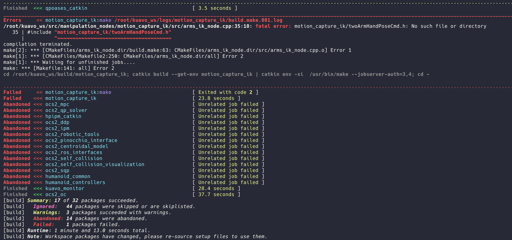
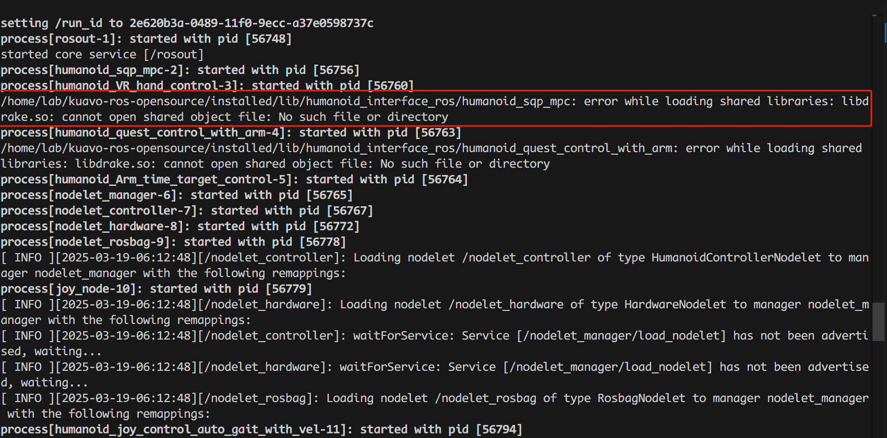
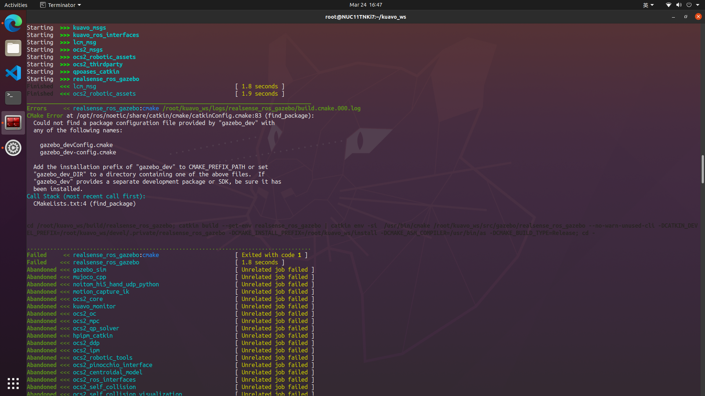
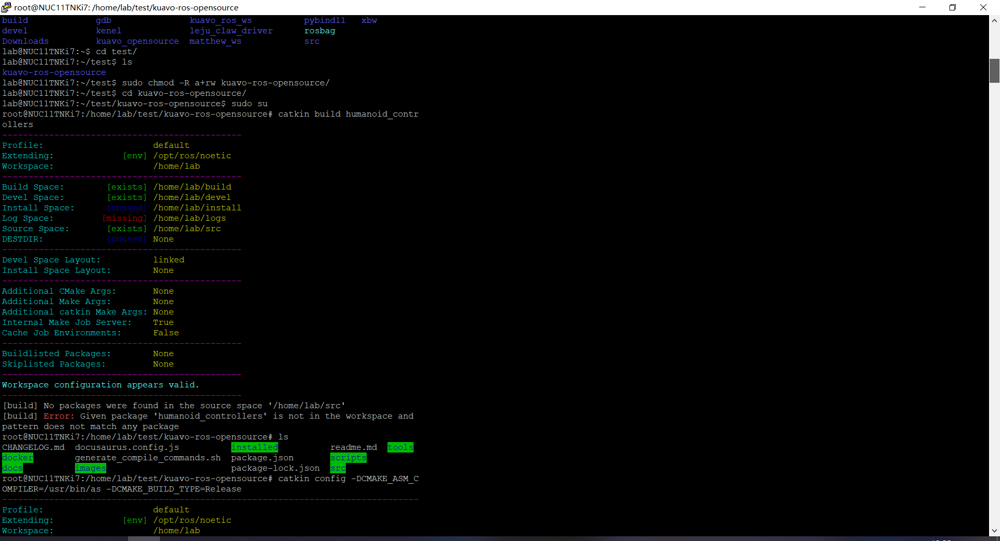
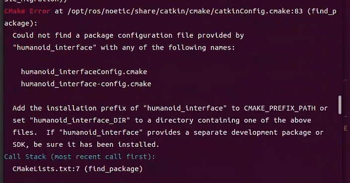
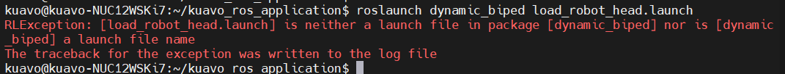

# 故障排查

- [故障排查](#故障排查)
  - [硬件](#硬件)
    - [一、EC 主站无法运行](#一ec-主站无法运行)
  - [软件](#软件)
    - [一、docker 编译报错](#一docker-编译报错)
    - [二、上位机](#二上位机)

## 硬件

### 一、EC 主站无法运行

1. **找不到从站:**

    * **检查 XML 文件:** 确认使用了正确的 XML 配置文件，该文件定义了 EtherCAT 网络的拓扑结构。
    * **检查 EtherCAT 网线:** 检查网线连接是否牢固，是否存在断开或接触不良的情况。可以尝试更换线材，如果更换后还是显示断连，则可能为驱动器插座损坏，需要更换驱动器

2. **DCM out (超时):**

    * **程序卡死:** 检查程序是否存在死循环或阻塞，导致进程卡死。
    * **CPU 内核隔离:** 确认已进行 CPU 内核隔离，避免其他进程干扰实时控制程序。
    * **程序版本:**  确认使用的是最新版本的程序，老版本程序可能存在已知的 bug。

3. **通讯丢帧:**

    * **网线连接:** 检查网线连接是否牢固可靠。
    * **网线质量:**  使用高质量的 EtherCAT 网线，避免劣质网线导致的通讯问题。
    * **驱动器座子虚焊:** 检查驱动器座子是否存在虚焊。
    * **驱动器座子:** 检查驱动器座子是否存在机械性损伤或接触不良。

## 软件

### 一、docker 编译报错

1. **catkin build humanoid_humanollers报关于motion_capture_ik相关的错:** 



`catkin build motion_capture_ik` 单独编译这个功能包

2. **报关于缺少.so文件的错** 

 

执行`echo 'export LD_LIBRARY_PATH=$LD_LIBRARY_PATH:/opt/drake/lib' >> ~/.zshrc && source ~/.zshrc`（如果是bash环境就修改bashrc）

3. **catkin build humanoid_humanollers报关于gazebo_sim相关的错:**

 

```bash
sudo apt-get update
sudo apt-get install ros-noetic-gazebo-dev
sudo apt-get install ros-noetic-gazebo-ros-pkgs ros-noetic-gazebo-ros-control
catkin build realsense_ros_gazebo
catkin build humanoid_controllers
```

4. **catking config工作空间不对**

 

/home/lab/.catkin_tools改成.catkin_tools.bak

5. **编译时出现humanoid_interface依赖报错**



```bash
#运行下面命令
source installed/setup.zsh
catkin build humanoid_controllers
```

### 二、上位机

1. **load_robot_head.launch报错**:

 

拉取master分支最新的commit
```bash
#确保目前处于master分支
git fetch
git pull 
source /opt/ros/noetic/setup.bash
catkin build apriltag_ros
catkin build 
```