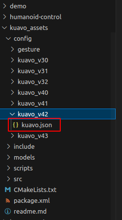

# kuavo_assets 配置文件说明
## 文件功能及路径说明 

kuavo.json 在项目中承上启下，有两方面的作用：

1. 存储上层控制器所使用的模型路径，末端连杆配置；
2. 存储关节电机相关信息，包括电机类型，电机上下限幅等；

文件所在路径如下：

## 文件中各参数的具体含义

|    数据名              |  数据类型  |          描述          |
| :-------------------: | :--------: | --------------------- |
| model_path | 字符串 | 用于计算初始化的下肢各关节逆解的模型路径 |
| model_with_arm_path | 字符串 | 参与踝关节并联杆解算的模型路径 |
| end_frames_name | 字符串数组 | 参与初始化逆解的躯干和下肢末端 在 URDF 中的 Link 名称 |
| NUM_ARM_JOINT | 整型 | 硬件层可驱动的手臂电机数量 |
| NUM_HEAD_JOINT | 整型 | 硬件层可驱动的头部电机数量 |
| NUM_JOINT | 整型 | 硬件层可驱动的所有电机数量 |
| ankle_solver_type| 枚举型 | 机器人使用的踝关节换算方法类型 (0为4代，1为4代pro，2为5代) |
| torsoP | 浮点型 | 初始化时，期望的躯干pitch角度，单位：度 |
| com_z | 浮点型 | 初始化时，期望的质心z方向高度，单位：m |
| StepWith | 浮点型 | 初始化时，脚掌中心距离躯干中心的y方向距离，单位：m |
| torsoY | 浮点型 | 初始化时，期望的躯干yaw角度，单位：度 |
| imu_invert | 布尔型 | IMU 的装配是否上下颠倒 |
| isParallelArm | 布尔型 | 是否使用并联杆手臂 |
| only_half_up_body | 布尔型 | 是否只启用上半身（头部+手臂）的控制 |
| MOTORS_TYPE | 字符串数组 | 各关节的电机类型，需与实际电机数量匹配 |
| EndEffectorType | 字符串数组 | 双臂的末端执行器类型 |
| min_joint_position_limits & max_joint_position_limits | 浮点型数组 | 各关节的上下限位角度，单位：度 |
| joint_velocity_limits | 浮点型数组 | 各关节的转速限幅，单位：度/秒 |
| end_frames_name_ik | 字符串数组 | 手臂 IK 关联的模型中躯干，手掌，肘关节的连杆名称 |
| shoulder_frame_names | 字符串名称 | 手臂 IK 关联的第一个关节连杆名称 | 
| eef_visual_stl_files | 字符串数组 | 仿真中可视化末端的模型文件名称 |
| upper_arm_length &  lower_arm_length | 浮点型 | VR 操作时，机器人的大臂和小臂长度 |
| motor_velocities_factor | 浮点型 | 头部电机速度期望的缩放因子 |