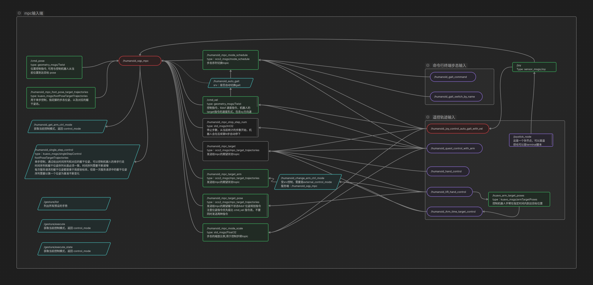
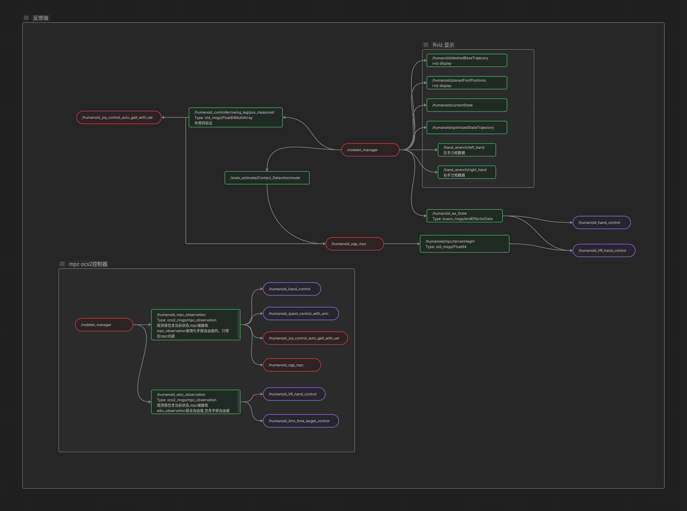
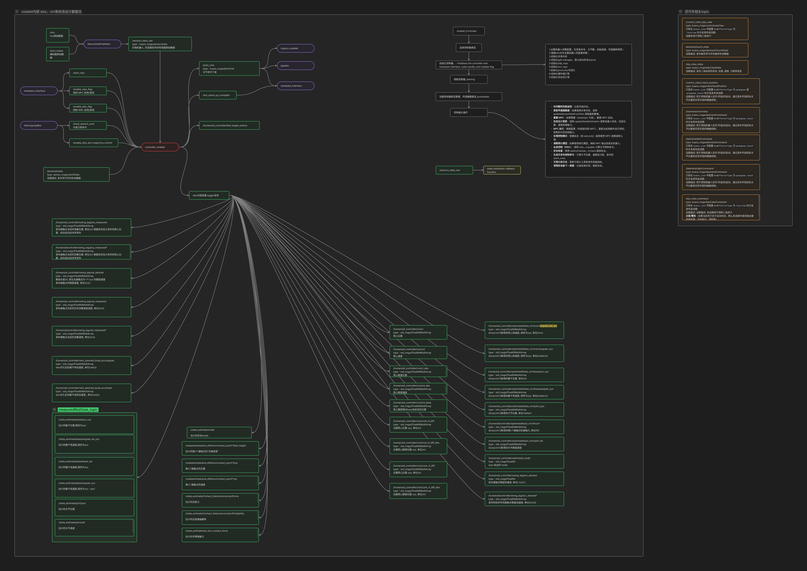

# 本文档为补充工程说明文档

涵盖wbc+mpc通信逻辑流程图；对节点逻辑关系进行了解耦；对配置文件进行重新梳理

## 详细逻辑图和说明可以查看html，本地双击浏览器打开
[运动控制接口及topic补充文档](./MPC+WBC.html)

## mpc_sqp_node 输入

## nodelet反馈端

## mpc输出端和nodelet输入端；跳过mpc的nodelt_controller输入端

## nodelet内部 wbc，mrt和状态估计数据流

## Info
###### gait.info：用于调整机器人步态的切换和对应的落足时序；

list中有可选取步态：{\[0\] stance, \[1\] trot, \[2\] jump, \[3\] sl ; single leg stance, \[4\] walk, \[5\] walk2, \[6\] trot2}
- modeSequence：接触模式，用于描述机器人双脚与地面的接触情况；
- switchingTimes：用于描述不同接触模式的持续时间，与接触模式一一对应；
modeSequence 是两个英文字母组成的字符串，单个英文描述单腿的接触情况，先左腿后右腿。 对于单条腿，接触模式有以下几种:
- S：stance，表示脚掌完全接触地面；
- F：floating，表示脚掌完全离开地面；humanoid_mpc_stop_step_num
- T：Toe，表示仅脚尖接触地面；
- H：Heel，表示仅脚跟接触地面；
example:
\`\`\`cpp fold title:gait_walk.info
walk
{
modeSequence
{
\[0\] SS
\[1\] ST
\[2\] SF
\[3\] SH
\[4\] SS
\[5\] TS
\[6\] FS
\[7\] HS

}
switchingTimes
{
\[0\] 0.05
\[1\] 0.07
\[2\] 0.35
\[3\] 0.04
\[4\] 0.05
\[5\] 0.07
\[6\] 0.35
\[7\] 0.04
}
}
\`\`\`

###### reference.info：用于调整遥控器的限幅，和各关节的控制模式和上层扭矩的kpkd；

1.  规划层的限幅（遥控器指令限幅（只关联速度和角速度），VR操作时手臂摆动的速度限幅）；
    1.  VR目标移动速度，旋转角速度；命令移动速度旋转角速度限幅；VR使用时torso胯部即质心位置的速度和角速度限幅。
    2.  质心高度，是否开启手臂模式。
2.  关节层的电机模式以及电机限幅和对应的kp，kd参数；
    1.  jointStateLimit: 各关节电机电机位置限幅频率
    2.  defaultCotrolMode: 各关节电机控制模式；
    3.  joint_kp\_: 站立模式下，各关节(除了头部) CST 模式下的扭矩指令，EC主站中位置环对应的kp系数 (==2kHz==);
    4.  joint_kd\_: 站立模式下，各关节(除了头部) CST 模式下的扭矩指令，EC主站中速度环对应的kd系数 (==2kHz==);
    5.  joint_kp_walking\_: 机器人运动时，对应关节 CST 模式下，EC主站中位置环对应的kp系数 (==2kHz==);
    6.  joint_kd_walking\_: 机器人运动时，对应关节 CST 模式下，EC主站中位置环对应的kp系数 (==2kHz==);
    7.  head_kp\_: 上层控制器下发头部扭矩时，执行的位置环对应的kp系数 (==500Hz==);
    8.  head_kd\_: 上层控制器下发头部扭矩时，执行的速度环对应的kd系数 (==500Hz==);
    9.  IMU和各关节以及速度的滤波频率；
    10. mrt_joint_vel_filter_cutoff_freq：Motion reference trajectory的低通滤波截止频率。
    11. 初始化模式序列合各个指令参数（站立时固定高度，速度角速度为0,关节位置固定）
        \###### dynamic_qr.info：MPC 根据步态，切换到对应的QR矩阵；

3. 若启用 dynamic_qr，则要保证矩阵维度对应于变量的维度，否则求解器报错；
4. 目前仅 DDP 支持，若使用 SQP 求解器，则 dynamic_qr 不会生效。
  支持三种Q矩阵的切换：
5. Q_base_stance：stance 步态时生效；
6. Q_base_walk：walk 和 trot 步态生效；
7. Q_base_jump：jump 步态生效；
###### task.info：MPC 和 WBC 各任务和约束，主要的修改文件；

1.  MPC 的模型设置；
2.  运动时，MPC 全身摆动轨迹的配置；
3.  MPC 求解器设置；
4.  MPC 使用的权重矩阵 Q，P，R；
5.  MPC 各种软约束和硬约束的参数；
6.  WBC 的扭矩约束和摩擦锥约束；
7.  WBC 加速度任务的增益系数；
8.  WBC 各加速度任务的权重；
9.  卡尔曼滤波器的参数设置；
10. 接触力估计的参数设置；
11. 代码运行时，重要频率的监测数据；
###### 参数说明：
###### 几乎不修改：

- centroidalModelType：0: FullCentroidalDynamics, 1: Single Rigid Body Dynamics；
- humanoid_interface：包含是否添加加载参数，解析梯度动力学模型计算和解析末端足底力运动学计算。
- SQP多重射击算法，求解器参数：
  - nThreads：sqp 求解时，参与并行计算的最大CPU数量9
  - dt：用户定义的动力学离散化时间0.015
  - sqpIteration：sqp 求解的迭代次数，次数多则增加求解时间
  - deltaTol：x(t)和u(t)的均方根误差小于该值，终止迭代
  - g_max & g_min：g 表示违反约束的值函数的范数, 分别表示最大和最小值
  - inequalityConstraintMu & inequalityConstraintDelta：表示不等式约束违反的宽松程度
  - projectStateInputEqualityConstraints：是否使用投影方法求解硬约束
  - printSolverStatistics & printSolverStatus & printLinesearch：求解过程的相关信息打印
  - useFeedbackPolicy：是否启用 RiccatiFeedback
  - integratorType：动力学离散化方法
  - threadPriority：MPC 求解时，所使用线程的优先级
- DDP反向迭代差分算法，求解器参数：
- IPM多重射击算法，求解器参数：
- rollout：ODE求解器参数：
  - AbsTolODE：ODE 求解器的绝对容忍误差
  - RelTolODE：ODE 求解器的相对容忍误差
  - timeStep：逐步推进动力学模拟的时间步长
  - integratorType：推进动力学模拟使用的积分器类型ODE45
  - maxNumStepsPerSecond：ODE 求解器每秒最大的积分点数量
  - checkNumericalStability：布尔变量，是否需要检查 rollout 过程的数值稳定性
- mpc固定参数：
  - timeHorizon：MPC 预测时域，越长则求解耗时越长
  - solutionTimeWindow：希望保留的优化输出的时间序列长度，负数表示检索整个预测时域的优化输出
  - recordSolverData：布尔量，表示是否要回放MPC求解结果
  - coldStart：每次运算MPC是否重置，通常不重置，求解速度更快
  - debugPrint：在终端中实时打印MPC调用的时间信息
  - mpcDesiredFrequency & mrtDesiredFrequency：mpc和mrt模块的期望输出频率
- MonitorParams：监控参数报警：
  - totalNum：监测器的数据队列长度
  - recentNum：监测器对异常给予警报的新数据数量
  - warningThreshold & errorThreshold：警告/报错倍数，若最新数据大于队列数据 的均值加"方差\*倍数"，则打印警告/错误信息
  - mpcFrequencyBiasPercent & mpcFrequencyBiasPercent：频率阈值百分比，mpc/wbc 需保持在期望频率的上下百分比区间内，否则打印警报；若队列所有数据均在阈值区间外，则打印报错
  - printWarning：布尔量，是否将警告信息在终端中打印
  - contact_cst_st：时间长度，单位:s。膝关节 kpkd 在修改步态前的设置时间之后，会切换为 joint_kp_walking\_ 中的设置
  - contact_cst_et：时间长度，单位:s。膝关节 kpkd 在修改步态后的设置时间之内，会切换为 joint_kp_walking\_ 中的设置
###### MPC相关参数设置：
- model_settings：
  - positionErrorGain：
  - positionErrorGain_xy：
  - velocityErrorGain_xy：下肢摆动足跟踪约束的位置和速度误差增益
  - phaseTransitionStanceTime：切换为站立的延迟时间
  - verboseCppAd：打印 CppAD 的装载情况
  - recompileLibrariesCppAd：若路径已存在文件，是否重新编译CppAD，默认为false
  - modelFolderCppAd：CppAD 文件的缓存路径，需与版本号保持一致
  - modelDof：全身关节总的自由度
  - mpcArmsDof：参与MPC计算的手臂自由度
  - mpcLegsDof：参与MPC计算的下肢自由度
  - jointNames：共可参与MPC计算的关节名称，与 modelDof 关联
  - jointNamesReal：实物机器人可控制的关节名称，与实物电机数量关联
  - contactNames6DoF：参与MPC计算的六维接触点，通常是上肢，末端两个点
  - contactNames3DoF：下肢八个支撑相点
  - eeFrame：MPC中与末端六维跟踪约束相关的坐标系名称
- swing_trajectory_config：摆动相轨迹配置
  - liftOffVelocity：机器人抬腿的末端z方向初速度
  - touchDownVelocity：机器人落足的末端z方向速度
  - swingHeight：机器人抬腿的最高高度
  - swingTimeScale：如果摆动相总时间小于该值，则抬腿高度会降低
  - toeSwingHeight：拟人步态中，脚跟着地时，脚尖的z方向高度
  - heelSwingHeight：拟人步态中，脚尖着地时，脚跟的z方向高度
  - deadBandVelocity：拟人步态中，躯干x方向速度小于该值，则退化为trot
  - heelToeMaxHeightVelocity：拟人步态中，躯干x方向速度小于该值，则将拟人步态的脚跟脚尖抬升高度进行缩小
  - swing_shoulder_center：摆臂时肩膀pitch电机的转动中心(单位:rad)
  - swing_shoulder_scale：摆臂时肩膀pitch电机的摆动范围(单位:rad)
  - swing_elbow_scale：摆臂时肘关节电机的摆动范围(单位:rad)
  - Q&P：Q为过程状态权重，P为终端状态权重(默认不启用)， 内部 scaling 为缩放因子，将矩阵数据统一缩放， 权重的顺序为：归一化质心动量，基坐标位姿，关节位置
  - R：R为控制权重矩阵，scaling为缩放因子，权重的顺序为： 三维接触点的接触力，六维接触点的接触力， 三维接触点相对躯干的摆动速度，手臂各关节速度
  - enableZeroSixDofForceConstraint：布尔量，表示是否启用手臂末端零力约束
  - frictionConeSoftConstraint：
    - frictionCoefficient：摩擦锥约束中设置的摩擦系数
    - mu：缩放因子，越大则约束惩罚程度越大
    - delta：松弛屏障阈值，越小则越接近对数屏障
  - basePitchLimits：表示对躯干 pitch 的 state-only 约束，限制 mrt 中 pitch 的角度和角速度的输出范围
  - zeroVelocityConstraint：支撑相0速度约束，布尔量，是否启用软约束，约束支撑相零速度， 默认需要启用，硬约束求解难度较大
  - softSwingTrajConstraint：摆动足的x-y方向跟踪软约束的权重
  - selfCollision：自碰撞约束，可写入碰撞对，用于约束URDF中对应名称的连杆不可碰撞
    \###### WBC相关参数设置
- torqueLimitsTask：全身各电机的扭矩约束，左右需对称，仅设置一组
- Wbc_rdd_K\_：质心位置跟踪加速度任务的 kp/kd， stance 在双支撑阶段生效, walk 在之外的阶段生效
- frictionConeTask：frictionCoefficient，WBC 中摩擦锥约束的摩擦系数
- swingLegTask：摆动足跟踪加速度任务，kp/kd 表示z方向跟踪增益, kp/kd_xy 表示x-y方向跟踪增益， real 在实物中生效，sim 在仿真中生效
- baseAngularTask：躯干角度跟踪加速度任务，kp/kd 的顺序为 roll/pitch/yaw
- armAccelTask：手臂关节跟踪加速度任务，对应的各关节kp/kd
- weight：stance 在双支撑阶段生效，walk 在之外的阶段生效，若干参数表示各自任务对应的权重

###### 状态估计相关的参数设置

kalmanFilter：
- footRadius：脚掌 z 方向的偏置，单位: m
- imuProcessNoisePosition：imu 估计位置的过程噪声协方差
- imuProcessNoiseVelocity：imu 估计速度的过程噪声协方差
- imuProcessNoiseZPosition：z方向 imu 估计位置的过程噪声
- imuProcessNoiseZVelocity：z方向 imu 估计速度的过程噪声
- footProcessNoisePosition：引入足端位置的过程噪声协方差
- footSensorNoisePosition：引入足端位置的测量噪声协方差
- footSensorNoiseVelocity：引入足端速度的测量噪声协方差
- footHeightSensorNoise：足端高度的测量噪声协方差
contactForceEsimation：
- cutoffFrequency：测量广义动量的截止频率
- contactThreshold：判断足端接触状态的z方向阈值
- detectCutoffFrequency：基于关节冲量的接触检测，对应滤波器的截止频率
- maxEnergyThreshold：基于关节冲量的接触检测，对应的一些阈值设置
- minEnergyThreshold：
- maxEnergyThreshold2：
- minEnergyThreshold2：
- time_treshold\_：两次接触状态判断，之间的时间间隔阈值

## json：

###### kuavo.json：

- model_path：用于计算初始化的下肢各关节逆解的模型路径
- model_with_arm_path：参与踝关节并联杆解算的模型路径
- end_frames_name：参与初始化逆解的躯干和下肢末端 在 URDF 中的 Link 名称
- ankle_solver_type：机器人使用的踝关节换算方法类型 (0为4代，1为4代pro，2为5代)
- torsoP：初始化时，期望的躯干pitch角度，单位：度
- com_z：初始化时，期望的质心z方向高度，单位：m
- StepWith：初始化时，脚掌中心距离躯干中心的y方向距离，单位：m
- torsoY：初始化时，期望的躯干yaw角度，单位：度
- imu_invert：IMU 的装配是否上下颠倒
- isParallelArm：是否使用并联杆手臂
- only_half_up_body：是否只启用上半身（头部+手臂）的控制
- MOTORS_TYPE：各关节的电机类型，需与实际电机数量匹配
- EndEffectorType：双臂的末端执行器类型
- min_joint_position_limits & max_joint_position_limits：各关节的上下限位角度，单位：度
- joint_velocity_limits：各关节的转速限幅，单位：度/秒
- end_frames_name_ik：手臂 IK 关联的模型中躯干，手掌，肘关节的连杆名称
- shoulder_frame_names：手臂 IK 关联的第一个关节连杆名称
- eef_visual_stl_files：仿真中可视化末端的模型文件名称
- upper_arm_length & lower_arm_length：VR 操作时，机器人的大臂和小臂长度
- motor_velocities_factor：头部电机速度期望的缩放因子
