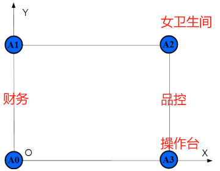
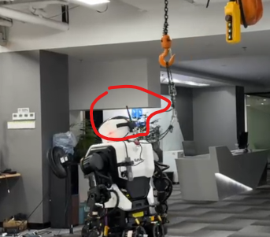
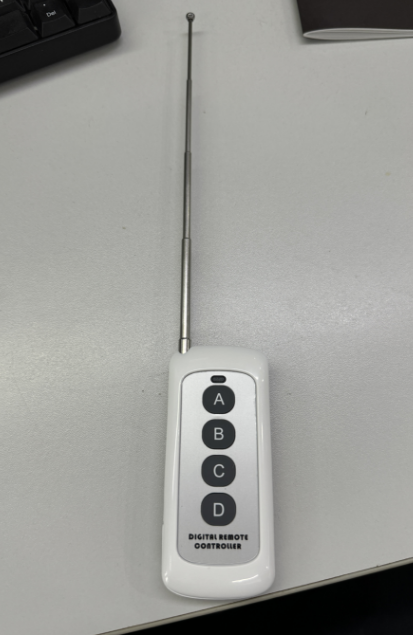

# 天轨操作手册  
## 硬件介绍  
### `六个UWB模块`/`四个定位器加两个追踪器`.  
* `uwb方案`：系统使用六个`UWB模块`（分为四个定位**基站**与两个定位**标签**）来进行定位.（已淘汰）  

* `激光雷达定位器方案`： 系统使用四个定位器与两个追踪器，来进行定位（目前使用）
1. 天轨上方固定**四个定位基站**，供电方式为充电插头供电.定位基站位置一般不允许移动.天轨坐标系及基站位置如图(两个方案的坐标系一致)      
    
 2. **两个定位标签**用来定位吊车与机器人的位置.**吊车**的定位标签已固定安装在吊车顶部，一般情况也不允许移动。  
 3. 机器人的**定位标签**安装要求在牢固固定在机器人头部（前端后端都可，推荐固定在前端）/激光雷达方案则固定在头顶部，**天线末端必须朝上且高于机器人**  .运行过程发生天线被打歪，或者定位标签被打掉时，请立即暂停测试，避免不可控情况发生  
   
### `吊车升降遥控器`    
遥控器用来单独控制吊车升降，A键升起吊绳，B键下放吊绳，使用前请把天线全部拉出保证信号最强.吊车供电总开关为操控台第一个配电柜
 
### `红色急停开关`   
急停开关用于紧急断开天轨电机的供电，意外发生时优先拍掉急停，正常使用前需检查是否拉起（可能较费力）确保电机正常供电.  
## 运行前检查  
1. 6个uwb模块是否正常上电？（上电UWB模块会亮绿灯）/四个定位器与两个追踪器是否正常（同样也是绿灯）   
2. 红色急停开关是否拉起？  
3. 白色遥控器能否能正常控制吊车升降  
4. 天轨电机是否能正常运动？（通过下文可键盘控制天轨）  

## 启动天轨  
天轨分为键盘控制与自动追踪控制两种模式，执行启动脚本即可启动程序
### 一键启动
```bash
sudo ./start.sh  
```  
### 手动启动（推荐，这样能看大到终端打印信息）  
1.  **开启新终端**, cd到ros工作空间目录下（这里以catkin_ws目录为例），先source, 后动nimservos_controller电机控制节点 输入命令:
```bash
cd ~/catkin_ws
source devel/setup.bash
roslaunch nimservos_controller nimservos_controller.launch
```

2.  **开启新终端**, cd到ros工作空间目录下（这里以catkin_ws目录为例）, 先source, 后启动user_pkg软件包 输入命名:

```bash
cd ~/catkin_ws
source devel/setup.bash
rosrun user_pkg main.py
```
* 鼠标要聚焦到控制页面，键盘才能正常控制与切换控制模式
* 脚本启动后会打开控制终端，此时可以键盘控制（a\d控制x轴移动，w\s控制y轴移动）天轨移动，一次只能控制一个轴运动，长按移动，松开停止  
* 通过键盘控制天轨到吊车到机器人正上方，将机器人吊上天轨（此操作可以确定天轨电机是否正常运动）  
* 机器人站立后按 `P`,切换到自动追踪模式（按`O`，同样可以切回键盘控制模式），此后天轨会一直追踪机器人运动（留足够长的吊绳防止拉倒机器人）    

## 注意事项

* 启动天轨的自动追踪模式前，机器人一定要挂在天轨上。如果机器人与天轨距离很远开启自动追踪模式则会触发位置保护，最好机器人站立后再开启自动追踪模式  
* 如果终端一直提示定位模块异常，请检查定位模块有无正确上电  
* 尽量控制机器人在天轨中间区域运动，避免边缘运动触发位置保护与电机开关
* 如果天轨**Y轴追踪很抖**，请断开红色急停按钮给电机重新上电后再重启电机节点
