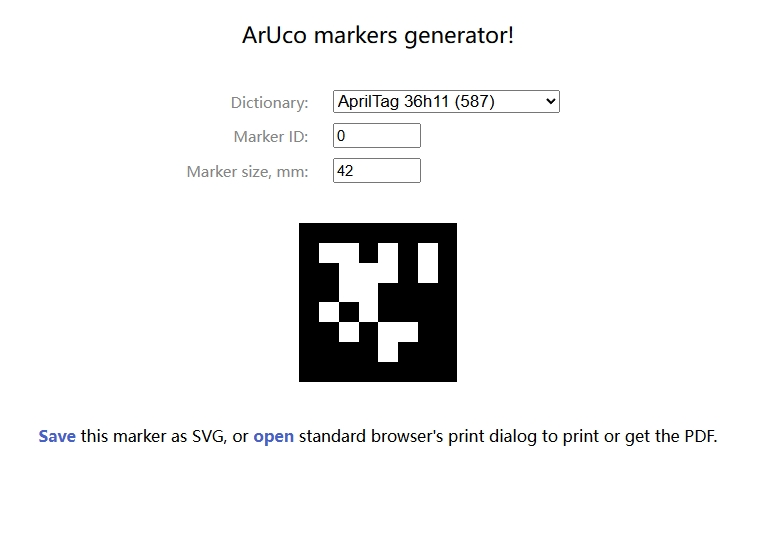
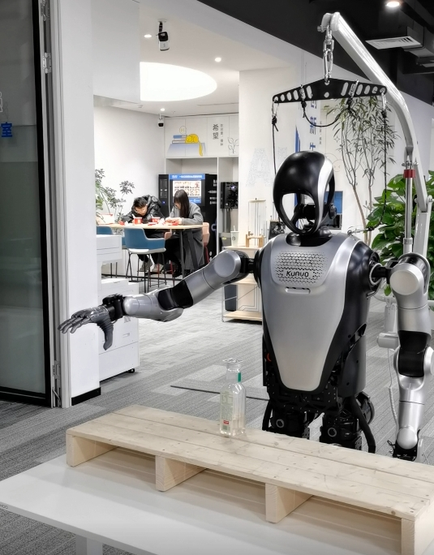
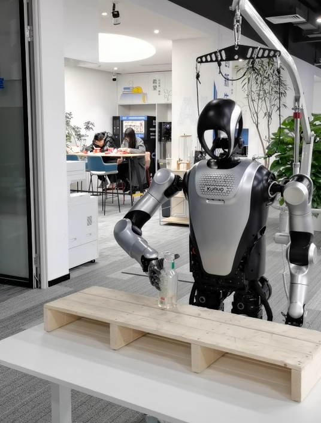
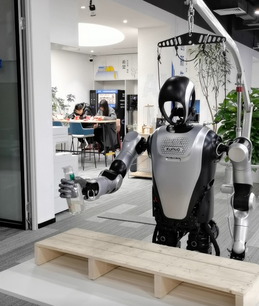

# 测试说明
  
  - 测试机器人手臂抓取过程
  - 默认的抓取点在二维码正下方，因此二维码要贴在瓶盖上面

### 二维码准备
1. 二维码下载
- [二维码下载网站](https://chev.me/arucogen/)
- 使用的二维码类型为apriltag，类型为36h11，id号与尺寸根据实际需要设置，这里我识别tag_0,尺寸为0.042


2. 调整配置文件(上位机)
  - 配置文件位于 `<kuavo_ros_application>/src/ros_vision/detection_apriltag/apriltag_ros/config/tags.yaml`
  ```yaml
  standalone_tags:
  [
    {id: 0, size: 0.042, name: 'tag_0'},
    {id: 1, size: 0.042, name: 'tag_1'},
    ...
  ]
  ```

### 运行步骤

1. **编译**
  - 执行 `cd <kuavo_ros_opensource>` 
  - 执行 `sudo su` 进入root用户
  - 执行 `catkin build humanoid_controllers` 完成编译 
  - 执行 `catkin build kuavo_sdk` 编译sdk功能包
  - 执行 `catkin build motion_capture_ik` 编译ik功能包

2. **下位机 使机器人站立**
  - 仿真：`roslaunch humanoid_controllers load_kuavo_mujoco_sim.launch`
  - 实物：`roslaunch humanoid_controllers load_kuavo_real.launch cali:=true`

3. **下位机 启动ik求解服务**
  - 在lab目录下新开一个终端执行 `cd <kuavo_ros_opensource>` ，
  - 执行 `sudo su` 进入root用户，
  - 执行 `source devel/setup.bash` ，
  - 执行 `roslaunch motion_capture_ik ik_node.launch ` ，

4. **发送tag信息（实机和仿真二选一，不要同时运行）**
- `仿真运行 下位机` 启动tag信息mock工具
  - 在lab目录下新开一个终端执行 `cd <kuavo_ros_opensource>` ，
  - 执行 `sudo su` 进入root用户，
  - 执行 `source devel/setup.bash` ， 
  - 执行 `python3 src/demo/arm_capture_apriltag/mock_tag_publisher.py`
- `实机运行 上位机` 启动传感器
  - 在lab目录下新开一个终端执行 `cd kuavo_ros_application` ，
  - 执行 `sros1` 切换到ros1环境 ，
  - 如果是远程连接上位机桌面 执行 `exp1`
  - 执行 `source devel/setup.bash` ， 
  - 执行 `roslaunch dynamic_biped load_robot_head.launch`

5. **检测下位机是否能收到标签信息**
- `下位机` 执行 `rostopic list | grep tag`
- 如果存在 `/robot_tag_info`
  - 执行 `rostopic echo /robot_tag_info`
  - 观察是否存在标签的坐标信息
- 注意事项:
  - 如果在实物上运行，需测量得到的坐标信息是否准确
  - 要启动下位机程序后，上位机才能检测到机器人各关节的角度，以计算出基于机器人坐标系的结果

6. **下位机 启动二维码抓取流程**
- 在lab目录下新开一个终端执行 `cd <kuavo_ros_opensource>` ，
- 执行 `sudo su` 进入root用户，
- 执行 `source devel/setup.bash` ， 
- 机器人实物运行
  - 执行 `python3 src/demo/arm_capture_apriltag/arm_capture_apriltag.py --offset_start True` 
- 机器人仿真运行  
  - 执行 `python3 src/demo/arm_capture_apriltag/arm_capture_apriltag.py --offset_start False` 
- 注意：若仿真环境卡顿，可适当增加延时，以确保机器人手臂每个动作都能执行到位，示例如下：
  - `publish_arm_target_poses([1.5], [20.0, ...])`修改为`publish_arm_target_poses([3], [20.0, ...])`
  - `time.sleep(2.5)`修改为`time.sleep(5)`
### 实机结果示例
  - 准备姿态



  - ik逆解移动



  - 递水


