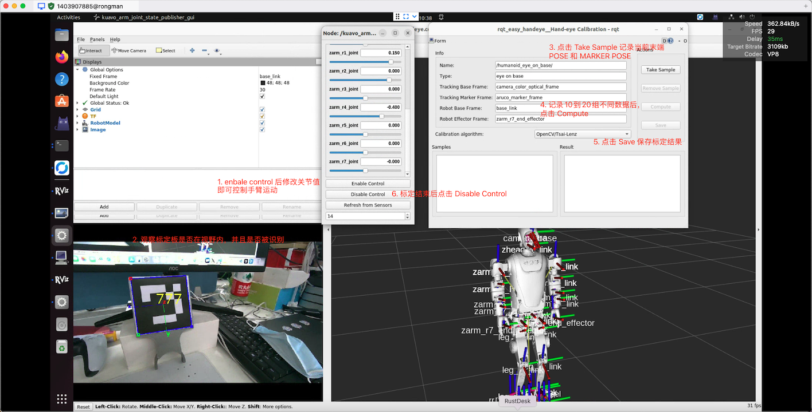

# KUAVO 手眼标定

## 概述

`kuavo_hand_eye_calibration`包提供了为机器人系统执行手眼标定的工具和实用程序。该包设计用于KUAVO机器人臂，并集成了ArUco标记检测系统和easy_handeye标定框架。

手眼标定是确定机器人末端执行器（手）和视觉传感器（眼）之间变换关系的过程。这种标定对于需要机器人运动和视觉反馈精确协调的机器人操作任务至关重要。

## 前提条件

- ROS（机器人操作系统）
- ArUco ROS包（`aruco_ros`）
- easy_handeye标定包
- KUAVO-ROS-CONTROL机器人包
- 标定标记（ArUco标记）
- RGB相机（例如RealSense相机）

## 编译

```bash
cd <kuavo-ros-control>
catkin build kuavo_hand_eye_calibration
```

## 使用方法

### 准备标定设置

1. 按指定大小（默认为10厘米）打印正确ID的ArUco标记（默认ID为777），标定文件在 
2. 将标记安装标定板上，并且将标定板安装在机器人末端执行器上
3. 确保相机正确安装并连接


### 启动标定过程

1. 启动机器人, 直到机器人站立

2. 在**上位机**启动相机节点

```bash
roslaunch realsense2_camera rs_camera.launch
```

3. 启动标定节点

```bash
export DISPLAY=:1.0 # 在机器人实物需要设置 DISPLAY
source <kuavo-ros-control>/devel/setup.bash
roslaunch kuavo_hand_eye_calibration kuavo_hand_eye_calibration.launch
```

### 标定程序

使用 VNC 或者 TODESK 等远程桌面软件连接机器人

1. 启动标定过程后，easy_handeye图形界面将打开
2. 使用KUAVO机械臂关节状态发布器GUI移动机器人到不同姿态
3. 对于每个姿态，确保相机视图中能看到标记
4. 在easy_handeye GUI中点击"Take Sample"（获取样本）
5. 至少对10-15个不同的机器人姿态重复此过程，确保良好覆盖工作空间
6. 点击"Compute"（计算）以计算标定变换
7. 使用"Save"（保存）按钮保存标定结果



标定结果保存在：
```
~/.ros/easy_handeye/humanoid_eye_on_base.yaml
```

### 评估标定结果

在标定完成后，您可以通过评估程序来验证标定结果的准确性

标定板被刚性固定在机器人末端执行器（EE, End Effector），那么 标定板相对于末端执行器的变换（Transform）应该是固定的。换句话说，变换矩阵 $T_{\text{EE} \to \text{target}}$ 在理想情况下是恒定的。

评估程序会记录末端执行器与标定板之间的变换关系，并计算统计数据来评估标定结果的准确性。

启动评估程序：

```bash
export DISPLAY=:1.0 # 在机器人实物需要设置 DISPLAY
source <kuavo-ros-control>/devel/setup.bash
roslaunch kuavo_hand_eye_calibration kuavo_hand_eye_evaluate.launch --repeats_per_position 10 # 每个末端位置重复运动测量10次
```

这将启动评估工具，该工具会执行以下操作：

1. 加载保存的相机标定矩阵数据
2. 发布机器人基座与相机之间的变换关系
3. 启动Rviz, 控制末端GUI，交互式评估程序

#### 评估交互模式使用说明

启动后，评估程序会进入交互模式，提供以下按键功能：

- `R`: 记录当前机器人关节位置（需要记录至少3个不同位置, 并且标定板要在相机视野内）
- `P`: 打印当前机器人手臂关节位置
- `S`: 开始评估流程（需要先记录好位置）
- `Q`: 退出程序

#### 评估流程

1. 通过 GUI 控制末端移动，使用 `R` 键记录多个不同的机器人姿态位置（建议5个以上不同的位置)
2. 在 GUI 界面 **DISABLE CONTROL** 后，按下 `S` 开始评估
3. 评估程序会自动移动机器人到每个记录的位置
4. 在每个位置，程序会多次测量标记与末端执行器之间的变换关系
5. 计算并显示变换的统计数据（平均值、标准差、最大差异等）
6. 评估结果将保存在 `~/.ros/easy_handeye/calibration_evaluation/` 目录下

Tips: 评估程序已经为 **ROBOT_VERSION** 为 45 预置了多个右手末端位置，可以直接按 `S` 开始评估

#### 评估指标

- 如果 RMSE、标准差、最大误差都较大，可能是标定过程中存在问题，如机械臂精度不足、相机安装不稳定等。

- 如果误差在多个位置都存在系统性偏移，可能是手眼标定矩阵本身存在错误。

- 如果旋转误差特别大，可能需要检查相机安装的稳定性，或者标定数据的质量。

- 如果 RMSE 随着机械臂运动变大，可能是相机内参误差或者标定板固定不牢固。

#### 影响评估的因素

1. 手眼标定的结果
2. 手臂运动精度
3. 相机安装牢固程度
4. 标定板安装牢固程度

## 故障排除

1. **标记无法检测**：确保光照条件适宜且标记清晰可见。
2. **标定结果较差**：采集更多样本，使用更广泛的机器人姿态。
3. **TF查找失败**：验证TF树中是否存在所有必需的帧。
