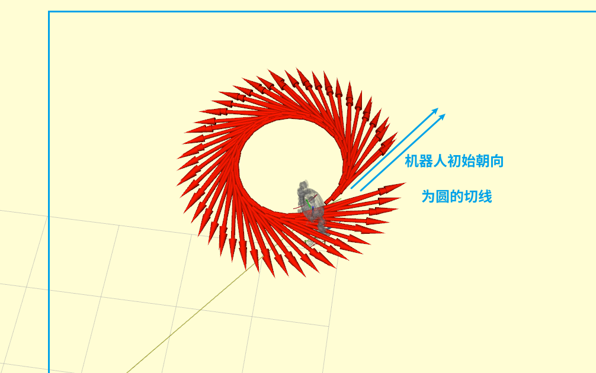
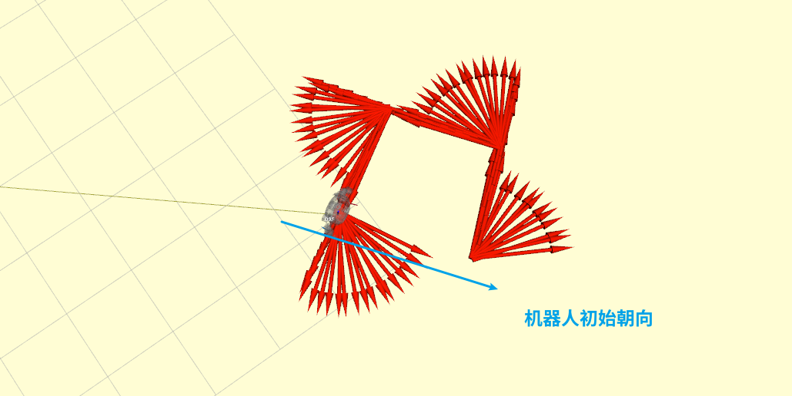
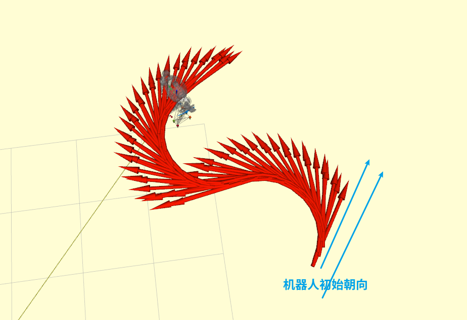

# Demo - 行走特定轨迹

## 运行

修改`src/humanoid-control/humanoid_interface_ros/scripts/walkTrajectory.py`文件的中的路径参数，执行以下命令 ：

```bash
chmod +x src/humanoid-control/humanoid_interface_ros/scripts/walkTrajectory.py # 添加可执行权限
source devel/setup.bash
rosrun humanoid_interface_ros walkTrajectory.py
```
**注意事项: 由于是通过简单的速度控制走轨迹路径,因此速度请勿过大.**

## 路径轨迹

### 圆形

机器人保持恒定的 yaw_v 和线性速度一直运动即可得到圆形轨迹。

**参数说明**：

- radius ：半径
  
- yaw_v：yaw 方向速度
  


### 正方形

正方形轨迹由`直线-转弯90度-直线-转弯90度-直线-转弯90度-直线`构成。

**参数说明**：

- side_length：正方形边长
  
- x_v：x 轴线性速度
  


### S 曲线

曲线轨迹由`半圆-直线-半圆`构成。

**参数说明**：

- radius ：曲线的半径
  
- yaw_v：yaw 方向速度

