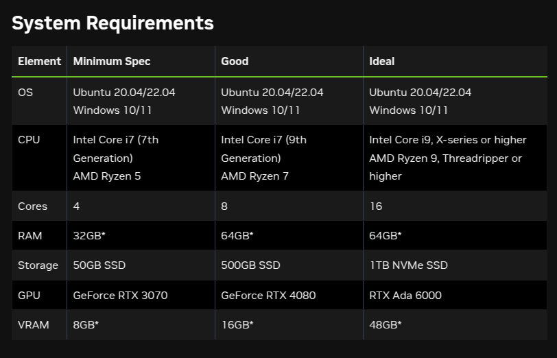
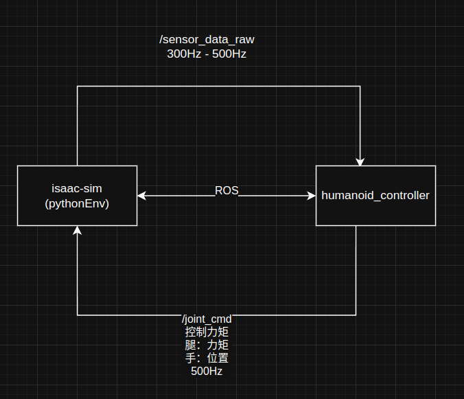
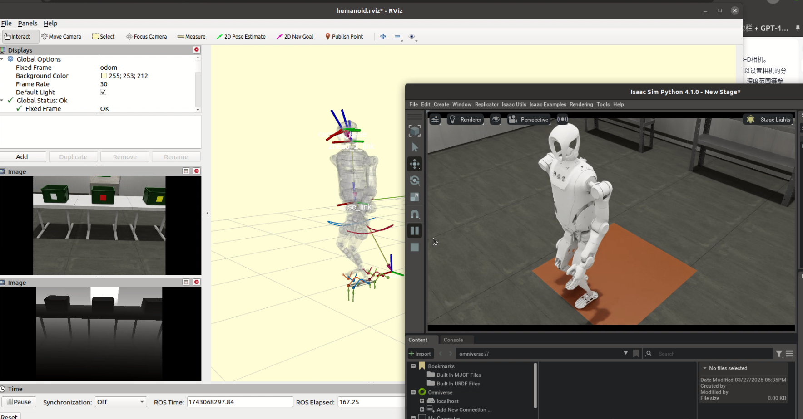

# isaac-sim 服务端 / 客户端实现
* 此库用于isaac-sim的state状态 与 控制器的直接交互

# 系统环境要求
* 硬件要求：需要安装至少`GeForce RTX 3070`的GPU环境

* isaac-sim版本要求：`isaac-sim-4.1.0`
    * [Download Isaac Sim Link](https://docs.isaacsim.omniverse.nvidia.com/latest/installation/download.html)
    * 请将下载好的isaac-sim源码环境放入至`/home/$USER/.local/share/ov/pkg`
* 请注意，`omni_python`为isaac-sim的pythonEnv环境索引，指向的目录为如下，请你在本机环境当中一定要正确进行设置到`bashrc`当中
```bash
alias omni_python

alias omni_python='/home/$USER/.local/share/ov/pkg/isaac-sim-4.1.0/python.sh'
```

```bash
├── controller_tcp  # launch功能包
├── nio-isaac       # issac-sim客户端，用于维护机器人、场景、启动isaac-sim
```
# 架构
* 

# build
* 编译isaac-sim仿真功能包
```bash
cd ~/kuavo-ros-control/
catkin build isaac_sim humanoid_controllers
```
* kuavo-ros-control控制器可用分支如下
```bash
* KangKK/dev/isaac-sim_controller_import_wbc
* opensource/0214_produce
* opensource/CASTest
```
* 

# 启动
### 启动OCS2控制器 | 启动isaac-sim仿真
```bash
roslaunch humanoid_controllers load_kuavo_isaac_sim.launch joystick_type:=bt2pro 
``` 
### 关键launch解析【参数配置写入到launch当中解析】
* launch.py : isaac-sim客户端，用于维护开启场景
* isaac_sim_nodelet_no_tcp.launch
```yaml
<launch>  
    <!-- Add robot version argument -->
    <arg name="isaac_robot_version"        default="$(optenv ROBOT_VERSION 45)"/>
    <arg name="use_camera_ros_topic_flag"  default="1"/>
    <arg name="use_point_cloud_flag"       default="0"/>
    <arg name="scene_index"                default="2"/>
    <arg name="robot_scene_point_index"    default="1"/>
    
    <param name="isaac_robot_version" value="$(arg isaac_robot_version)"/>
    <param name="use_camera_ros_topic_flag" value="$(arg use_camera_ros_topic_flag)"/>
    <param name="use_point_cloud_flag" value="$(arg use_point_cloud_flag)"/>
    <param name="robot_scene_point_index" value="$(arg robot_scene_point_index)"/>
    <param name="scene_index" value="$(arg scene_index)"/>

    <node pkg="tcp_cpp" name="isaac_sim_launcher" type="launch.py" output="screen">
    </node>
</launch>  
```
# 启动launch参数说明
```bash
# 0 : 车企检测场景
# 1 : 比赛场景
# 2 : 默认地板场景
scene_index

robot_scene_point_index    # 机器人初始所在点位 | 根据场景不同，初始点位不同

# 0 : 关闭相机渲染ROS发布
# 1 : 开启相机渲染ROS发布
use_camera_ros_topic_flag # 是否开启相机话题

# 0 : 关闭相机点云ROS发布
# 1 : 开启相机点云ROS发布
use_point_cloud_flag # 是否开启相机点云信息发布【该模式下很吃GPU渲染，请慎重开启】
```