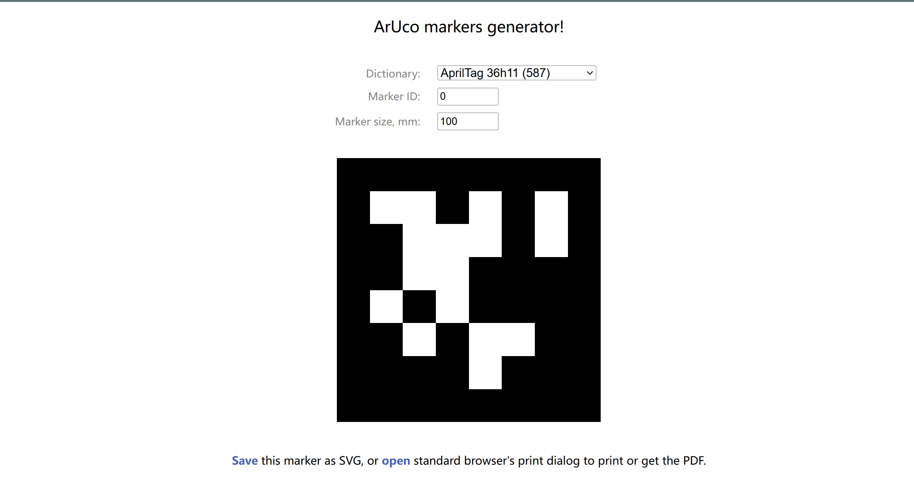

# 测试说明
该测试代码属于上位机代码在kuavo_ros_application/demo_test/apriltag_detection中，需要在上位机测试。
## 测试步骤
拉取最新dev分支，在kuavo_ros_application/demo_test/apriltag_detection目录下，运行脚本 `start_apriltag_detection.sh` 即可完成测试

## 环境准备

- 运行脚本前确保 apriltag 码放置在摄像头可见范围内
- 给脚本添加执行权限：
  ```bash
  chmod +x start_apriltag_detection.sh
  ./start_apriltag_detection.sh
     ```

## AprilTag 码准备
1. 二维码获取：
   - [在线生成工具](https://chev.me/arucogen/)
   - 类型选择：apriltag (36h11)

2. 打印要求：
   - 使用 A4 纸打印
   - 实际尺寸：93mm × 93mm
   - 测试用标签：ID 0
   

##  坐标系说明:
- 基坐标系可以参考下图躯干坐标系：


- 坐标系说明:
  - X轴(红色): 水平偏移，正向朝前，表示二维码在机器人躯干坐标系前后方向的距离
  - Y轴(绿色): 相机偏移，正向朝左，表示二维码在机器人躯干坐标系左右方向的距离  
  - Z轴(蓝色): 垂直偏移，正向朝上，表示二维码在机器人躯干坐标系上下方向的距离
- 旋转角度说明:
  - Roll(绕X轴): 横滚角，范围-180° ~ 180°
    - 正值: 向右倾斜
    - 负值: 向左倾斜
  - Pitch(绕Y轴): 俯仰角，范围-180° ~ 180°
    - 正值: 向上抬起
    - 负值: 向下俯视
  - Yaw(绕Z轴): 偏航角，范围-180° ~ 180°
    - 正值: 向左旋转
    - 负值: 向右旋转


## 测试输出
- 测试结果将保存在 `apriltag_results.txt` 文件中
- 结果文件包含以下信息：
  - 标签ID：检测到的 AprilTag 码的标识号
  - 水平偏移：AprilTag 码相对于机器人躯干坐标系在前后方向的距离（单位：米）
  - 相机偏移：AprilTag 码相对于机器人躯干坐标系在左右方向的距离（单位：米）
  - 垂直偏移：AprilTag 码相对于机器人躯干坐标系在上下方向的距离（单位：米）
  - 横滚角(Roll)：绕X轴旋转角度（单位：度）
  - 俯仰角(Pitch)：绕Y轴旋转角度（单位：度）
  - 偏航角(Yaw)：绕Z轴旋转角度（单位：度）


