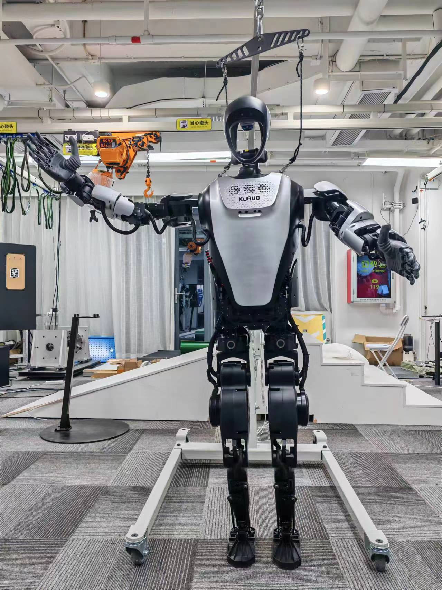

# 测试说明
  
  - 测试机器人手臂正逆解功能

### 实机运行步骤

1. 编译
  - 执行 `git clone https://www.lejuhub.com/highlydynamic/kuavo-ros-control.git` 拉取 `kuavo-ros-control` 工作空间，根据需要切换到对应分支上，拉取最新代码
  - 在lab目录下打开一个终端执行 `cd kuavo-ros-control` 
  - 执行 `sudo su` 进入root用户
  - 执行 `catkin build kuavo_sdk` 完成编译 

2. 运行
  - 使机器人站立
  - 在lab目录下新开一个终端执行 `cd kuavo-ros-control` ，
  - 执行 `sudo su` 进入root用户，
  - 执行 `source devel/setup.bash` ，
  - 执行 `roslaunch motion_capture_ik ik_node.launch ` ，
  - 在lab目录下新开一个终端执行 `cd kuavo-ros-control` ，
  - 执行 `sudo su` 进入root用户，
  - 执行 `source devel/setup.bash` ， 
  - 执行 `python3 src/kuavo_sdk/scripts/arm_fk_ik/robot_arm_fk_ik.py --joint_angles_id 1` ，程序参数 `joint_angles_id` 可输入1，2，3分别对应三组不同的末端执行器姿态。单只手臂的七个电机本测试程序均有涉及。

3. 实机结果示例
  - 按照测试步骤执行后， `--joint_angles_id 1` 对应如下：
    1. 图示1
        

