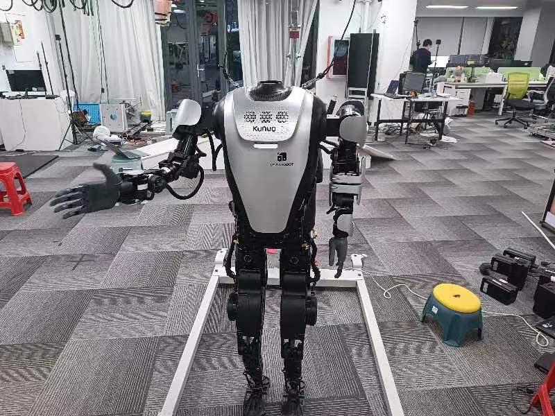
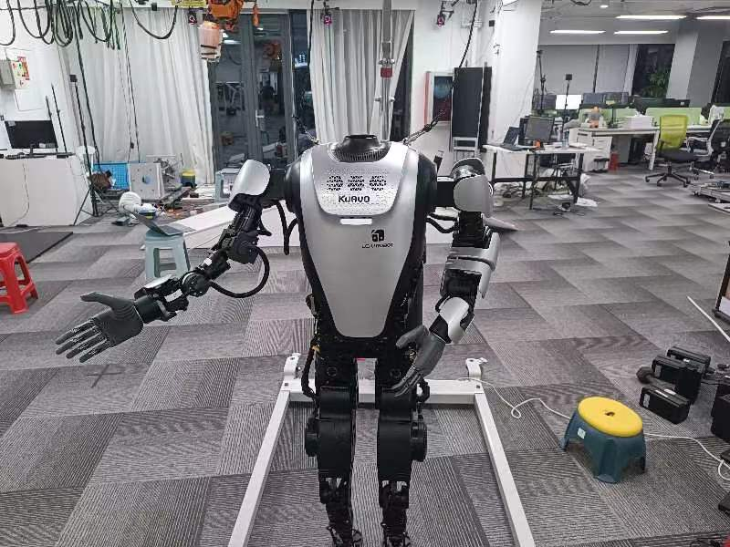

# 测试说明
## 运行步骤
- 在kuavo-ros-control目录下拉取最新的beta分支。
- 执行`sudo su`切换到root用户。
- 执行`catkin build kuavo_sdk`完成编译。
- 使机器人完成站立。
- 执行`source devel/setup.bash`。
- 执行python程序`python3  plan_arm_traj_bezier_no_tact_demo.py`。
- 观察机器人是否按照预设轨迹运动，本案例设置的是一个欢迎动作。
## 动作描述
- 机器人会先从站立状态，抬起右手:

- 然后向右手向右摆动:

- 然后抬起左手:

- 最后完成一个双手张开动作:

