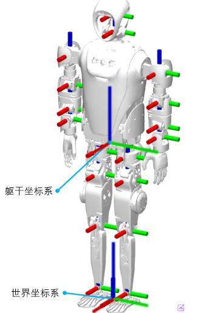

# 测试说明
该测试代码属于上位机代码在kuavo_ros_application/demo_test/yolo_detection中，需要在上位机测试。
## 测试步骤
拉取最新dev分支，在kuavo_ros_application/demo_test/yolo_detection目录下，运行脚本 `start_detection_box.sh` 即可完成测试

## 环境准备
- 运行脚本前确保待检测快递箱子放置在相机可见范围内，并确定检测范围中只有一个快递箱子，因为计算的是平均距离。
- 给脚本添加执行权限：
  ```bash
  chmod +x start_detection_box.sh
  ./start_detection_box.sh
  ```

## 测试对象准备
1. 箱子要求：
   - 尺寸：标准纸箱
   - 摆放：保持箱子表面平整，避免严重变形

2. 环境要求：
   - 光照：确保环境光线充足
   - 背景：尽量避免杂乱背景
##  坐标系说明:
- 基坐标系可以参考下图躯干坐标系
  

- 坐标系说明:
  - X轴(红色): 水平偏移，正向朝前，表示箱子在机器人躯干坐标系前后方向的距离
  - Y轴(绿色): 相机偏移，正向朝左，表示箱子在机器人躯干坐标系左右方向的距离  
  - Z轴(蓝色): 垂直偏移，正向朝上，表示箱子在机器人躯干坐标系上下方向的距离

## 测试输出
- 测试结果将保存在 `yolo_box_info.txt` 文件中，包含：
  1. 成功检测时的输出：
     - 检测时间：记录检测的具体日期和时间
     - 位置信息：
       - X：箱子在机器人躯干坐标系下的前后位置（单位：米）
       - Y：箱子在机器人躯干坐标系下的左右位置（单位：米）
       - Z：箱子在机器人躯干坐标系下的高度位置（单位：米）
  2. 检测失败时的输出：
     - 检测时间
     - 状态：显示"未检测到有效目标"
  3. 数据格式说明：
     - 每次检测结果之间使用分隔线"----------------------------------"隔开
     - 位置数据精确到小数点后4位
## 注意事项
1. 确保机器人头部相机正确连接
2. 测试过程中保持箱子静止
3. 使用 Ctrl+C 可正常结束测试
4. 测距有效范围：0.3~3m(实际测试发现超过2m后，测距误差会增大)
5. 测距时不要将相机对着光源，否则测距会不稳定
6. 测距背景尽量单调，确保相机和快递盒之间没有物体遮挡，以及没有其它盒子干扰
