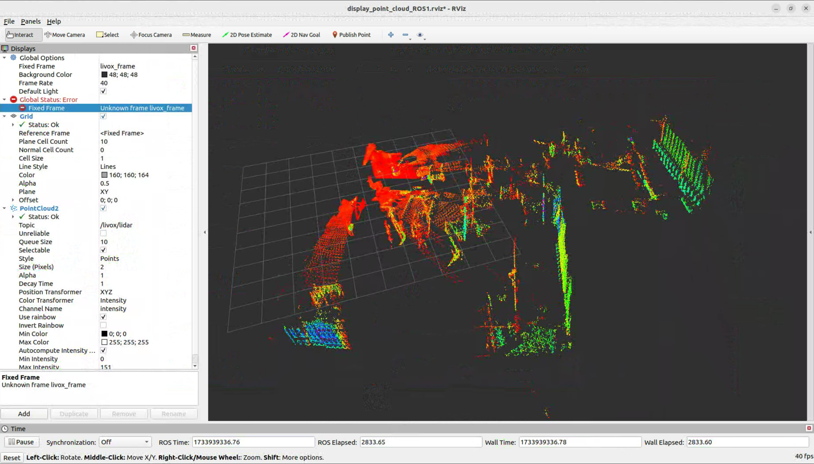

# 雷达基础使用

- [雷达基础使用](#雷达基础使用)
  - [说明](#说明)
  - [驱动下载编译](#驱动下载编译)
  - [配置文件修改](#配置文件修改)
  - [运行](#运行)
  - [消息话题](#消息话题)

## 说明
- 机器人雷达位于头部位置，雷达型号为 livox Mid-360。
- 雷达详情页：https://www.livoxtech.com/mid-360
- 雷达资料页：https://www.livoxtech.com/mid-360/downloads
- 雷达官方 github 地址：https://github.com/Livox-SDK
- 雷达出厂默认ip：192.168.1.191，上位机ip：192.168.1.102

## 驱动下载编译
```bash
mkdir -p caktin_livox_ros_driver2/src
cd caktin_livox_ros_driver2/src
git clone https://github.com/Livox-SDK/livox_ros_driver2.git 
cd livox_ros_driver2
sros1
./build.sh ROS1
```
## 配置文件修改
- 配置文件路径：`livox_ros_driver2/config/MID360_config.json`
- 将 `cmd_data_ip`、`push_msg_ip`、`point_data_ip`、`imu_data_ip` ip 改为 192.168.1.102
- 将雷达ip改为：192.168.1.191

## 运行
```
cd caktin_livox_ros_driver2
source devel/setup.bash
roslaunch livox_ros_driver2 rviz_MID360.launch
```
雷达点云数据可视化


## 消息话题
- `/livox/imu`: 雷达内置imu信息
- `/livox/lidar`: 雷达点云数据信息