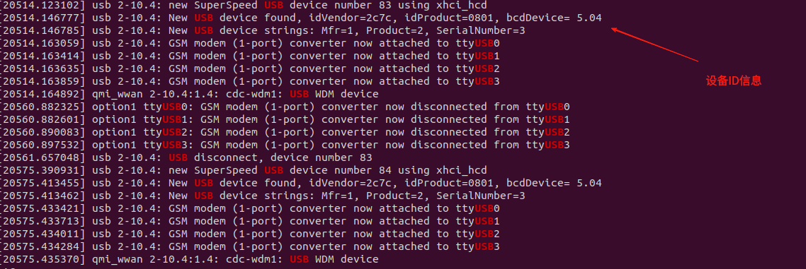
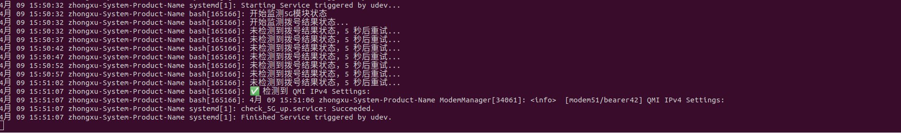
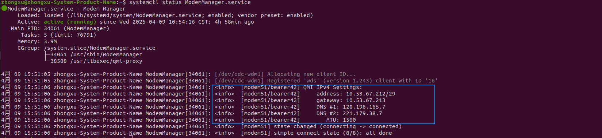

# 5G 模块监测服务脚本说明
## 执行当前目录的部署脚本后会有下列两个监视器启动：
```bash
    ./set_5G_monitor.sh
```
## udev 监测设备接入事件
- 在目录 /etc/udev/rules.d/ 下新建一条规则文件： 99-check_5G_up.rules
- 该规则会监测设备 ID 是否接入来触发拨号监测服务的启动：
- 当前适配的 5G 模块型号为 RM530N-GL，设备ID如下图所示：

- **如果更换设备，则对应的 ID 也会改变！届时请联系技术支持操作！**
## system 服务监测是否拨号成功
- 在目录 /etc/systemd/system/ 下会新建一个服务单元文件： check_5G_up.service
- 该服务由 udev 监测到 RM530N-GL 设备接入时调用启动，监听 ModemManager.service 的活动，判断移动模块是否拨号成功并且获取 IP。
- 通过命令查看服务日志结果：
```bash
    journalctl -u  check_5G_up.service
```
## 调试方法
1. 输出系统 USB 设备变化信息
```bash
    dmesg | grep USB
```
2. 插拔 5G 模块设备应有如下输出


3. 查看服务是否启动监听：
```bash
    journalctl -u  check_5G_up.service -f
    会实时输出监测拨号结果的日志：
```


4. 查看移动模块是否正常分配 IP：
```bash
    systemctl status ModemManager.service
```
