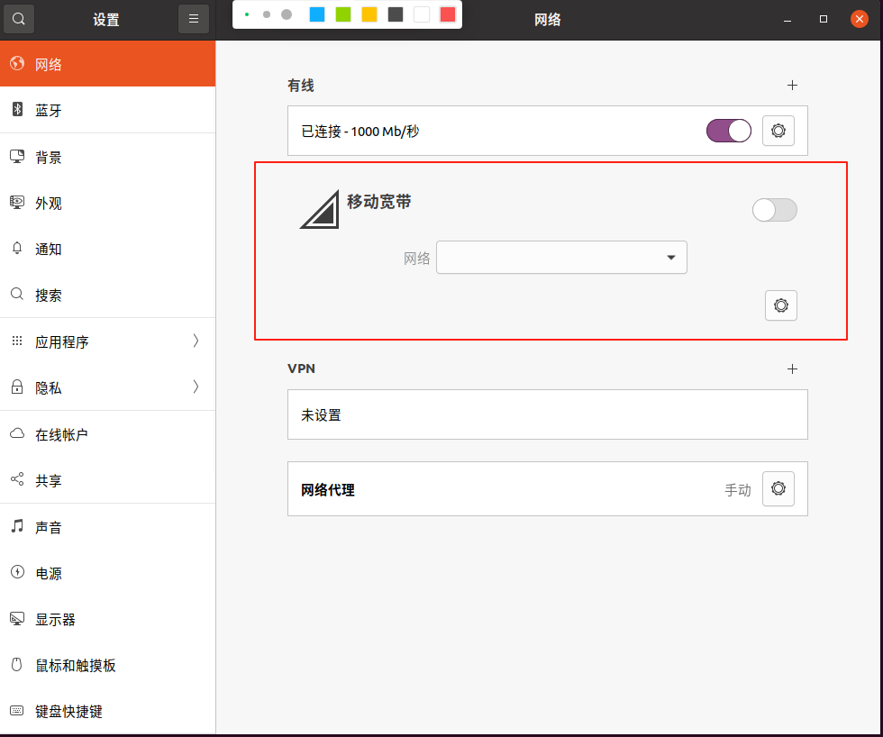
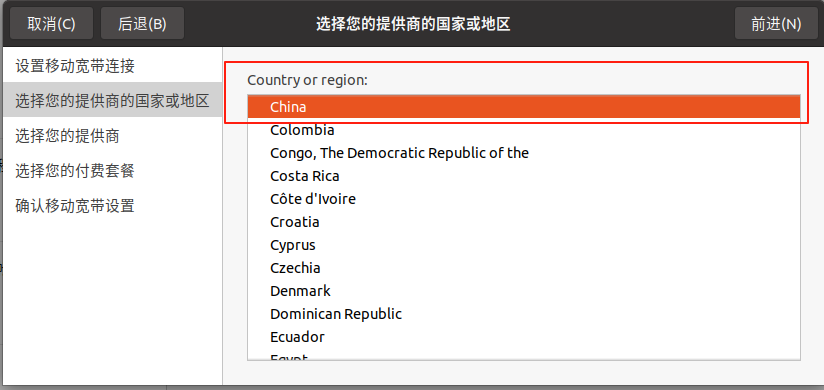
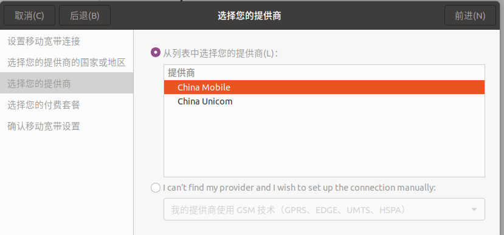
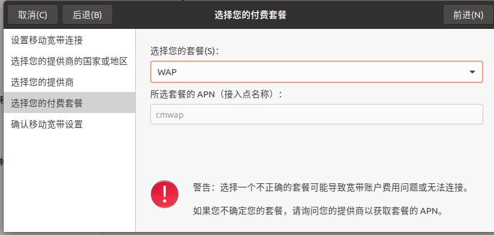
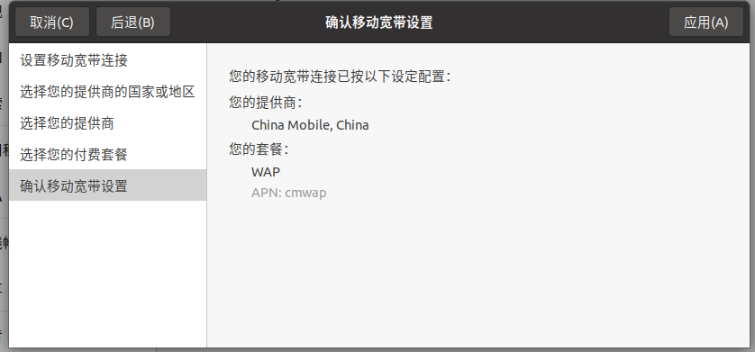
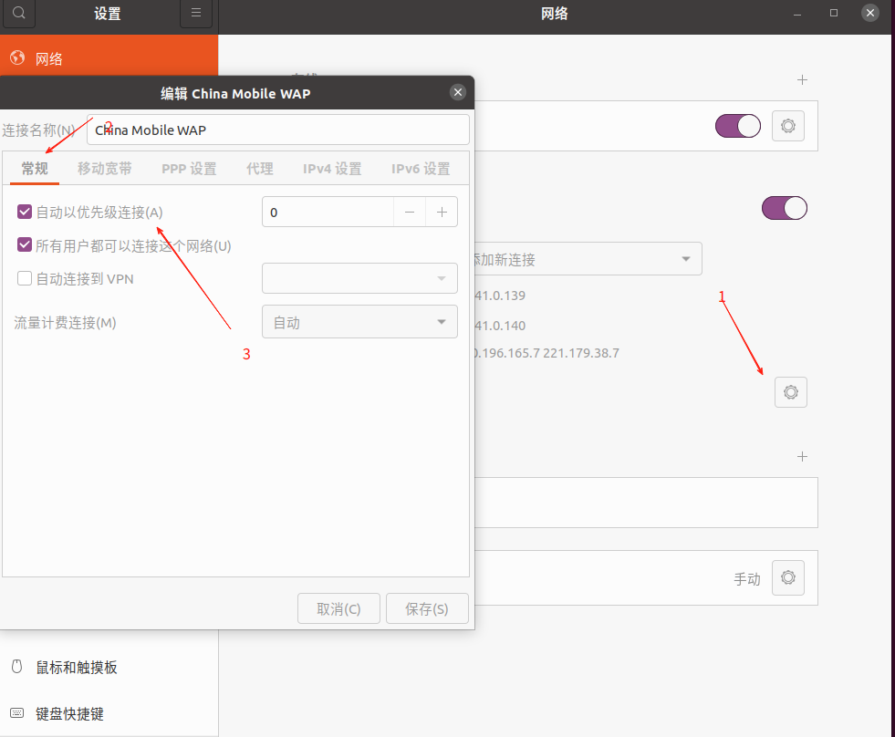
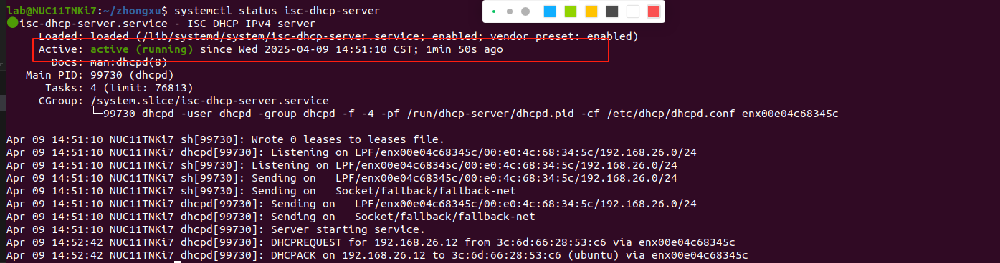
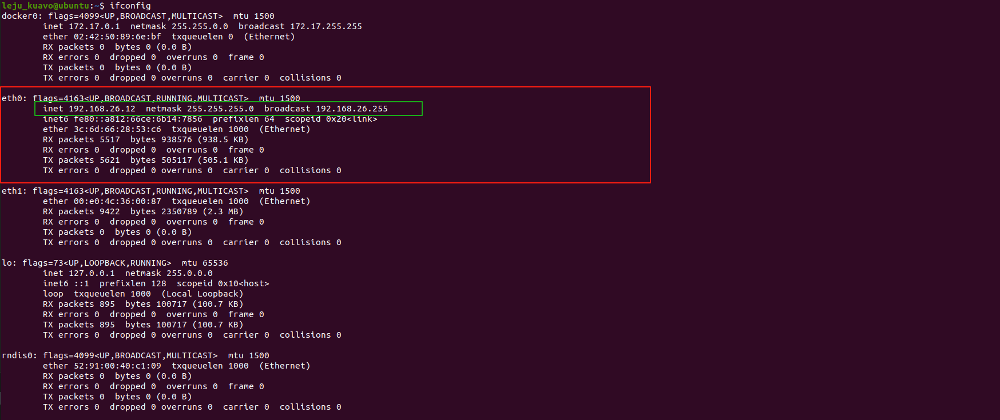
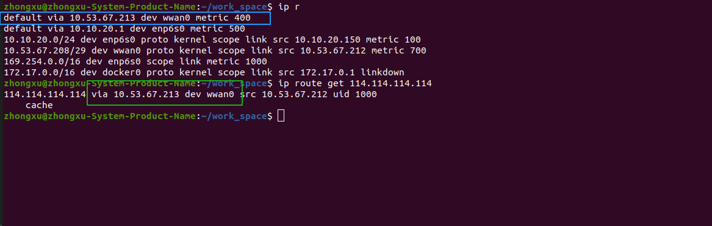

# 5G 模块配置说明
## 5G 模块接入
### 连接设备，Ubuntu 系统是免驱的，接入即可监测设备，但是需要配置部分事项：
- 在可视化桌面条件下：
1. 打开 setting->network

2. 打开移动宽带按钮，添加新连接，选择右上角前进，选择国家或地区时选择 China

3. 供应商选择电话卡的供应商，中国联通就 China Unicom，中国移动就 China Mobile

4. 套餐选择WAP

5. 确认宽带设置

6. 打开宽带自动连接

## DHCP 主机变更
- 当搭载 5G 模块后，应当使得下位机作为 DHCP 主机，作为网关，给上位机进行网络分配，上位机通过网口走 5G 模块上网。
- 配置 DHCP 服务：
1. 配置**下位机**作为 DHCP 的主机：
```bash
    chmod -R +X ./* 
    ./dhcp_setting/set_dhcp_server.sh
```
2. 进入**上位机**，执行脚本取消固定IP：详情可参考文档：[head_setting](./dhcp_setting/head_dhcp_setting.md)

3. 重启机器，进入下位机检查 DHCP 服务是否正常启动：
```bash
    输入以下指令：
    systemctl status isc-dhcp-server
    输出如下，其中 Active 一栏为 active(running)：
```

4. 进入上位机，查看是否成功被分配 IP：
```bash
    输入以下指令
    ifconfig
```


5. **如果有设置失败，请及时联系技术支持操作！！**

## 5G 模块状态监测设置
- 为避免偶发的移动模块设备拨号上网失败的情况，需要配置守护进程确保拨号成功：
1. 启动配置脚本
```bash
    chmod -R -X ./* 
    ./5G_server_monitor/set_5G_monitor.sh
```
- **当模块监测没有生效时，请技术人员参考文档排查：**
[Monitor Setting](./5G_server_monitor/Readme.md)
## 默认上网路由切换
### 该脚本可以区分当前设备上网的默认路由，并且按照需求更改
1. 启动脚本
```bash
    chmod -R -X ./* 
    ./set_default_gateway.sh
```
2. 按照路由提示选择默认路由

- 路由的优先级的值越小，则网络会优先经过该路由。
- 调试方法：
```bash
    ip route get 114.114.114.114
```

