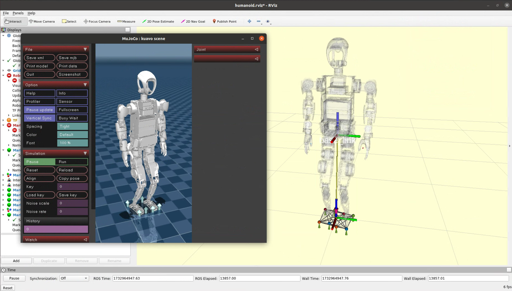

# 仿真环境使用

- [仿真环境使用](#仿真环境使用)
  - [仿真环境部署](#仿真环境部署)
  - [运行](#运行)


## 仿真环境部署

在没有机器人运行环境的情况下，可以使用docker环境进行编译和仿真使用。

- 确保已经完成下位机代码仓库的克隆[下位机代码仓库](https://gitee.com/leju-robot/kuavo-ros-opensource.git)

- docker镜像可以自行根据后续章节使用`./docker/Dockerfile`构建，或者下载已经编译好的镜像：

```bash  
容器下载链接：https://kuavo.lejurobot.com/docker_images/kuavo_opensource_ocs2_mpc_wbc_img_0_3.tar
```

- 执行以下命令导入容器镜像：
```bash
docker load -i kuavo_opensource_ocs2_mpc_wbc_img_0_3.tar
```

- 在`<kuavo-ros-opensource>`目录下执行`./docker/run.sh`进入容器后，默认在仓库的映射目录`/root/kuavo_ws`
- 修改`~/.zshrc`
```zsh
export ROBOT_VERSION=42 # 4pro版本
```
- source生效
```
source ~/.zshrc
```
- 执行以下命令开始编译：

```bash
rm -r devel/ build/
catkin config -DCMAKE_ASM_COMPILER=/usr/bin/as -DCMAKE_BUILD_TYPE=Release # Important! 
# -DCMAKE_ASM_COMPILER=/usr/bin/as 为配置了ccache必要操作，否则可能出现找不到编译器的情况
catkin build humanoid_controllers #会编译所有依赖项
```
如果失败，执行
```
rm -r devel/ build/
```
再重新进行编译

## 运行

```bash
source devel/setup.zsh
roslaunch humanoid_controllers load_kuavo_mujoco_sim.launch # 启动控制器、mpc、wbc、mujoco仿真器
```

